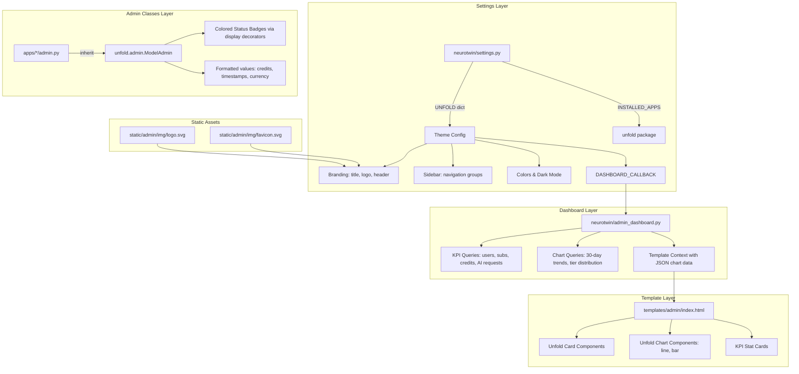

# Design Document: Admin Modernization

## Overview

This design modernizes the NeuroTwin Django admin panel by integrating the [django-unfold](https://github.com/unfoldadmin/django-unfold) theme package. The implementation replaces the default Django admin styling with a polished, Tailwind CSS-based interface featuring NeuroTwin branding, organized sidebar navigation, an analytics dashboard with Chart.js charts, enhanced model list views with colored status badges, and dark mode support.

The approach is non-destructive: all existing admin registrations and business logic remain intact. Each app's `admin.py` is updated to inherit from `unfold.admin.ModelAdmin` instead of `django.contrib.admin.ModelAdmin`, and the `UNFOLD` settings dictionary drives branding, sidebar grouping, and dashboard configuration.

### Key Design Decisions

1. **django-unfold over alternatives** (e.g., django-jazzmin, grappelli): Unfold uses Tailwind CSS, provides built-in Chart.js components, supports dark mode natively, and has active maintenance. It integrates via `INSTALLED_APPS` and a settings dictionary — no template overrides needed for most features.

2. **Dashboard via `DASHBOARD_CALLBACK`**: Unfold's callback pattern injects chart data and KPI cards into the admin index template. A custom `admin/index.html` template uses Unfold's component system (`unfold/components/chart/line.html`, `unfold/components/chart/bar.html`, etc.) to render analytics widgets.

3. **Server-side chart data**: All dashboard metrics are queried at page load via Django ORM aggregations. No separate API endpoints or JavaScript fetch calls are needed — data is serialized to JSON and passed through the template context.

4. **Sidebar navigation via `UNFOLD["SIDEBAR"]`**: Model grouping is configured declaratively in `settings.py` using `reverse_lazy` links and Google Material Icons.

## Architecture



## Components and Interfaces

### 1. Settings Configuration (`neurotwin/settings.py`)

The `UNFOLD` dictionary is the central configuration point:

```python
UNFOLD = {
    "SITE_TITLE": "NeuroTwin AI Admin",
    "SITE_HEADER": "NeuroTwin",
    "SITE_LOGO": {
        "light": lambda request: static("admin/img/logo-light.svg"),
        "dark": lambda request: static("admin/img/logo-dark.svg"),
    },
    "SITE_ICON": {
        "light": lambda request: static("admin/img/icon-light.svg"),
        "dark": lambda request: static("admin/img/icon-dark.svg"),
    },
    "SITE_FAVICONS": [...],
    "DASHBOARD_CALLBACK": "neurotwin.admin_dashboard.dashboard_callback",
    "COLORS": { ... },  # NeuroTwin brand palette
    "SIDEBAR": {
        "show_search": True,
        "navigation": [ ... ],  # 8 groups with icons
    },
}
```

### 2. Dashboard Callback Module (`neurotwin/admin_dashboard.py`)

A dedicated module containing:

- `dashboard_callback(request, context)` — the main callback that queries metrics and injects them into the template context.
- Helper functions for each metric query (total users, active subscriptions, credit consumption, AI request volume, user registrations).
- All queries use Django ORM with `annotate()`, `aggregate()`, and `TruncDate` for time-series data.
- Each query is wrapped in a try/except to return fallback data on failure (Requirement 4.7).

```python
def dashboard_callback(request, context):
    context.update({
        "kpi_cards": get_kpi_cards(),
        "ai_requests_chart": get_ai_requests_chart_data(),
        "credit_consumption_chart": get_credit_consumption_chart_data(),
        "subscription_tier_chart": get_subscription_tier_chart_data(),
        "user_registrations_chart": get_user_registrations_chart_data(),
        "navigation": [...],  # optional dashboard tab navigation
    })
    return context
```

### 3. Dashboard Template (`templates/admin/index.html`)

Extends Unfold's base admin index and uses the component system:

- KPI row: 4 stat cards (total users, active subs, credits consumed, AI requests)
- Chart row 1: AI request volume line chart + credit consumption bar chart
- Chart row 2: subscription tier distribution (rendered as bar chart with tier labels) + user registrations line chart
- Fallback: if chart data is `None`, display a "Data temporarily unavailable" message card

### 4. Admin Class Updates (all `apps/*/admin.py`)

Each admin class changes its base class:

```python
# Before
from django.contrib.admin import ModelAdmin

# After
from unfold.admin import ModelAdmin
```

For `UserAdmin` in authentication, inherit from both `unfold.admin.ModelAdmin` and `django.contrib.auth.admin.UserAdmin` (Unfold provides guidance for this pattern).

Enhanced display methods are added for:
- **Status badges**: `@display(label={"active": "success", "inactive": "danger", ...})` decorator for status fields
- **Formatted values**: Custom display methods for credit amounts (comma-separated), timestamps (humanized), and monetary values (currency prefix)

### 5. Static Assets

- `static/admin/img/logo-light.svg` — NeuroTwin logo for light mode
- `static/admin/img/logo-dark.svg` — NeuroTwin logo for dark mode
- `static/admin/img/icon-light.svg` — Small icon for sidebar/favicon (light)
- `static/admin/img/icon-dark.svg` — Small icon for sidebar/favicon (dark)
- `static/admin/img/favicon.svg` — Browser tab favicon

### 6. Sidebar Navigation Groups

| Group | Icon | Models |
|-------|------|--------|
| Users & Auth | `people` | User, VerificationToken, PasswordResetToken |
| Subscriptions & Billing | `payments` | Subscription, SubscriptionHistory, PaymentTransaction, WebhookLog, CreditTopUp |
| AI & Credits | `psychology` | UserCredits, CreditUsageLog, AIRequestLog, BrainRoutingConfig |
| Twin & Cognition | `neurology` | Twin, OnboardingProgress, CSMProfile, CSMChangeLog |
| Memory & Learning | `memory` | MemoryRecord, MemoryAccessLog, LearningEvent |
| Safety & Audit | `shield` | PermissionScope, PermissionHistory, AuditLog |
| Automation | `bolt` | IntegrationTypeModel, AutomationTemplate, Integration, WebhookEvent, Message, Conversation |
| Voice | `call` | VoiceProfile, CallRecord, VoiceApprovalHistory |

## Data Models

No new database models are introduced. This feature is purely a presentation-layer change.

The dashboard queries aggregate data from existing models:

| Metric | Source Model | Query Type |
|--------|-------------|------------|
| Total Users | `authentication.User` | `count()` |
| Active Subscriptions | `subscription.Subscription` | `filter(is_active=True).count()` |
| Total Credits Consumed | `credits.CreditUsageLog` | `aggregate(Sum('credits_consumed'))` |
| Total AI Requests | `credits.AIRequestLog` | `count()` |
| AI Requests (30 days) | `credits.AIRequestLog` | `TruncDate` + `annotate(count)` |
| Credit by Brain Mode | `credits.CreditUsageLog` | `values('brain_mode').annotate(Sum)` |
| Subscription Tiers | `subscription.Subscription` | `filter(is_active=True).values('tier').annotate(count)` |
| User Registrations (30 days) | `authentication.User` | `TruncDate('created_at').annotate(count)` |


## Correctness Properties

*A property is a characteristic or behavior that should hold true across all valid executions of a system — essentially, a formal statement about what the system should do. Properties serve as the bridge between human-readable specifications and machine-verifiable correctness guarantees.*

### Property 1: KPI summary statistics match database state

*For any* set of users, subscriptions, credit usage logs, and AI request logs in the database, the KPI card values returned by the dashboard callback SHALL equal the actual `count()` of users, `count()` of active subscriptions, `Sum('credits_consumed')` of credit usage logs, and `count()` of AI request logs respectively.

**Validates: Requirements 4.1**

### Property 2: Time-series aggregation preserves totals and per-day accuracy

*For any* set of timestamped records (AI request logs or user registrations) within a 30-day window, the time-series chart data function SHALL produce daily count values that: (a) sum to the total number of records in the period, and (b) each day's count equals the actual number of records created on that date.

**Validates: Requirements 4.2, 4.5**

### Property 3: Grouped aggregation matches per-category totals

*For any* set of credit usage logs with varying `brain_mode` values and credit amounts, the grouped aggregation function SHALL produce per-brain-mode totals that equal the actual `Sum('credits_consumed')` for each brain mode. Similarly, *for any* set of active subscriptions with varying `tier` values, the tier distribution function SHALL produce per-tier counts that equal the actual count of active subscriptions for each tier.

**Validates: Requirements 4.3, 4.4**

### Property 4: Value formatting produces valid output format

*For any* non-negative integer credit amount, the credit formatting function SHALL produce a string containing comma-separated thousands (e.g., 1000 → "1,000"). *For any* positive monetary value, the currency formatting function SHALL produce a string prefixed with the currency symbol. *For any* valid datetime, the timestamp formatting function SHALL produce a non-empty human-readable string.

**Validates: Requirements 5.2**

## Error Handling

### Dashboard Query Failures (Requirement 4.7)

Each dashboard metric query function is wrapped in a try/except block. On any exception (database connection error, query timeout, unexpected data), the function returns a fallback value:

- KPI cards: return `0` or `"N/A"` for the failed metric
- Chart data: return `None`, which the template checks before rendering — if `None`, a "Data temporarily unavailable" card is displayed instead of the chart component

```python
def get_kpi_cards():
    cards = []
    try:
        total_users = User.objects.count()
    except Exception:
        total_users = "N/A"
    cards.append({"title": "Total Users", "metric": total_users})
    # ... repeat for each KPI
    return cards

def get_ai_requests_chart_data():
    try:
        # ... query logic
        return json.dumps(chart_data)
    except Exception:
        return None
```

### Admin Class Migration Safety

The migration from `django.contrib.admin.ModelAdmin` to `unfold.admin.ModelAdmin` is a drop-in replacement. Unfold's ModelAdmin extends Django's ModelAdmin, so all existing `list_display`, `list_filter`, `search_fields`, `fieldsets`, `readonly_fields`, and custom methods continue to work without modification.

For `UserAdmin` in the authentication app, the class must use multiple inheritance:
```python
from unfold.admin import ModelAdmin as UnfoldModelAdmin
from django.contrib.auth.admin import UserAdmin as BaseUserAdmin

class UserAdmin(UnfoldModelAdmin, BaseUserAdmin):
    ...
```

### Static Asset Fallback

If logo SVG files are missing, Unfold gracefully falls back to text-only display using `SITE_HEADER` and `SITE_TITLE`. No broken image icons will appear.

## Testing Strategy

### Unit Tests (Example-Based)

- **Settings validation**: Verify `UNFOLD` dictionary contains required keys (`SITE_TITLE`, `SITE_HEADER`, `SITE_LOGO`, `SIDEBAR`, `DASHBOARD_CALLBACK`).
- **Admin class inheritance**: Iterate `admin.site._registry` and assert all admin classes inherit from `unfold.admin.ModelAdmin`.
- **Model registration completeness**: Verify all expected models from all 11 apps are registered.
- **Sidebar configuration**: Verify 8 navigation groups with correct titles, icons, and model links. Assert all icons are distinct.
- **Error handling**: Mock database queries to raise exceptions and verify dashboard functions return fallback values.
- **Status badge configuration**: Verify admin classes for models with status fields have `@display` decorators with label color mappings.

### Property-Based Tests (Hypothesis)

Property-based testing applies to the dashboard data transformation functions and value formatting functions. These are pure-ish functions (given a database state, they produce deterministic output) where input variation reveals edge cases (empty data, single record, many records, all same date, all same brain mode, etc.).

- **Library**: [Hypothesis](https://hypothesis.readthedocs.io/) (already in dev dependencies)
- **Minimum iterations**: 100 per property
- **Tag format**: `Feature: admin-modernization, Property {number}: {property_text}`

| Property | Test Description |
|----------|-----------------|
| Property 1 | Generate random users/subscriptions/logs, call KPI functions, assert counts match |
| Property 2 | Generate random timestamped records over 30 days, call time-series function, assert daily counts sum to total and match per-day actuals |
| Property 3 | Generate random credit logs with varying brain modes, call grouped aggregation, assert per-mode totals match. Same for subscription tier distribution |
| Property 4 | Generate random integers/floats/datetimes, call formatting functions, assert output matches expected format patterns |

### Integration Tests

- **Admin page load**: Use Django test client to verify admin index page returns 200 and contains expected KPI card text.
- **Login page branding**: Verify login page response contains "NeuroTwin AI Admin" text.
- **Dark mode config**: Verify `UNFOLD` settings do not force a theme (allowing toggle).

### Manual Verification

- Visual inspection of responsive layout on desktop and tablet widths
- Dark mode toggle behavior (client-side, handled by Unfold's Alpine.js)
- Theme persistence across browser sessions (localStorage)
