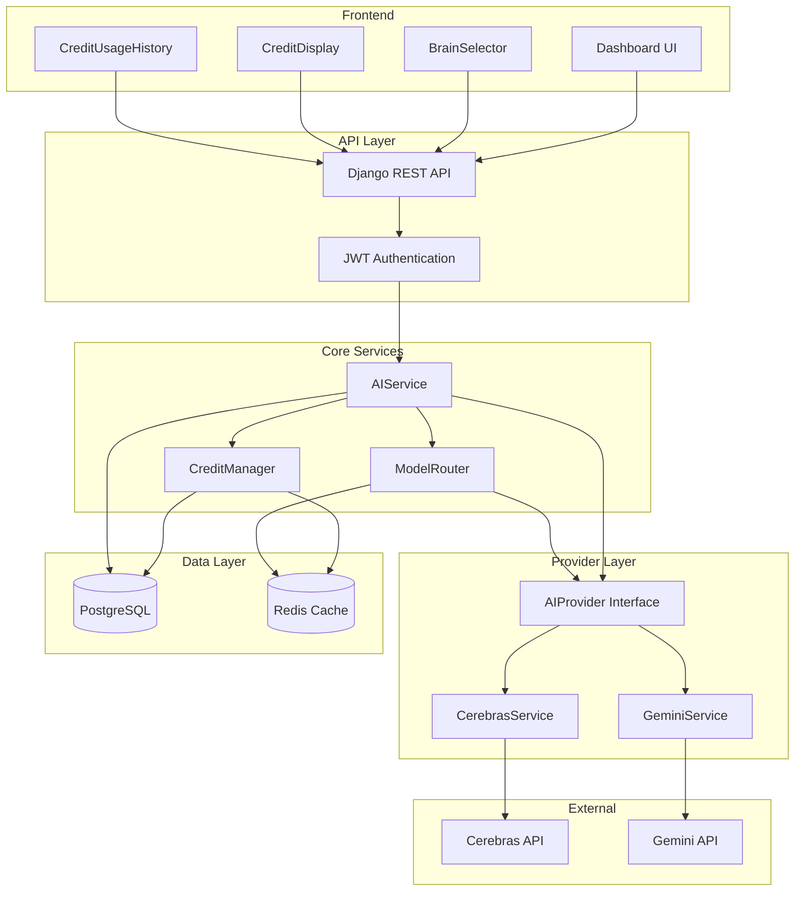
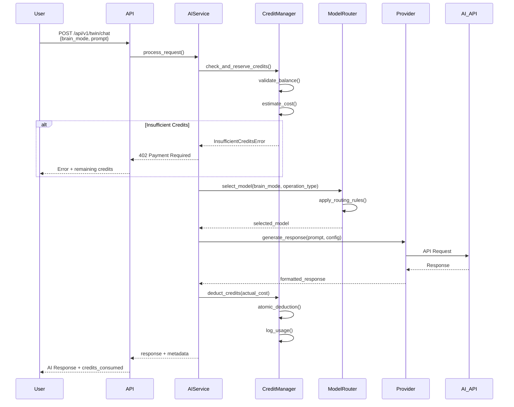
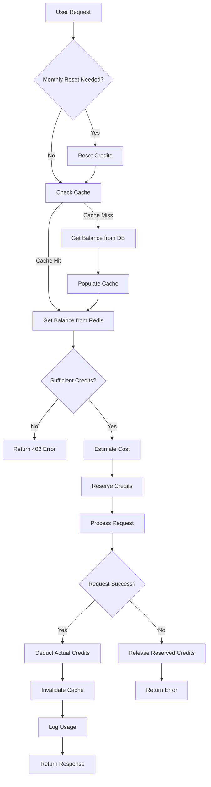
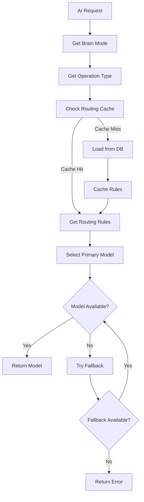
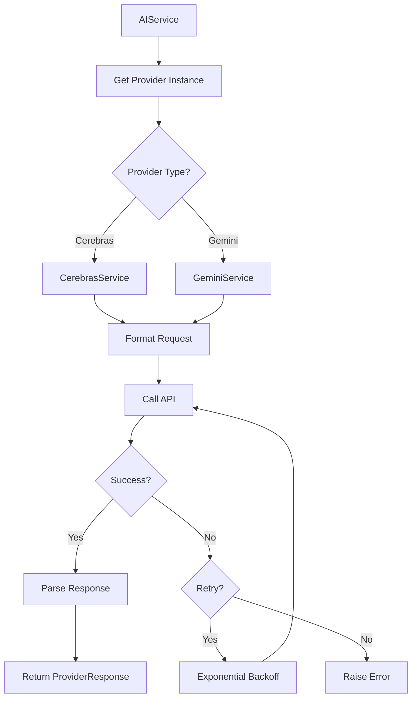

# Design Document: Credit-Based AI Architecture

## Overview

This design transforms the NeuroTwin platform from direct model selection to a credit-based AI usage system with intelligent Brain mode abstraction. The architecture introduces three user-facing Brain modes (Brain, Brain Pro, Brain Gen) that automatically route requests to appropriate AI models based on task complexity and subscription tier, while tracking usage through a credit system.

### Key Design Goals

1. **Simplified User Experience**: Replace technical model selection with intuitive Brain intelligence levels
2. **Predictable Cost Control**: Credit-based metering with tier-specific monthly allocations
3. **Intelligent Routing**: Automatic model selection based on task complexity and Brain mode
4. **Provider Flexibility**: Abstraction layer enabling easy model provider changes (Qwen → Cerebras)
5. **Scalability**: Redis caching and async operations for high-performance credit validation
6. **Auditability**: Comprehensive logging of credit usage and AI requests

### Architecture Principles

- **Service-Oriented**: Clear separation between CreditManager, ModelRouter, and AIService
- **Provider Abstraction**: AIProvider interface isolates model-specific implementations
- **Cache-First**: Redis caching for credit balances and routing rules
- **Fail-Safe**: Credit validation before execution, no deduction on failure
- **Backward Compatible**: Legacy API support with gradual migration path

### Compatibility with Existing Codebase

The following conflicts with the existing codebase must be resolved during implementation:

**1. Model Name Alignment**
The existing `AIModel` enum uses `"gemini-3-flash"` as the model identifier, but the credit architecture routes to `"gemini-2.5-flash"` and `"gemini-2.5-pro"`. These are distinct model names. The migration must update all existing Twin records and enum values to use the new model identifiers.

**2. Twin Chat Endpoint Does Not Exist**
`apps/twin/views.py` currently only contains onboarding, blend, and kill-switch views. There is no `/api/v1/twin/chat` endpoint. Task 9.1 must create this endpoint from scratch rather than modifying an existing one.

**3. Exception Handler Conflict**
`settings.py` registers `apps.automation.exception_handlers.custom_exception_handler` as the DRF exception handler. The credit spec defines its own handler in `apps/credits/exception_handlers.py`. The credits exception handler must delegate to the automation handler for non-credit errors, or the automation handler must be updated to handle credit exceptions — the recommended approach is to update the automation handler to also handle `InsufficientCreditsError`, `BrainModeRestrictedError`, and `ModelUnavailableError`, keeping a single registered handler.

**4. CSM Integration in AIService**
The `AIService.process_request()` must load the user's CSM profile via `CSMService` before generating a response when `cognitive_blend > 0`. The `cognitive_blend_value` stored in `AIRequestLog` should be read from the user's active Twin record (via `TwinService.get_twin()`), not passed as a raw parameter. This ensures personality context is applied consistently with the existing CSM architecture.

**5. URL Namespace Alignment**
The existing automation app uses `/api/v1/automations/` and `/api/v1/integrations/` (registered via `core/api/urls.py`). The credit spec's new endpoints (`/api/v1/credits/`, `/api/v1/twin/chat`, `/api/v1/admin/`) must be registered in `core/api/urls.py` following the same pattern, not added directly to `neurotwin/urls.py`.

**6. Twin Model `MODEL_CHOICES` and `AuditLog` Duplication**
`apps/twin/models.py` has `MODEL_CHOICES` hardcoded from the current `AIModel` enum values and contains a duplicated `AuditLog` class definition (appears twice in the file — this is a pre-existing bug). When updating `AIModel` enum values in task 2.4, `MODEL_CHOICES` in `Twin` must also be updated to match. The duplicate `AuditLog` class must be removed as part of the migration task.

**7. Exception Handler — Extend, Don't Replace**
`settings.py` registers `apps.automation.exception_handlers.custom_exception_handler`. Rather than creating a separate handler in `apps/credits/`, the credit-specific exceptions (`InsufficientCreditsError`, `BrainModeRestrictedError`, `ModelUnavailableError`) must be handled by extending the existing `custom_exception_handler` in `apps/automation/exception_handlers.py`. This keeps a single registered handler and avoids settings changes.

## Architecture

### High-Level System Architecture



### Request Flow Architecture




## Components and Interfaces

### 1. CreditManager Service

**Responsibility**: Manages credit balance operations, cost calculations, and monthly resets.

**Interface**:
```python
class CreditManager:
    def get_balance(self, user_id: int) -> CreditBalance
    def estimate_cost(self, operation_type: OperationType, brain_mode: BrainMode, estimated_tokens: int) -> int
    def check_sufficient_credits(self, user_id: int, estimated_cost: int) -> bool
    def deduct_credits(self, user_id: int, amount: int, metadata: dict) -> CreditUsageLog
    def check_and_reset_if_needed(self, user_id: int) -> bool
    def get_usage_history(self, user_id: int, filters: dict) -> List[CreditUsageLog]
    def get_usage_summary(self, user_id: int, days: int) -> dict
```

**Key Methods**:

- `get_balance()`: Retrieves credit balance from cache (Redis) with 60s TTL, falls back to database
- `estimate_cost()`: Calculates credits using formula: `base_cost × (tokens/1000) × brain_multiplier`
- `deduct_credits()`: Atomic credit deduction using SELECT FOR UPDATE, invalidates cache, creates usage log
- `check_and_reset_if_needed()`: Checks if first day of month and last_reset_date is previous month, resets if needed

**Cost Calculation Logic**:
```python
base_costs = {
    'simple_response': 1,
    'long_response': 3,
    'summarization': 2,
    'complex_reasoning': 5,
    'automation': 8
}

brain_multipliers = {
    'brain': 1.0,
    'brain_pro': 1.5,
    'brain_gen': 2.0
}

cost = max(1, round(base_cost * (tokens / 1000) * brain_multiplier))
```

**Caching Strategy**:
- Cache key: `credit_balance:{user_id}`
- TTL: 60 seconds
- Invalidation: Immediate on deduction or reset
- Cache miss: Load from database, populate cache

### 2. ModelRouter Service

**Responsibility**: Selects appropriate AI model based on Brain mode and operation type.

**Interface**:
```python
class ModelRouter:
    def select_model(self, brain_mode: BrainMode, operation_type: OperationType) -> ModelSelection
    def get_fallback_models(self, primary_model: str) -> List[str]
    def load_routing_config(self) -> dict
    def validate_routing_config(self, config: dict) -> bool
```

**Routing Rules**:

Brain Mode Routing Table:
```python
routing_rules = {
    'brain': {
        'simple_response': 'cerebras',
        'long_response': 'gemini-2.5-flash',
        'summarization': 'mistral',
        'complex_reasoning': 'gemini-2.5-pro',
        'automation': 'gemini-2.5-pro'
    },
    'brain_pro': {
        'simple_response': 'gemini-3-pro',
        'long_response': 'gemini-3-pro',
        'summarization': 'gemini-3-pro',
        'complex_reasoning': 'gemini-3-pro',
        'automation': 'gemini-3-pro'
    },
    'brain_gen': {
        'simple_response': 'gemini-3.1-pro',
        'long_response': 'gemini-3.1-pro',
        'summarization': 'gemini-3.1-pro',
        'complex_reasoning': 'gemini-3.1-pro',
        'automation': 'gemini-3.1-pro'
    }
}
```

**Note on Mistral**: Mistral is used in the Brain (free tier) routing for summarization tasks. It is not available in Brain Pro or Brain Gen modes. The `MistralService` provider must be implemented alongside Cerebras and Gemini.

**Fallback Logic**:
- Primary model failure → Try first fallback
- All fallbacks exhausted → Raise ModelUnavailableError
- Fallback order: Cerebras → Gemini 2.5 Flash → Gemini 2.5 Pro

**Configuration Management**:
- Routing rules stored in database as JSON
- Cached in memory with 5-minute refresh
- Admin endpoint for updating rules without deployment
- Validation on load: check model existence in provider registry

### 3. AIService Orchestrator

**Responsibility**: Coordinates credit validation, model routing, and request execution.

**Interface**:
```python
class AIService:
    def process_request(
        self,
        user_id: int,
        prompt: str,
        brain_mode: BrainMode,
        operation_type: OperationType,
        context: dict = None
    ) -> AIResponse
    
    def validate_brain_mode_access(self, user: User, brain_mode: BrainMode) -> bool
```

**Execution Flow**:
1. Validate user's subscription tier allows requested brain_mode
2. Check and perform monthly reset if needed
3. Estimate credit cost
4. Validate sufficient credits
5. Select model via ModelRouter
6. Load CSM profile via `CSMService.get_profile(user_id)` and read `cognitive_blend` from the user's active Twin via `TwinService.get_twin(user_id)` — apply personality context proportionally to blend value before constructing the final prompt
7. Execute request through provider
8. Deduct actual credits based on token usage
9. Create usage and request logs (store `cognitive_blend_value` from Twin record)
10. Return response with metadata

**CSM Integration**:
- When `cognitive_blend > 0`, prepend a system prompt derived from the CSM profile (tone, vocabulary, communication style) to the provider request
- When `cognitive_blend == 0`, send the raw prompt with no personality overlay
- If CSM profile is not found, proceed without personality overlay and log a warning — do not fail the request

**Error Handling**:
- `InsufficientCreditsError` (402): Return remaining balance and required amount
- `BrainModeRestrictedError` (403): Return required tier information
- `ModelUnavailableError` (503): Try fallback or return service unavailable
- Provider errors: Log, don't deduct credits, return error to user

### 4. AIProvider Abstraction

**Responsibility**: Unified interface for AI model providers.

**Abstract Base Class**:
```python
from abc import ABC, abstractmethod

class AIProvider(ABC):
    @abstractmethod
    def generate_response(
        self,
        prompt: str,
        system_prompt: str = None,
        max_tokens: int = 1000,
        temperature: float = 0.7
    ) -> ProviderResponse:
        pass
    
    @abstractmethod
    def generate_embeddings(self, text: str) -> List[float]:
        pass
    
    @abstractmethod
    def estimate_tokens(self, text: str) -> int:
        pass
```

**ProviderResponse Dataclass**:
```python
@dataclass
class ProviderResponse:
    content: str
    tokens_used: int
    model_used: str
    latency_ms: int
    metadata: dict
```

### 5. CerebrasService Implementation

**Responsibility**: Cerebras API integration.

**Implementation**:
```python
class CerebrasService(AIProvider):
    def __init__(self):
        self.api_key = settings.CEREBRAS_API_KEY
        self.base_url = "https://api.cerebras.ai/v1"
        self.timeout = 30
        self.max_retries = 3
    
    def generate_response(self, prompt, system_prompt=None, max_tokens=1000, temperature=0.7):
        # Exponential backoff for rate limits
        # Request formatting
        # Response parsing
        # Error handling
        pass
```

**Error Handling**:
- Rate limit (429): Exponential backoff, max 3 retries
- Timeout: Raise CerebrasTimeoutError
- Authentication (401): Raise CerebrasAuthError
- Server error (5xx): Raise CerebrasAPIError

### 6. GeminiService Implementation

**Responsibility**: Google Gemini API integration.

**Implementation**:
```python
class GeminiService(AIProvider):
    def __init__(self, model: str = "gemini-2.5-flash"):
        self.api_key = settings.GOOGLE_API_KEY
        self.model = model
        self.client = genai.Client(api_key=self.api_key)
    
    def generate_response(self, prompt, system_prompt=None, max_tokens=1000, temperature=0.7):
        # Use existing google-genai SDK
        # Support model parameter for different Gemini versions
        pass
```

**Supported Models**:
- gemini-2.5-flash
- gemini-2.5-pro
- gemini-3-pro
- gemini-3.1-pro


## Data Models

### Database Schema

#### UserCredits Model

```python
class UserCredits(models.Model):
    """Tracks credit balance and usage for each user."""
    
    user = models.OneToOneField(
        'authentication.User',
        on_delete=models.CASCADE,
        related_name='credits'
    )
    monthly_credits = models.IntegerField(
        help_text="Monthly credit allocation based on subscription tier"
    )
    remaining_credits = models.IntegerField(
        help_text="Current available credits"
    )
    used_credits = models.IntegerField(
        default=0,
        help_text="Credits consumed this billing period"
    )
    purchased_credits = models.IntegerField(
        default=0,
        help_text="Additional credits purchased (future feature)"
    )
    last_reset_date = models.DateField(
        help_text="Last date credits were reset"
    )
    created_at = models.DateTimeField(auto_now_add=True)
    updated_at = models.DateTimeField(auto_now=True)
    
    class Meta:
        db_table = 'user_credits'
        indexes = [
            models.Index(fields=['user']),
            models.Index(fields=['last_reset_date']),
        ]
```

#### CreditUsageLog Model

```python
class CreditUsageLog(models.Model):
    """Audit log of credit consumption."""
    
    user = models.ForeignKey(
        'authentication.User',
        on_delete=models.CASCADE,
        related_name='credit_usage_logs'
    )
    timestamp = models.DateTimeField(auto_now_add=True, db_index=True)
    credits_consumed = models.IntegerField()
    operation_type = models.CharField(
        max_length=50,
        choices=[
            ('simple_response', 'Simple Response'),
            ('long_response', 'Long Response'),
            ('summarization', 'Summarization'),
            ('complex_reasoning', 'Complex Reasoning'),
            ('automation', 'Automation'),
        ]
    )
    brain_mode = models.CharField(
        max_length=20,
        choices=[
            ('brain', 'Brain'),
            ('brain_pro', 'Brain Pro'),
            ('brain_gen', 'Brain Gen'),
        ]
    )
    model_used = models.CharField(max_length=50)
    request_id = models.UUIDField(null=True, blank=True)
    created_at = models.DateTimeField(auto_now_add=True)
    
    class Meta:
        db_table = 'credit_usage_log'
        indexes = [
            models.Index(fields=['user', 'timestamp']),
            models.Index(fields=['user', 'operation_type']),
            models.Index(fields=['user', 'brain_mode']),
        ]
        ordering = ['-timestamp']
```

#### AIRequestLog Model

```python
class AIRequestLog(models.Model):
    """Comprehensive audit log of AI requests."""
    
    id = models.UUIDField(primary_key=True, default=uuid.uuid4)
    user = models.ForeignKey(
        'authentication.User',
        on_delete=models.CASCADE,
        related_name='ai_request_logs'
    )
    timestamp = models.DateTimeField(auto_now_add=True, db_index=True)
    brain_mode = models.CharField(max_length=20)
    operation_type = models.CharField(max_length=50)
    model_used = models.CharField(max_length=50)
    prompt_length = models.IntegerField()
    response_length = models.IntegerField(null=True)
    tokens_used = models.IntegerField(null=True)
    credits_consumed = models.IntegerField(null=True)
    latency_ms = models.IntegerField(null=True)
    status = models.CharField(
        max_length=20,
        choices=[
            ('success', 'Success'),
            ('failed', 'Failed'),
            ('insufficient_credits', 'Insufficient Credits'),
            ('model_error', 'Model Error'),
        ],
        db_index=True
    )
    error_message = models.TextField(null=True, blank=True)
    error_type = models.CharField(max_length=100, null=True, blank=True)
    cognitive_blend_value = models.IntegerField(null=True, blank=True)
    created_at = models.DateTimeField(auto_now_add=True)
    
    class Meta:
        db_table = 'ai_request_log'
        indexes = [
            models.Index(fields=['user', 'timestamp']),
            models.Index(fields=['user', 'status']),
            models.Index(fields=['model_used', 'timestamp']),
        ]
        ordering = ['-timestamp']
```

#### BrainRoutingConfig Model

```python
class BrainRoutingConfig(models.Model):
    """Stores routing configuration for Brain modes."""
    
    config_name = models.CharField(max_length=100, unique=True)
    routing_rules = models.JSONField(
        help_text="JSON mapping of brain_mode -> operation_type -> model"
    )
    is_active = models.BooleanField(default=False)
    created_by = models.ForeignKey(
        'authentication.User',
        on_delete=models.SET_NULL,
        null=True
    )
    created_at = models.DateTimeField(auto_now_add=True)
    updated_at = models.DateTimeField(auto_now=True)
    
    class Meta:
        db_table = 'brain_routing_config'
```

#### CreditTopUp Model (Future)

```python
class CreditTopUp(models.Model):
    """Records credit purchases (future feature)."""
    
    id = models.UUIDField(primary_key=True, default=uuid.uuid4)
    user = models.ForeignKey(
        'authentication.User',
        on_delete=models.CASCADE,
        related_name='credit_topups'
    )
    amount = models.IntegerField(help_text="Credits purchased")
    price_paid = models.DecimalField(max_digits=10, decimal_places=2)
    payment_method = models.CharField(max_length=50)
    transaction_id = models.CharField(max_length=255, unique=True)
    status = models.CharField(
        max_length=20,
        choices=[
            ('pending', 'Pending'),
            ('completed', 'Completed'),
            ('failed', 'Failed'),
            ('refunded', 'Refunded'),
        ]
    )
    created_at = models.DateTimeField(auto_now_add=True)
    updated_at = models.DateTimeField(auto_now=True)
    
    class Meta:
        db_table = 'credit_topup'
        indexes = [
            models.Index(fields=['user', 'created_at']),
            models.Index(fields=['transaction_id']),
        ]
```

### Enums and Constants

```python
class BrainMode(Enum):
    BRAIN = "brain"
    BRAIN_PRO = "brain_pro"
    BRAIN_GEN = "brain_gen"

class OperationType(Enum):
    SIMPLE_RESPONSE = "simple_response"
    LONG_RESPONSE = "long_response"
    SUMMARIZATION = "summarization"
    COMPLEX_REASONING = "complex_reasoning"
    AUTOMATION = "automation"

TIER_CREDIT_ALLOCATIONS = {
    'FREE': 50,
    'PRO': 2000,
    'TWIN_PLUS': 5000,
    'EXECUTIVE': 10000
}

BRAIN_MODE_TIER_REQUIREMENTS = {
    'brain': ['FREE', 'PRO', 'TWIN_PLUS', 'EXECUTIVE'],
    'brain_pro': ['PRO', 'TWIN_PLUS', 'EXECUTIVE'],
    'brain_gen': ['EXECUTIVE']
}
```

### Migration Strategy

**Migration 1: Add UserCredits**
```python
# Create UserCredits table
# Populate with initial credits based on user subscription tier
# Set last_reset_date to current date
```

**Migration 2: Add Logging Tables**
```python
# Create CreditUsageLog table
# Create AIRequestLog table
# Create indexes
```

**Migration 3: Add BrainRoutingConfig**
```python
# Create BrainRoutingConfig table
# Insert default routing configuration
```

**Migration 4: Update Twin Model**
```python
# Add brain_mode field to Twin model (nullable, default='brain')
# Migrate existing model field values to brain_mode
```

**Migration 5: Qwen to Cerebras**
```python
# Update all Twin records: model='qwen' -> model='cerebras'
# Update AIModel enum
# Update TierFeatures dataclasses
```


## API Endpoints

### Credit Management Endpoints

#### GET /api/v1/credits/balance
**Description**: Retrieve user's current credit balance

**Authentication**: Required (JWT)

**Response**:
```json
{
  "monthly_credits": 2000,
  "remaining_credits": 1543,
  "used_credits": 457,
  "purchased_credits": 0,
  "last_reset_date": "2024-01-01",
  "next_reset_date": "2024-02-01",
  "days_until_reset": 15,
  "usage_percentage": 22.85
}
```

#### GET /api/v1/credits/estimate
**Description**: Estimate credit cost for a request

**Authentication**: Required (JWT)

**Query Parameters**:
- `operation_type` (required): simple_response | long_response | summarization | complex_reasoning | automation
- `brain_mode` (required): brain | brain_pro | brain_gen
- `estimated_tokens` (optional): Default 500

**Response**:
```json
{
  "estimated_cost": 3,
  "operation_type": "long_response",
  "brain_mode": "brain",
  "estimated_tokens": 500,
  "sufficient_credits": true,
  "remaining_credits": 1543
}
```

#### GET /api/v1/credits/usage
**Description**: Retrieve paginated credit usage history

**Authentication**: Required (JWT)

**Query Parameters**:
- `page` (optional): Page number, default 1
- `page_size` (optional): Items per page, default 20
- `start_date` (optional): Filter from date (ISO 8601)
- `end_date` (optional): Filter to date (ISO 8601)
- `operation_type` (optional): Filter by operation type
- `brain_mode` (optional): Filter by brain mode

**Response**:
```json
{
  "count": 457,
  "next": "/api/v1/credits/usage?page=2",
  "previous": null,
  "results": [
    {
      "id": 12345,
      "timestamp": "2024-01-15T14:32:10Z",
      "credits_consumed": 3,
      "operation_type": "long_response",
      "brain_mode": "brain",
      "model_used": "gemini-2.5-flash",
      "request_id": "550e8400-e29b-41d4-a716-446655440000"
    }
  ],
  "summary": {
    "total_credits_consumed": 457,
    "average_per_request": 2.3,
    "date_range": {
      "start": "2024-01-01",
      "end": "2024-01-15"
    }
  }
}
```

#### GET /api/v1/credits/usage/summary
**Description**: Get aggregated usage summary

**Authentication**: Required (JWT)

**Query Parameters**:
- `days` (optional): Number of days to include, default 30

**Response**:
```json
{
  "period": {
    "start_date": "2023-12-16",
    "end_date": "2024-01-15",
    "days": 30
  },
  "total_credits_consumed": 457,
  "daily_breakdown": [
    {
      "date": "2024-01-15",
      "credits": 23,
      "requests": 12
    }
  ],
  "by_operation_type": {
    "simple_response": 120,
    "long_response": 180,
    "summarization": 67,
    "complex_reasoning": 90,
    "automation": 0
  },
  "by_brain_mode": {
    "brain": 320,
    "brain_pro": 137,
    "brain_gen": 0
  }
}
```

### AI Request Endpoints

#### POST /api/v1/twin/chat
**Description**: Send chat message to Twin with Brain mode

**Authentication**: Required (JWT)

**Request Body**:
```json
{
  "message": "Help me draft an email to my team",
  "brain_mode": "brain_pro",
  "operation_type": "long_response",
  "context": {
    "cognitive_blend": 65,
    "conversation_id": "conv_123"
  }
}
```

**Response (Success)**:
```json
{
  "response": "I'd be happy to help you draft that email...",
  "metadata": {
    "brain_mode": "brain_pro",
    "model_used": "gemini-3-pro",
    "tokens_used": 487,
    "credits_consumed": 4,
    "latency_ms": 1234,
    "request_id": "550e8400-e29b-41d4-a716-446655440000"
  },
  "credits": {
    "remaining": 1539,
    "consumed": 4
  }
}
```

**Response (Insufficient Credits - 402)**:
```json
{
  "error": "INSUFFICIENT_CREDITS",
  "message": "You have insufficient credits to complete this request",
  "details": {
    "required_credits": 4,
    "remaining_credits": 2,
    "next_reset_date": "2024-02-01",
    "upgrade_url": "/dashboard/subscription"
  }
}
```

**Response (Brain Mode Restricted - 403)**:
```json
{
  "error": "BRAIN_MODE_RESTRICTED",
  "message": "Brain Pro mode requires PRO tier or higher",
  "details": {
    "requested_mode": "brain_pro",
    "current_tier": "FREE",
    "required_tier": "PRO",
    "upgrade_url": "/dashboard/subscription"
  }
}
```

#### POST /api/v1/twin/generate
**Description**: Generate AI response for automation workflows

**Authentication**: Required (JWT)

**Request Body**:
```json
{
  "prompt": "Summarize the key points from this meeting transcript",
  "brain_mode": "brain",
  "operation_type": "summarization",
  "max_tokens": 500,
  "temperature": 0.7
}
```

**Response**: Same format as /api/v1/twin/chat

### User Settings Endpoints

#### GET /api/v1/users/settings
**Description**: Get user settings including Brain mode preference

**Authentication**: Required (JWT)

**Response**:
```json
{
  "brain_mode": "brain_pro",
  "cognitive_blend": 65,
  "notification_preferences": {},
  "subscription_tier": "PRO"
}
```

#### PUT /api/v1/users/settings
**Description**: Update user settings

**Authentication**: Required (JWT)

**Request Body**:
```json
{
  "brain_mode": "brain_pro"
}
```

**Response**:
```json
{
  "brain_mode": "brain_pro",
  "cognitive_blend": 65,
  "notification_preferences": {},
  "subscription_tier": "PRO",
  "updated_at": "2024-01-15T14:32:10Z"
}
```

### Admin Endpoints

#### GET /api/v1/admin/ai-requests
**Description**: Admin view of all AI requests

**Authentication**: Required (JWT + Admin role)

**Query Parameters**:
- `page`, `page_size`: Pagination
- `user_id`: Filter by user
- `brain_mode`: Filter by brain mode
- `model_used`: Filter by model
- `status`: Filter by status
- `start_date`, `end_date`: Date range

**Response**:
```json
{
  "count": 15234,
  "results": [
    {
      "id": "550e8400-e29b-41d4-a716-446655440000",
      "user_id": 123,
      "timestamp": "2024-01-15T14:32:10Z",
      "brain_mode": "brain_pro",
      "operation_type": "long_response",
      "model_used": "gemini-3-pro",
      "tokens_used": 487,
      "credits_consumed": 4,
      "latency_ms": 1234,
      "status": "success"
    }
  ],
  "aggregates": {
    "total_requests": 15234,
    "success_rate": 98.5,
    "average_latency_ms": 1156,
    "total_tokens": 7234567
  }
}
```

#### POST /api/v1/admin/brain-config
**Description**: Update Brain routing configuration

**Authentication**: Required (JWT + Admin role)

**Request Body**:
```json
{
  "config_name": "production_v2",
  "routing_rules": {
    "brain": {
      "simple_response": "cerebras",
      "long_response": "gemini-2.5-flash",
      "complex_reasoning": "gemini-2.5-pro"
    },
    "brain_pro": {
      "simple_response": "gemini-3-pro",
      "long_response": "gemini-3-pro",
      "complex_reasoning": "gemini-3-pro"
    },
    "brain_gen": {
      "simple_response": "gemini-3.1-pro",
      "long_response": "gemini-3.1-pro",
      "complex_reasoning": "gemini-3.1-pro"
    }
  }
}
```

**Response**:
```json
{
  "id": 5,
  "config_name": "production_v2",
  "is_active": false,
  "validation_status": "valid",
  "created_at": "2024-01-15T14:32:10Z"
}
```

#### GET /api/v1/health
**Description**: System health check

**Authentication**: None

**Response**:
```json
{
  "status": "healthy",
  "timestamp": "2024-01-15T14:32:10Z",
  "services": {
    "database": "healthy",
    "redis": "healthy",
    "cerebras_api": "healthy",
    "gemini_api": "healthy"
  },
  "metrics": {
    "credit_check_p95_latency_ms": 45,
    "ai_request_success_rate": 98.5
  }
}
```


## Frontend Architecture

### Component Structure

```
neuro-frontend/src/
├── components/
│   ├── brain/
│   │   ├── BrainSelector.tsx          # Brain mode selection component
│   │   ├── BrainModeCard.tsx          # Individual mode card
│   │   └── BrainModeTooltip.tsx       # Tier requirement tooltip
│   ├── credits/
│   │   ├── CreditDisplay.tsx          # Credit balance display
│   │   ├── CreditProgressBar.tsx      # Visual usage indicator
│   │   ├── CreditUsageHistory.tsx     # Usage history table
│   │   ├── CreditUsageChart.tsx       # Daily usage chart
│   │   └── CreditBreakdownPie.tsx     # Breakdown by type/mode
│   └── twin/
│       └── ChatInterface.tsx          # Updated with Brain mode
├── hooks/
│   ├── useCredits.ts                  # Credit balance hook
│   ├── useCreditEstimate.ts           # Cost estimation hook
│   └── useBrainMode.ts                # Brain mode preference hook
├── lib/
│   └── api/
│       ├── credits.ts                 # Credit API client
│       └── brain.ts                   # Brain mode API client
└── types/
    ├── credits.ts                     # Credit type definitions
    └── brain.ts                       # Brain mode type definitions
```

### BrainSelector Component

**Purpose**: Allow users to select their preferred Brain intelligence level

**Props**:
```typescript
interface BrainSelectorProps {
  currentMode: BrainMode;
  userTier: SubscriptionTier;
  onModeChange: (mode: BrainMode) => void;
  disabled?: boolean;
}
```

**Implementation**:
```typescript
export function BrainSelector({ currentMode, userTier, onModeChange, disabled }: BrainSelectorProps) {
  const modes = [
    {
      id: 'brain',
      title: 'Brain',
      description: 'Balanced - Fast and efficient',
      icon: <CerebrasIcon />,
      requiredTier: 'FREE',
      multiplier: '1x'
    },
    {
      id: 'brain_pro',
      title: 'Brain Pro',
      description: 'Advanced - Higher reasoning quality',
      icon: <StarIcon />,
      requiredTier: 'PRO',
      multiplier: '1.5x'
    },
    {
      id: 'brain_gen',
      title: 'Brain Gen',
      description: 'Genius - Maximum intelligence',
      icon: <LightningIcon />,
      requiredTier: 'EXECUTIVE',
      multiplier: '2x'
    }
  ];

  const isLocked = (mode) => {
    return !canAccessBrainMode(userTier, mode.id);
  };

  return (
    <div className="grid grid-cols-3 gap-4">
      {modes.map(mode => (
        <BrainModeCard
          key={mode.id}
          mode={mode}
          isSelected={currentMode === mode.id}
          isLocked={isLocked(mode)}
          onClick={() => !isLocked(mode) && onModeChange(mode.id)}
          disabled={disabled}
        />
      ))}
    </div>
  );
}
```

**Visual Design**:
- Glass panel cards with backdrop blur
- Selected card: Purple border (#4A3AFF) with checkmark
- Locked cards: Grayscale with lock icon and tier badge
- Hover state: Subtle scale animation and glow effect
- Cost multiplier badge in corner

### CreditDisplay Component

**Purpose**: Show remaining credits with visual progress indicator

**Props**:
```typescript
interface CreditDisplayProps {
  compact?: boolean;
  showDetails?: boolean;
}
```

**Implementation**:
```typescript
export function CreditDisplay({ compact = false, showDetails = true }: CreditDisplayProps) {
  const { data: credits, isLoading } = useCredits();
  
  if (isLoading) return <Skeleton />;
  
  const usagePercentage = (credits.used_credits / credits.monthly_credits) * 100;
  const color = usagePercentage > 80 ? 'red' : usagePercentage > 50 ? 'yellow' : 'green';
  
  return (
    <div className="bg-white/10 backdrop-blur-md border border-white/20 rounded-xl p-4">
      <div className="flex items-center justify-between mb-2">
        <span className="text-sm text-white/70">Credits</span>
        {showDetails && (
          <span className="text-xs text-white/50">
            Resets in {credits.days_until_reset} days
          </span>
        )}
      </div>
      
      <div className="text-2xl font-bold text-white mb-2">
        {credits.remaining_credits.toLocaleString()} / {credits.monthly_credits.toLocaleString()}
      </div>
      
      <CreditProgressBar 
        percentage={usagePercentage} 
        color={color}
      />
      
      {usagePercentage > 80 && (
        <div className="mt-2 flex items-center gap-2 text-sm text-yellow-400">
          <AlertIcon className="w-4 h-4" />
          <span>Running low on credits</span>
        </div>
      )}
      
      {credits.remaining_credits === 0 && (
        <div className="mt-2 text-sm text-red-400">
          Credits exhausted - Resets {credits.next_reset_date}
        </div>
      )}
    </div>
  );
}
```

**Placement**:
- Dashboard header (compact mode)
- Twin chat interface sidebar (full mode)
- Credit usage history page (full mode with details)

### CreditUsageHistory Component

**Purpose**: Display detailed credit usage history with filtering and charts

**Route**: `/dashboard/credits`

**Features**:
- Paginated table of usage logs
- Date range filter (Today, Last 7 Days, Last 30 Days, Custom)
- Operation type filter dropdown
- Brain mode filter dropdown
- Daily usage line chart
- Breakdown pie charts (by operation type and brain mode)
- CSV export functionality

**Implementation**:
```typescript
export function CreditUsageHistory() {
  const [filters, setFilters] = useState({
    startDate: subDays(new Date(), 30),
    endDate: new Date(),
    operationType: null,
    brainMode: null,
    page: 1
  });
  
  const { data: usage, isLoading } = useCreditUsage(filters);
  const { data: summary } = useCreditSummary(30);
  
  return (
    <div className="space-y-6">
      {/* Summary Cards */}
      <div className="grid grid-cols-3 gap-4">
        <StatCard 
          title="Total Credits Used" 
          value={summary?.total_credits_consumed}
        />
        <StatCard 
          title="Average per Request" 
          value={summary?.average_per_request}
        />
        <StatCard 
          title="Most Used Mode" 
          value={getMostUsedMode(summary)}
        />
      </div>
      
      {/* Charts */}
      <div className="grid grid-cols-2 gap-4">
        <CreditUsageChart data={summary?.daily_breakdown} />
        <div className="space-y-4">
          <CreditBreakdownPie 
            title="By Operation Type"
            data={summary?.by_operation_type}
          />
          <CreditBreakdownPie 
            title="By Brain Mode"
            data={summary?.by_brain_mode}
          />
        </div>
      </div>
      
      {/* Filters */}
      <CreditFilters filters={filters} onChange={setFilters} />
      
      {/* Usage Table */}
      <CreditUsageTable 
        data={usage?.results}
        isLoading={isLoading}
        pagination={usage?.pagination}
        onPageChange={(page) => setFilters(f => ({ ...f, page }))}
      />
      
      {/* Export Button */}
      <Button onClick={exportToCSV}>
        <DownloadIcon /> Export CSV
      </Button>
    </div>
  );
}
```

### Custom Hooks

#### useCredits Hook

```typescript
export function useCredits() {
  return useQuery({
    queryKey: ['credits', 'balance'],
    queryFn: () => api.credits.getBalance(),
    refetchInterval: 60000, // Refresh every minute
    staleTime: 30000
  });
}
```

#### useCreditEstimate Hook

```typescript
export function useCreditEstimate(
  operationType: OperationType,
  brainMode: BrainMode,
  estimatedTokens: number = 500
) {
  return useQuery({
    queryKey: ['credits', 'estimate', operationType, brainMode, estimatedTokens],
    queryFn: () => api.credits.estimate({ operationType, brainMode, estimatedTokens }),
    enabled: !!operationType && !!brainMode
  });
}
```

#### useBrainMode Hook

```typescript
export function useBrainMode() {
  const queryClient = useQueryClient();
  
  const { data: settings } = useQuery({
    queryKey: ['user', 'settings'],
    queryFn: () => api.users.getSettings()
  });
  
  const mutation = useMutation({
    mutationFn: (brainMode: BrainMode) => 
      api.users.updateSettings({ brain_mode: brainMode }),
    onSuccess: () => {
      queryClient.invalidateQueries({ queryKey: ['user', 'settings'] });
    }
  });
  
  return {
    brainMode: settings?.brain_mode || 'brain',
    setBrainMode: mutation.mutate,
    isLoading: mutation.isPending
  };
}
```

### Type Definitions

```typescript
// types/brain.ts
export type BrainMode = 'brain' | 'brain_pro' | 'brain_gen';

export type OperationType = 
  | 'simple_response' 
  | 'long_response' 
  | 'summarization' 
  | 'complex_reasoning' 
  | 'automation';

export interface BrainModeInfo {
  id: BrainMode;
  title: string;
  description: string;
  requiredTier: SubscriptionTier;
  multiplier: number;
}

// types/credits.ts
export interface CreditBalance {
  monthly_credits: number;
  remaining_credits: number;
  used_credits: number;
  purchased_credits: number;
  last_reset_date: string;
  next_reset_date: string;
  days_until_reset: number;
  usage_percentage: number;
}

export interface CreditUsageLog {
  id: number;
  timestamp: string;
  credits_consumed: number;
  operation_type: OperationType;
  brain_mode: BrainMode;
  model_used: string;
  request_id: string;
}

export interface CreditEstimate {
  estimated_cost: number;
  operation_type: OperationType;
  brain_mode: BrainMode;
  estimated_tokens: number;
  sufficient_credits: boolean;
  remaining_credits: number;
}
```

### Integration with Chat Interface

Update existing ChatInterface component to include Brain mode selector and credit display:

```typescript
export function ChatInterface() {
  const { brainMode, setBrainMode } = useBrainMode();
  const { data: credits } = useCredits();
  const [message, setMessage] = useState('');
  
  const sendMessage = useMutation({
    mutationFn: (msg: string) => 
      api.twin.chat({
        message: msg,
        brain_mode: brainMode,
        operation_type: 'long_response'
      }),
    onSuccess: () => {
      // Invalidate credits to refresh balance
      queryClient.invalidateQueries({ queryKey: ['credits'] });
    },
    onError: (error) => {
      if (error.code === 'INSUFFICIENT_CREDITS') {
        toast.error('Insufficient credits', {
          description: `You need ${error.details.required_credits} credits but only have ${error.details.remaining_credits}`
        });
      }
    }
  });
  
  return (
    <div className="flex h-full">
      {/* Sidebar with Brain selector and credit display */}
      <div className="w-80 border-r border-white/10 p-4 space-y-4">
        <CreditDisplay />
        <BrainSelector 
          currentMode={brainMode}
          userTier={user.subscription_tier}
          onModeChange={setBrainMode}
        />
      </div>
      
      {/* Chat area */}
      <div className="flex-1 flex flex-col">
        <ChatMessages messages={messages} />
        <ChatInput 
          value={message}
          onChange={setMessage}
          onSend={() => sendMessage.mutate(message)}
          disabled={credits?.remaining_credits === 0}
        />
      </div>
    </div>
  );
}
```


## Integration Points and Data Flow

### Credit Validation Flow



### Model Selection Flow



### Provider Integration Flow



### Subscription Tier Integration

The credit system integrates with the existing subscription system:

1. **User Creation**: When a user is created, UserCredits record is automatically created with credits based on subscription tier
2. **Tier Upgrade**: When user upgrades tier, monthly_credits is updated and difference is added to remaining_credits
3. **Tier Downgrade**: When user downgrades, monthly_credits is updated but remaining_credits is not reduced (user keeps current balance until next reset)
4. **Brain Mode Access**: Brain mode selection validates against subscription tier before allowing selection

**Integration Points**:
- `apps/subscription/signals.py`: Listen for subscription changes, update UserCredits
- `apps/subscription/services.py`: Provide tier feature checks for Brain mode validation
- `apps/authentication/signals.py`: Create UserCredits on user creation

### Twin Integration

The credit system integrates with Twin chat and automation:

1. **Chat Interface**: All Twin chat requests go through AIService with credit validation
2. **Automation Workflows**: Automation actions consume credits based on operation_type
3. **Cognitive Blend**: AIRequestLog stores cognitive_blend_value for audit trail
4. **Memory Operations**: Memory writes are async and don't consume credits (infrastructure cost)

**Integration Points**:
- `apps/twin/views.py`: Update chat endpoint to use AIService
- `apps/automation/services.py`: Update workflow execution to use AIService
- `apps/twin/services.py`: Provide operation_type classification logic

### External API Integration

**Cerebras API**:
- Endpoint: `https://api.cerebras.ai/v1/chat/completions`
- Authentication: Bearer token in Authorization header
- Rate Limits: 100 requests/minute per API key
- Timeout: 30 seconds
- Retry Strategy: Exponential backoff for 429 and 5xx errors

**Gemini API**:
- SDK: `google-genai` Python package
- Authentication: API key in client initialization
- Rate Limits: Varies by model (Flash: 1500/min, Pro: 360/min)
- Timeout: 60 seconds for long responses
- Retry Strategy: Built into SDK

### Caching Strategy

**Redis Cache Structure**:
```
credit_balance:{user_id} -> {
  "monthly_credits": 2000,
  "remaining_credits": 1543,
  "used_credits": 457,
  "last_reset_date": "2024-01-01"
}
TTL: 60 seconds

routing_rules:active -> {
  "brain": {...},
  "brain_pro": {...},
  "brain_gen": {...}
}
TTL: 300 seconds (5 minutes)

provider_health:{provider_name} -> {
  "status": "healthy",
  "last_check": "2024-01-15T14:32:10Z",
  "failure_count": 0
}
TTL: 60 seconds
```

**Cache Invalidation**:
- Credit balance: Invalidate on deduction, reset, or top-up
- Routing rules: Invalidate on admin config update
- Provider health: Invalidate on API error or health check failure

### Async Operations

**Django-Q2 Tasks**:
- Credit reset checks: Scheduled daily at 00:00 UTC
- Usage log aggregation: Scheduled hourly
- Provider health checks: Scheduled every 5 minutes
- Stale cache cleanup: Scheduled daily

**Task Definitions**:
```python
# apps/credits/tasks.py
def check_and_reset_credits():
    """Check all users for monthly reset."""
    users = User.objects.filter(is_active=True)
    for user in users:
        CreditManager().check_and_reset_if_needed(user.id)

def aggregate_usage_logs():
    """Aggregate usage logs for analytics."""
    # Create daily summaries for dashboard
    pass

def check_provider_health():
    """Check health of all AI providers."""
    for provider in get_all_providers():
        health = provider.health_check()
        cache.set(f'provider_health:{provider.name}', health, 60)
```


## Security Considerations

### Authentication and Authorization

**JWT Token Validation**:
- All credit and AI endpoints require valid JWT token
- Token must not be expired or blacklisted
- User must be active (not suspended or deleted)

**Role-Based Access Control**:
- Admin endpoints require `is_staff=True` or specific admin role
- Users can only access their own credit data
- Admin can view all users' credit usage for monitoring

**Brain Mode Authorization**:
- Validate subscription tier before allowing Brain mode selection
- Return 403 Forbidden if user attempts to use restricted mode
- Check tier on every request, not just on preference save

### API Security

**Rate Limiting**:
```python
# settings.py
REST_FRAMEWORK = {
    'DEFAULT_THROTTLE_RATES': {
        'credits': '100/hour',      # Credit endpoints
        'ai_requests': '1000/hour',  # AI request endpoints
        'admin': '500/hour'          # Admin endpoints
    }
}
```

**Input Validation**:
- Validate brain_mode against enum values
- Validate operation_type against enum values
- Sanitize user prompts before logging (remove PII)
- Validate estimated_tokens is positive integer
- Validate date ranges for usage queries

**SQL Injection Prevention**:
- Use Django ORM for all database queries
- Never construct raw SQL with user input
- Use parameterized queries if raw SQL is necessary

**CSRF Protection**:
- Enable CSRF middleware for all state-changing endpoints
- Require CSRF token for PUT, POST, DELETE requests
- Exempt health check endpoint from CSRF

### Data Protection

**Sensitive Data Handling**:
- Encrypt API keys (Cerebras, Gemini) using Fernet symmetric encryption
- Store encryption key in environment variable, never in code
- Never log full user prompts (log only length and hash)
- Sanitize error messages to avoid leaking system details

**PII Protection**:
```python
def sanitize_prompt_for_logging(prompt: str) -> str:
    """Remove PII from prompts before logging."""
    # Remove email addresses
    prompt = re.sub(r'\b[A-Za-z0-9._%+-]+@[A-Za-z0-9.-]+\.[A-Z|a-z]{2,}\b', '[EMAIL]', prompt)
    # Remove phone numbers
    prompt = re.sub(r'\b\d{3}[-.]?\d{3}[-.]?\d{4}\b', '[PHONE]', prompt)
    # Remove credit card numbers
    prompt = re.sub(r'\b\d{4}[-\s]?\d{4}[-\s]?\d{4}[-\s]?\d{4}\b', '[CARD]', prompt)
    return prompt
```

**Audit Logging**:
- Log all credit balance modifications with timestamp and actor
- Log all Brain mode changes with old and new values
- Log all admin configuration changes
- Retain audit logs for minimum 12 months

### Provider API Security

**API Key Management**:
- Store API keys in environment variables
- Rotate API keys quarterly
- Use separate API keys for development and production
- Monitor API key usage for anomalies

**Request Security**:
- Always use HTTPS for external API calls
- Validate SSL certificates
- Set reasonable timeouts to prevent hanging requests
- Implement request signing for Cerebras API

**Error Handling**:
- Never expose API keys in error messages
- Log provider errors with sanitized details
- Return generic error messages to users
- Alert on repeated provider failures

### Race Condition Prevention

**Credit Deduction**:
```python
def deduct_credits(user_id: int, amount: int) -> bool:
    """Atomically deduct credits using database lock."""
    with transaction.atomic():
        credits = UserCredits.objects.select_for_update().get(user_id=user_id)
        
        if credits.remaining_credits < amount:
            raise InsufficientCreditsError()
        
        credits.remaining_credits -= amount
        credits.used_credits += amount
        credits.save()
        
        return True
```

**Concurrent Request Handling**:
- Use SELECT FOR UPDATE to lock credit records during deduction
- Use database transactions for atomic operations
- Implement optimistic locking for routing config updates
- Use Redis distributed locks for cache invalidation

### Monitoring and Alerting

**Security Monitoring**:
- Alert on repeated failed authentication attempts
- Alert on unusual credit consumption patterns
- Alert on admin configuration changes
- Alert on provider API authentication failures

**Anomaly Detection**:
- Monitor for users consuming credits faster than expected
- Monitor for repeated insufficient credit errors (possible attack)
- Monitor for unusual Brain mode usage patterns
- Monitor for API key usage from unexpected IPs


## Performance Optimization

### Database Optimization

**Indexing Strategy**:
```python
# UserCredits indexes
- user_id (primary key, unique)
- last_reset_date (for reset checks)

# CreditUsageLog indexes
- (user_id, timestamp) composite (for usage queries)
- (user_id, operation_type) composite (for filtering)
- (user_id, brain_mode) composite (for filtering)

# AIRequestLog indexes
- (user_id, timestamp) composite (for request history)
- (user_id, status) composite (for error analysis)
- (model_used, timestamp) composite (for model analytics)
```

**Query Optimization**:
```python
# Use select_related for foreign keys
credits = UserCredits.objects.select_related('user').get(user_id=user_id)

# Use prefetch_related for reverse foreign keys
users = User.objects.prefetch_related('credit_usage_logs').filter(is_active=True)

# Use only() to fetch specific fields
logs = CreditUsageLog.objects.only('timestamp', 'credits_consumed', 'operation_type')

# Use iterator() for large querysets
for log in CreditUsageLog.objects.filter(user_id=user_id).iterator(chunk_size=1000):
    process_log(log)
```

**Connection Pooling**:
```python
# settings.py
DATABASES = {
    'default': {
        'ENGINE': 'django.db.backends.postgresql',
        'CONN_MAX_AGE': 600,  # Keep connections alive for 10 minutes
        'OPTIONS': {
            'connect_timeout': 10,
            'options': '-c statement_timeout=30000'  # 30 second query timeout
        }
    }
}
```

### Caching Strategy

**Multi-Level Caching**:
1. **L1 - In-Memory Cache**: Routing rules cached in application memory (5 min TTL)
2. **L2 - Redis Cache**: Credit balances cached in Redis (60 sec TTL)
3. **L3 - Database**: Source of truth for all data

**Cache Warming**:
```python
def warm_credit_cache(user_id: int):
    """Pre-populate cache with user's credit balance."""
    credits = UserCredits.objects.get(user_id=user_id)
    cache_key = f'credit_balance:{user_id}'
    cache.set(cache_key, {
        'monthly_credits': credits.monthly_credits,
        'remaining_credits': credits.remaining_credits,
        'used_credits': credits.used_credits,
        'last_reset_date': str(credits.last_reset_date)
    }, 60)
```

**Cache Invalidation Strategy**:
- Write-through: Update cache immediately after database write
- Time-based: Short TTL for frequently changing data
- Event-based: Invalidate on specific events (deduction, reset)

### Async Operations

**Background Tasks**:
```python
# Use Django-Q2 for async operations
from django_q.tasks import async_task

# Async credit reset
async_task('apps.credits.tasks.check_and_reset_credits', schedule_type='daily')

# Async usage log aggregation
async_task('apps.credits.tasks.aggregate_usage_logs', schedule_type='hourly')

# Async provider health checks
async_task('apps.credits.tasks.check_provider_health', schedule_type='cron', cron='*/5 * * * *')
```

**Non-Blocking AI Requests**:
```python
# Use async views for AI requests
from asgiref.sync import sync_to_async

class AIRequestView(APIView):
    async def post(self, request):
        # Validate credits synchronously
        credits_ok = await sync_to_async(credit_manager.check_sufficient_credits)(
            request.user.id, estimated_cost
        )
        
        if not credits_ok:
            return Response(status=402)
        
        # Call AI provider asynchronously
        response = await provider.generate_response_async(prompt)
        
        # Deduct credits asynchronously
        await sync_to_async(credit_manager.deduct_credits)(
            request.user.id, actual_cost
        )
        
        return Response(response)
```

### API Performance

**Response Time Targets**:
- Credit balance check: < 50ms (p95)
- Credit estimation: < 20ms (p95)
- AI request (excluding model latency): < 100ms (p95)
- Usage history query: < 200ms (p95)

**Pagination**:
```python
# Use cursor pagination for large datasets
class CreditUsagePagination(CursorPagination):
    page_size = 20
    ordering = '-timestamp'
    cursor_query_param = 'cursor'
```

**Response Compression**:
```python
# Enable gzip compression for API responses
MIDDLEWARE = [
    'django.middleware.gzip.GZipMiddleware',
    # ... other middleware
]
```

### Provider API Optimization

**Connection Pooling**:
```python
# Reuse HTTP connections for provider APIs
import httpx

class CerebrasService:
    def __init__(self):
        self.client = httpx.AsyncClient(
            timeout=30.0,
            limits=httpx.Limits(max_keepalive_connections=20, max_connections=100)
        )
```

**Request Batching**:
```python
# Batch multiple requests to same provider
async def batch_generate(prompts: List[str]) -> List[ProviderResponse]:
    """Generate responses for multiple prompts in parallel."""
    tasks = [provider.generate_response_async(prompt) for prompt in prompts]
    return await asyncio.gather(*tasks)
```

**Timeout Configuration**:
```python
# Different timeouts for different operation types
OPERATION_TIMEOUTS = {
    'simple_response': 10,      # 10 seconds
    'long_response': 30,        # 30 seconds
    'summarization': 20,        # 20 seconds
    'complex_reasoning': 45,    # 45 seconds
    'automation': 60            # 60 seconds
}
```

### Monitoring and Metrics

**Performance Metrics**:
```python
# Prometheus metrics
from prometheus_client import Counter, Histogram

credit_checks = Counter('credit_checks_total', 'Total credit checks')
credit_check_latency = Histogram('credit_check_latency_seconds', 'Credit check latency')
ai_request_latency = Histogram('ai_request_latency_seconds', 'AI request latency', ['brain_mode', 'model'])
model_failures = Counter('model_failures_total', 'Model failures', ['model', 'error_type'])
```

**Performance Alerts**:
- Alert when credit check p95 latency > 100ms
- Alert when AI request p95 latency > 5 seconds
- Alert when cache hit rate < 80%
- Alert when database connection pool exhaustion

### Scalability Considerations

**Horizontal Scaling**:
- Stateless API servers (can scale horizontally)
- Redis cluster for distributed caching
- PostgreSQL read replicas for usage queries
- Load balancer for API traffic distribution

**Database Sharding** (Future):
- Shard CreditUsageLog by user_id for large-scale deployments
- Shard AIRequestLog by timestamp for time-series data
- Keep UserCredits in single database for consistency

**Rate Limiting**:
```python
# Per-user rate limiting
class UserRateThrottle(UserRateThrottle):
    rate = '1000/hour'
    
    def get_cache_key(self, request, view):
        return f'throttle_user_{request.user.id}'
```


## Correctness Properties

*A property is a characteristic or behavior that should hold true across all valid executions of a system—essentially, a formal statement about what the system should do. Properties serve as the bridge between human-readable specifications and machine-verifiable correctness guarantees.*

### Property 1: User Credit Initialization

*For any* new user with a valid subscription tier, when the user is created, the system should initialize their UserCredits record with monthly_credits matching their tier allocation (FREE=50, PRO=2000, TWIN+=5000, EXECUTIVE=10000), remaining_credits equal to monthly_credits, used_credits equal to 0, and last_reset_date equal to the current date.

**Validates: Requirements 1.2, 1.3, 1.4, 1.5, 1.6, 1.7, 1.8, 1.9**

### Property 2: Credit Balance API Accuracy

*For any* user with a UserCredits record, when querying GET /api/v1/credits/balance, the API response should contain the exact values stored in the database for monthly_credits, remaining_credits, used_credits, and last_reset_date.

**Validates: Requirements 1.10**

### Property 3: Monthly Credit Reset

*For any* user whose last_reset_date is in a previous month and the current date is the first day of a month, when the reset check is performed, the system should set remaining_credits equal to monthly_credits, set used_credits to 0, and update last_reset_date to the current date.

**Validates: Requirements 2.1, 2.2, 2.3, 2.4**

### Property 4: Reset Event Logging

*For any* credit reset operation, the system should create a log entry containing user_id, previous remaining_credits value, new remaining_credits value, and timestamp.

**Validates: Requirements 2.5**

### Property 5: Reset Before Request Processing

*For any* AI request made on the first day of a month by a user whose last_reset_date is in the previous month, the system should perform the credit reset before validating credit sufficiency for the request.

**Validates: Requirements 2.6**

### Property 6: Tier Upgrade Credit Adjustment

*For any* user who upgrades their subscription tier mid-month, the system should update monthly_credits to the new tier allocation and add the difference (new_allocation - old_allocation) to remaining_credits.

**Validates: Requirements 2.7**

### Property 7: Credit Cost Calculation

*For any* combination of operation_type, estimated_tokens, and brain_mode, the calculated credit cost should equal max(1, round(base_cost × (estimated_tokens / 1000) × brain_multiplier)), where base_cost is determined by operation_type (simple_response=1, long_response=3, summarization=2, complex_reasoning=5, automation=8) and brain_multiplier is determined by brain_mode (brain=1.0, brain_pro=1.5, brain_gen=2.0).

**Validates: Requirements 3.1, 3.2, 3.3, 3.4, 3.5, 3.6, 3.7, 3.8, 3.9, 3.10, 3.11**

### Property 8: Credit Validation

*For any* AI request, the system should reject the request with 402 status code when remaining_credits is less than estimated_cost, and should allow the request to proceed when remaining_credits is greater than or equal to estimated_cost.

**Validates: Requirements 4.1, 4.2, 4.3, 4.4**

### Property 9: Credit Warning Flag

*For any* user, when their used_credits divided by monthly_credits exceeds 0.8 (80%), the system should set a warning flag that is visible in the credit balance API response.

**Validates: Requirements 4.6**

### Property 10: Brain Mode Access Control

*For any* user, the system should only allow selection of brain modes that are permitted for their subscription tier: FREE tier can access only 'brain', PRO and TWIN+ tiers can access 'brain' and 'brain_pro', and EXECUTIVE tier can access all three modes ('brain', 'brain_pro', 'brain_gen').

**Validates: Requirements 5.6, 5.7, 5.10**

### Property 11: Brain Mode Persistence

*For any* user who selects a brain mode that is valid for their subscription tier, the system should persist that selection in user settings and return it in subsequent GET /api/v1/users/settings requests.

**Validates: Requirements 5.8**

### Property 12: Model Routing Rules

*For any* combination of brain_mode and operation_type, the ModelRouter should select a model according to the configured routing rules, where brain mode with simple_response selects cerebras, brain mode with long_response selects gemini-2.5-flash, brain mode with summarization selects mistral, brain mode with complex_reasoning or automation selects gemini-2.5-pro, brain_pro mode selects gemini-3-pro for all operations, and brain_gen mode selects gemini-3.1-pro for all operations.

**Validates: Requirements 6.2, 6.3, 6.4, 6.5, 6.6**

### Property 13: Model Fallback

*For any* AI request where the primary model fails, the ModelRouter should attempt to use a fallback model from the configured fallback list, and should only raise ModelUnavailableError when all fallback options are exhausted.

**Validates: Requirements 6.7**

### Property 14: Routing Decision Logging

*For any* model routing decision, the system should create a log entry containing the selected model, brain_mode, operation_type, and selection_reason.

**Validates: Requirements 6.8**

### Property 15: Provider Response Validity

*For any* valid request to CerebrasService or GeminiService with a prompt, the provider should return a ProviderResponse containing non-empty content, a positive tokens_used value, the model_used identifier, and a positive latency_ms value.

**Validates: Requirements 7.5**

### Property 16: Provider Retry on Rate Limit

*For any* provider API call that returns a rate limit error (429 status), the provider service should retry the request with exponential backoff up to a maximum of 3 attempts before raising an error.

**Validates: Requirements 7.6**

### Property 17: Provider Request Logging

*For any* provider API request, the system should create a log entry containing timestamp, prompt_length, response_length, and latency_ms.

**Validates: Requirements 7.8**

### Property 18: Provider Error Handling

*For any* provider API call that returns an error response, the provider service should raise a provider-specific error (CerebrasAPIError or GeminiAPIError) containing the error details from the API response.

**Validates: Requirements 7.9**

### Property 19: Provider Error Consistency

*For any* error condition (authentication failure, timeout, rate limit, server error), all AIProvider implementations should handle the error in a consistent manner by raising appropriately typed exceptions with standardized error messages.

**Validates: Requirements 8.5**

### Property 20: Provider Logging Consistency

*For any* provider API request, all AIProvider implementations should create log entries with the same structure containing timestamp, prompt_length, response_length, latency_ms, and status fields.

**Validates: Requirements 8.6**

### Property 21: Provider Registry Lookup

*For any* registered provider name, the provider registry should return the corresponding provider instance, and for any unregistered provider name, the registry should raise a ProviderNotFoundError.

**Validates: Requirements 8.8**

### Property 22: Provider Availability Check

*For any* model routing decision, the ModelRouter should only select providers that are currently marked as available in the provider health cache, and should skip providers marked as unavailable.

**Validates: Requirements 8.10**

### Property 23: Credit Deduction on Success

*For any* successful AI request, the system should deduct the actual credit cost (based on actual tokens_used) from the user's remaining_credits and add it to used_credits, and the deduction should be atomic using database transactions.

**Validates: Requirements 9.7**

### Property 24: No Credit Deduction on Failure

*For any* AI request that fails (due to provider error, timeout, or other failure), the system should not deduct any credits from the user's balance and should log the failure reason.

**Validates: Requirements 9.10**

### Property 25: AI Response Completeness

*For any* successful AI request, the response should contain all required fields: response content, tokens_used, model_used, credits_consumed, latency_ms, and request_id.

**Validates: Requirements 9.11**

### Property 26: Credit Usage Logging

*For any* credit deduction operation, the system should create a CreditUsageLog record containing user_id, timestamp, credits_consumed, operation_type, brain_mode, model_used, and request_id.

**Validates: Requirements 10.1, 10.2**

### Property 27: Usage History API

*For any* user, the GET /api/v1/credits/usage endpoint should return a paginated list of their CreditUsageLog records ordered by timestamp descending, with each record containing all log fields.

**Validates: Requirements 10.3**

### Property 28: Usage History Filtering

*For any* usage history query with filters (date_range, operation_type, brain_mode), the API should return only records that match all specified filter criteria.

**Validates: Requirements 10.4**

### Property 29: Usage Summary Aggregation

*For any* user, the GET /api/v1/credits/usage/summary endpoint should return aggregated usage data including total_credits_consumed, daily_breakdown array, by_operation_type breakdown, and by_brain_mode breakdown for the specified time period.

**Validates: Requirements 10.7, 10.8**

### Property 30: Brain Config Round Trip

*For any* valid Brain routing configuration JSON, parsing the JSON to routing rule objects, then serializing those objects back to JSON, then parsing again should produce routing rule objects equivalent to the original parsed objects.

**Validates: Requirements 21.6**

### Property 31: Brain Config Validation

*For any* Brain routing configuration JSON, the parser should validate that all required fields (brain_mode, operation_type, primary_model, fallback_models) are present, that all model references exist in the provider registry, and that all brain_mode values are valid enum members, and should raise descriptive validation errors for any violations.

**Validates: Requirements 21.2, 21.3, 21.4, 21.7**

### Property 32: Config Variable Substitution

*For any* Brain routing configuration JSON containing environment variable placeholders (e.g., ${MODEL_NAME}), the parser should substitute the placeholders with their corresponding environment variable values before creating routing rule objects.

**Validates: Requirements 21.8**


## Error Handling

### Error Types and Responses

#### InsufficientCreditsError (402 Payment Required)

**Trigger**: User attempts AI request with remaining_credits < estimated_cost

**Response**:
```json
{
  "error": "INSUFFICIENT_CREDITS",
  "message": "You have insufficient credits to complete this request",
  "details": {
    "required_credits": 4,
    "remaining_credits": 2,
    "next_reset_date": "2024-02-01",
    "upgrade_url": "/dashboard/subscription"
  }
}
```

**Handling**:
- Do not deduct credits
- Log attempt with status='insufficient_credits'
- Return user-friendly message with actionable information

#### BrainModeRestrictedError (403 Forbidden)

**Trigger**: User attempts to use brain mode not allowed for their subscription tier

**Response**:
```json
{
  "error": "BRAIN_MODE_RESTRICTED",
  "message": "Brain Pro mode requires PRO tier or higher",
  "details": {
    "requested_mode": "brain_pro",
    "current_tier": "FREE",
    "required_tier": "PRO",
    "upgrade_url": "/dashboard/subscription"
  }
}
```

**Handling**:
- Reject request before credit validation
- Log attempt with error details
- Provide clear upgrade path

#### ModelUnavailableError (503 Service Unavailable)

**Trigger**: All models (primary + fallbacks) are unavailable or failing

**Response**:
```json
{
  "error": "MODEL_UNAVAILABLE",
  "message": "AI service is temporarily unavailable. Please try again in a few moments.",
  "details": {
    "requested_brain_mode": "brain_pro",
    "attempted_models": ["gemini-3-pro", "gemini-2.5-pro"],
    "retry_after": 60
  }
}
```

**Handling**:
- Do not deduct credits
- Log all attempted models and failure reasons
- Alert monitoring system
- Suggest retry with exponential backoff

#### ProviderAPIError (502 Bad Gateway)

**Trigger**: Provider API returns error (authentication, timeout, server error)

**Response**:
```json
{
  "error": "PROVIDER_ERROR",
  "message": "AI provider encountered an error. Please try again.",
  "details": {
    "provider": "cerebras",
    "error_type": "timeout",
    "request_id": "550e8400-e29b-41d4-a716-446655440000"
  }
}
```

**Handling**:
- Do not deduct credits
- Log full error context for debugging
- Increment provider failure counter
- Return sanitized error message (no internal details)

#### ValidationError (400 Bad Request)

**Trigger**: Invalid input parameters (invalid brain_mode, operation_type, etc.)

**Response**:
```json
{
  "error": "VALIDATION_ERROR",
  "message": "Invalid request parameters",
  "details": {
    "brain_mode": ["Must be one of: brain, brain_pro, brain_gen"],
    "operation_type": ["This field is required"]
  }
}
```

**Handling**:
- Validate all inputs before processing
- Return specific field-level errors
- Do not log as system error (user error)

### Error Recovery Strategies

**Transient Errors** (Rate limits, timeouts, temporary unavailability):
- Implement exponential backoff retry (3 attempts)
- Use fallback models when available
- Cache provider health status to avoid repeated failures

**Permanent Errors** (Authentication, invalid configuration):
- Fail fast without retries
- Alert administrators immediately
- Provide clear error messages for resolution

**Race Conditions** (Concurrent credit deductions):
- Use SELECT FOR UPDATE for atomic operations
- Retry transaction on deadlock (up to 3 times)
- Log race condition occurrences for monitoring

### Error Logging

All errors should be logged with:
- Timestamp
- User ID
- Request ID (for tracing)
- Error type and message
- Stack trace (for system errors)
- Request context (brain_mode, operation_type, etc.)

**Log Levels**:
- ERROR: System failures, provider errors, unexpected exceptions
- WARNING: Rate limits, fallback usage, validation errors
- INFO: Normal operations, successful requests
- DEBUG: Detailed request/response data (development only)

### Graceful Degradation

**Provider Failures**:
- If Cerebras fails, fall back to Gemini 2.5 Flash
- If all Gemini models fail, return service unavailable
- Continue serving other users even if one provider is down

**Cache Failures**:
- If Redis is unavailable, fall back to database queries
- Log cache failures but don't block requests
- Disable caching temporarily if repeated failures

**Database Failures**:
- Use connection pooling with automatic reconnection
- Implement circuit breaker for database operations
- Return 503 Service Unavailable if database is down


## Testing Strategy

### Dual Testing Approach

This feature requires both unit tests and property-based tests for comprehensive coverage:

**Unit Tests**: Verify specific examples, edge cases, and error conditions
- Specific tier credit allocations (FREE=50, PRO=2000, etc.)
- Specific cost calculations for known inputs
- Edge cases (zero credits, first day of month, tier boundaries)
- Error responses and status codes
- Integration points between components

**Property-Based Tests**: Verify universal properties across all inputs
- Credit calculations hold for all operation types, token counts, and brain modes
- Routing rules work for all valid brain_mode/operation_type combinations
- Credit deductions are atomic for all concurrent scenarios
- Parser round-trips work for all valid configurations
- API responses contain required fields for all requests

Together, these approaches provide comprehensive coverage: unit tests catch concrete bugs in specific scenarios, while property tests verify general correctness across the input space.

### Property-Based Testing Configuration

**Library**: Hypothesis (Python property-based testing library)

**Configuration**:
```python
# conftest.py
from hypothesis import settings, HealthCheck

settings.register_profile("ci", max_examples=100, deadline=5000)
settings.register_profile("dev", max_examples=50, deadline=None)
settings.load_profile("ci" if os.getenv("CI") else "dev")
```

**Test Structure**:
```python
from hypothesis import given, strategies as st
import pytest

@given(
    tier=st.sampled_from(['FREE', 'PRO', 'TWIN_PLUS', 'EXECUTIVE']),
    user_data=st.fixed_dictionaries({
        'email': st.emails(),
        'username': st.text(min_size=3, max_size=20)
    })
)
def test_property_1_user_credit_initialization(tier, user_data):
    """
    Feature: credit-based-ai-architecture, Property 1: User Credit Initialization
    
    For any new user with a valid subscription tier, when the user is created,
    the system should initialize their UserCredits record with monthly_credits
    matching their tier allocation.
    """
    # Create user with tier
    user = User.objects.create(**user_data, subscription_tier=tier)
    
    # Get expected credits for tier
    expected_credits = TIER_CREDIT_ALLOCATIONS[tier]
    
    # Verify initialization
    credits = UserCredits.objects.get(user=user)
    assert credits.monthly_credits == expected_credits
    assert credits.remaining_credits == expected_credits
    assert credits.used_credits == 0
    assert credits.last_reset_date == date.today()
```

**Minimum Iterations**: 100 per property test (configured via Hypothesis settings)

**Test Tagging**: Each property test must include a docstring with the format:
```python
"""
Feature: credit-based-ai-architecture, Property {number}: {property_title}

{property_description}
"""
```

### Unit Test Coverage

**Credit Manager Tests** (`tests/test_credit_manager.py`):
- `test_get_balance_returns_correct_values()`: Verify balance retrieval
- `test_estimate_cost_simple_response()`: Verify cost for simple_response
- `test_estimate_cost_with_brain_pro_multiplier()`: Verify brain_pro multiplier
- `test_deduct_credits_atomic()`: Verify atomic deduction
- `test_deduct_credits_insufficient()`: Verify insufficient credits error
- `test_monthly_reset_on_first_of_month()`: Verify reset logic
- `test_tier_upgrade_adds_difference()`: Verify tier upgrade adjustment

**Model Router Tests** (`tests/test_model_router.py`):
- `test_select_model_brain_simple_response()`: Verify cerebras selection
- `test_select_model_brain_pro()`: Verify gemini-3-pro selection
- `test_fallback_on_primary_failure()`: Verify fallback logic
- `test_routing_config_validation()`: Verify config validation
- `test_routing_decision_logging()`: Verify routing logs

**AI Service Tests** (`tests/test_ai_service.py`):
- `test_process_request_success()`: Verify successful request flow
- `test_process_request_insufficient_credits()`: Verify credit validation
- `test_process_request_brain_mode_restricted()`: Verify tier validation
- `test_process_request_provider_failure()`: Verify error handling
- `test_no_credit_deduction_on_failure()`: Verify failure doesn't deduct

**Provider Tests** (`tests/test_providers.py`):
- `test_cerebras_service_generate_response()`: Verify Cerebras integration
- `test_gemini_service_generate_response()`: Verify Gemini integration
- `test_provider_retry_on_rate_limit()`: Verify retry logic
- `test_provider_error_handling()`: Verify error handling
- `test_provider_logging()`: Verify request logging

**API Tests** (`tests/test_api.py`):
- `test_get_credit_balance()`: Verify balance endpoint
- `test_get_credit_estimate()`: Verify estimate endpoint
- `test_get_usage_history()`: Verify usage history endpoint
- `test_get_usage_summary()`: Verify summary endpoint
- `test_post_twin_chat_with_brain_mode()`: Verify chat endpoint
- `test_post_twin_chat_insufficient_credits()`: Verify 402 response
- `test_put_user_settings_brain_mode()`: Verify settings update

**Frontend Component Tests** (`neuro-frontend/src/__tests__/`):
- `test_brain_selector_renders_modes()`: Verify mode cards render
- `test_brain_selector_locks_restricted_modes()`: Verify tier restrictions
- `test_credit_display_shows_balance()`: Verify credit display
- `test_credit_display_warning_at_80_percent()`: Verify warning state
- `test_credit_usage_history_filters()`: Verify filtering
- `test_credit_usage_chart_renders()`: Verify chart rendering

### Property-Based Test Examples

**Property 7: Credit Cost Calculation**
```python
@given(
    operation_type=st.sampled_from(['simple_response', 'long_response', 'summarization', 'complex_reasoning', 'automation']),
    estimated_tokens=st.integers(min_value=1, max_value=10000),
    brain_mode=st.sampled_from(['brain', 'brain_pro', 'brain_gen'])
)
def test_property_7_credit_cost_calculation(operation_type, estimated_tokens, brain_mode):
    """
    Feature: credit-based-ai-architecture, Property 7: Credit Cost Calculation
    
    For any combination of operation_type, estimated_tokens, and brain_mode,
    the calculated credit cost should follow the formula.
    """
    base_costs = {
        'simple_response': 1, 'long_response': 3, 'summarization': 2,
        'complex_reasoning': 5, 'automation': 8
    }
    brain_multipliers = {'brain': 1.0, 'brain_pro': 1.5, 'brain_gen': 2.0}
    
    expected_cost = max(1, round(
        base_costs[operation_type] * (estimated_tokens / 1000) * brain_multipliers[brain_mode]
    ))
    
    actual_cost = CreditManager().estimate_cost(operation_type, brain_mode, estimated_tokens)
    
    assert actual_cost == expected_cost
```

**Property 30: Brain Config Round Trip**
```python
@given(
    config=st.fixed_dictionaries({
        'brain': st.fixed_dictionaries({
            'simple_response': st.sampled_from(['cerebras', 'gemini-2.5-flash']),
            'long_response': st.sampled_from(['gemini-2.5-flash', 'gemini-2.5-pro']),
            'complex_reasoning': st.sampled_from(['gemini-2.5-pro', 'gemini-3-pro'])
        }),
        'brain_pro': st.fixed_dictionaries({
            'simple_response': st.just('gemini-3-pro'),
            'long_response': st.just('gemini-3-pro'),
            'complex_reasoning': st.just('gemini-3-pro')
        }),
        'brain_gen': st.fixed_dictionaries({
            'simple_response': st.just('gemini-3.1-pro'),
            'long_response': st.just('gemini-3.1-pro'),
            'complex_reasoning': st.just('gemini-3.1-pro')
        })
    })
)
def test_property_30_brain_config_round_trip(config):
    """
    Feature: credit-based-ai-architecture, Property 30: Brain Config Round Trip
    
    For any valid Brain routing configuration JSON, parsing then printing
    then parsing should produce equivalent objects.
    """
    # Convert to JSON
    json_str = json.dumps(config)
    
    # Parse to objects
    parsed1 = BrainConfigParser().parse(json_str)
    
    # Print back to JSON
    json_str2 = BrainConfigPrinter().print(parsed1)
    
    # Parse again
    parsed2 = BrainConfigParser().parse(json_str2)
    
    # Should be equivalent
    assert parsed1 == parsed2
```

### Integration Testing

**End-to-End Flow Tests**:
1. User creates account → Credits initialized
2. User selects Brain Pro → Preference saved
3. User sends chat message → Credits deducted, response returned
4. User views usage history → Logs displayed
5. Month changes → Credits reset automatically

**External Integration Tests**:
- Mock Cerebras API responses for testing
- Mock Gemini API responses for testing
- Test retry logic with simulated failures
- Test timeout handling with delayed responses

### Performance Testing

**Load Tests**:
- 1000 concurrent credit checks (target: < 100ms p95)
- 100 concurrent AI requests (target: < 5s p95 including model latency)
- 10000 usage log queries (target: < 200ms p95)

**Stress Tests**:
- Credit deduction race conditions (100 concurrent deductions)
- Cache invalidation under load
- Database connection pool exhaustion

### Test Data Generators

**Hypothesis Strategies**:
```python
# Custom strategies for domain objects
@st.composite
def user_with_credits(draw):
    tier = draw(st.sampled_from(['FREE', 'PRO', 'TWIN_PLUS', 'EXECUTIVE']))
    user = draw(st.builds(User, subscription_tier=st.just(tier)))
    credits = UserCredits.objects.create(
        user=user,
        monthly_credits=TIER_CREDIT_ALLOCATIONS[tier],
        remaining_credits=draw(st.integers(min_value=0, max_value=TIER_CREDIT_ALLOCATIONS[tier])),
        used_credits=draw(st.integers(min_value=0, max_value=TIER_CREDIT_ALLOCATIONS[tier])),
        last_reset_date=draw(st.dates())
    )
    return user, credits

@st.composite
def ai_request_data(draw):
    return {
        'prompt': draw(st.text(min_size=10, max_size=1000)),
        'brain_mode': draw(st.sampled_from(['brain', 'brain_pro', 'brain_gen'])),
        'operation_type': draw(st.sampled_from(['simple_response', 'long_response', 'summarization', 'complex_reasoning', 'automation'])),
        'estimated_tokens': draw(st.integers(min_value=100, max_value=2000))
    }
```

### Continuous Integration

**CI Pipeline**:
1. Run unit tests (pytest)
2. Run property-based tests (Hypothesis with 100 examples)
3. Check code coverage (minimum 80%)
4. Run linting (ruff, mypy)
5. Run integration tests
6. Run frontend tests (Jest)

**Test Execution**:
```bash
# Backend tests
uv run pytest tests/ --hypothesis-profile=ci --cov=apps --cov-report=html

# Frontend tests
cd neuro-frontend && npm test -- --coverage

# Property tests only
uv run pytest tests/ -m property_based
```

