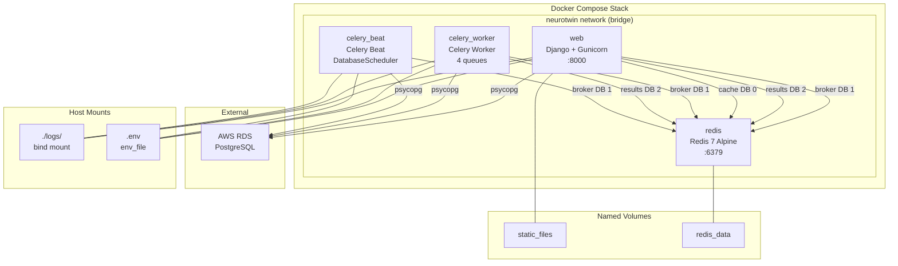
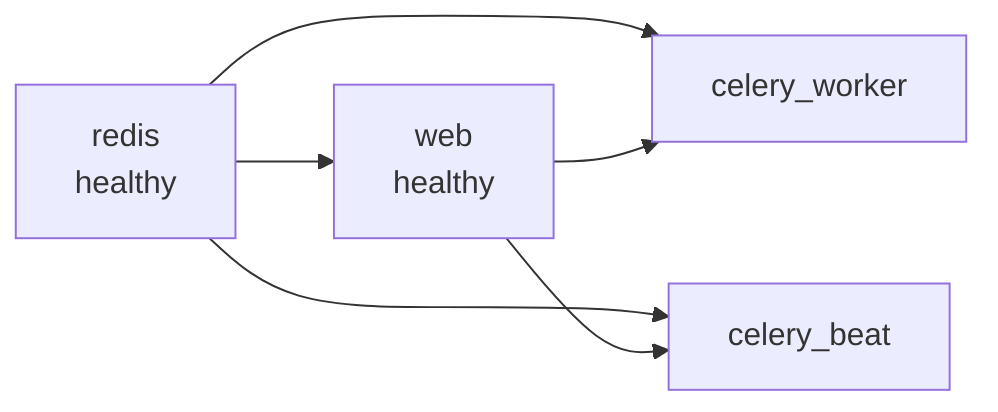
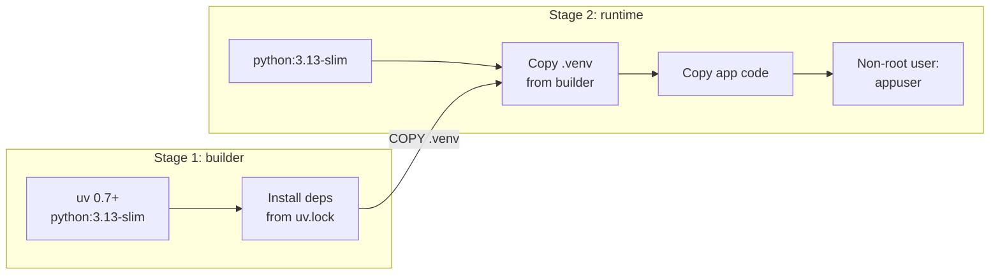

# Design Document

## Overview

This design describes the Docker containerization of the NeuroTwin Django backend for deployment on AWS EC2 instances. The architecture uses a multi-stage Dockerfile with `uv` for fast dependency installation, Docker Compose for service orchestration, and an entrypoint script for container initialization. The stack consists of four services: a Gunicorn-served Django web app, a Celery worker, a Celery Beat scheduler, and Redis. PostgreSQL remains external on AWS RDS.

The design prioritizes production readiness on first run: health checks gate service startup ordering, the entrypoint handles migrations and static file collection, and all services share a single built image with different CMD overrides.

## Architecture



### Service Dependency Chain



`celery_worker` and `celery_beat` depend on both `redis` (for broker) and `web` (which runs migrations via its entrypoint). This ensures the database schema is up to date before workers start consuming tasks.

### Multi-Stage Build



## Components and Interfaces

### 1. Dockerfile

A multi-stage build producing a minimal production image.

**Builder stage:**
- Base: `python:3.13-slim`
- Installs `uv` via the official installer image (`ghcr.io/astral-sh/uv`)
- Copies `pyproject.toml` and `uv.lock` first (layer caching)
- Runs `uv sync --frozen --no-dev` to install production dependencies into `.venv`

**Runtime stage:**
- Base: `python:3.13-slim`
- Installs only runtime system deps (`libpq5` for PostgreSQL, `curl` for health checks)
- Copies `.venv` from builder
- Copies application code
- Creates non-root `appuser` (UID 1000)
- Creates `logs/` directory with write permissions
- Sets `DJANGO_SETTINGS_MODULE=neurotwin.settings`
- Exposes port 8000
- Default CMD: Gunicorn

### 2. Entrypoint Script (`docker/entrypoint.sh`)

Initialization sequence executed before the main process:

```
1. Wait for database (loop with pg_isready or Python check)
2. Run `python manage.py migrate --noinput`
3. Run `python manage.py collectstatic --noinput`
4. exec "$@" (hand off to CMD — Gunicorn, Celery worker, or Celery beat)
```

Each step prints a timestamped log message. If migration or collectstatic fails, the script exits with a non-zero code, causing Docker to mark the container as failed.

The database wait uses a Python-based check (`django.db.connection.ensure_connection()`) to avoid requiring `pg_isready` as a system dependency.

### 3. Docker Compose Services

| Service | Image | CMD | Ports | Depends On |
|---------|-------|-----|-------|------------|
| `redis` | `redis:7-alpine` | `redis-server --appendonly yes --maxmemory 256mb --maxmemory-policy allkeys-lru` | `6379:6379` | — |
| `web` | Built from Dockerfile | `gunicorn neurotwin.wsgi:application --bind 0.0.0.0:8000 ...` | `8000:8000` | `redis` (healthy) |
| `celery_worker` | Same image as `web` | `celery -A neurotwin worker -l info -Q default,high_priority,incoming_messages,outgoing_messages --concurrency ${CELERY_CONCURRENCY:-4}` | — | `redis` (healthy), `web` (healthy) |
| `celery_beat` | Same image as `web` | `celery -A neurotwin beat -l info --scheduler django_celery_beat.schedulers:DatabaseScheduler` | — | `redis` (healthy), `web` (healthy) |

### 4. Settings Changes (`neurotwin/settings.py`)

Add `STATIC_ROOT` for `collectstatic`:
```python
STATIC_ROOT = BASE_DIR / 'staticfiles'
```

This is separate from `STATICFILES_DIRS` (which lists source directories). `collectstatic` gathers files from all sources into `STATIC_ROOT`.

### 5. Dependency Addition (`pyproject.toml`)

Add `gunicorn` to project dependencies:
```toml
"gunicorn>=23.0.0",
```

### 6. `.dockerignore`

Excludes unnecessary files from the build context to speed up builds and reduce image size:
- `.venv/`, `.git/`, `__pycache__/`
- `neuro-frontend/`, `node_modules/`
- `.env`, `logs/`, `*.log`
- `.hypothesis/`, `tests/`, `docs/`

### 7. `.env.example` Updates

New Docker-specific variables:
```
GUNICORN_WORKERS=4
GUNICORN_TIMEOUT=120
CELERY_CONCURRENCY=4
```

## Data Models

No new database models are introduced. This feature is purely infrastructure configuration.

Existing data flows remain unchanged:
- Django ORM connects to PostgreSQL via `DB_*` environment variables
- Redis DB 0 for caching, DB 1 for Celery broker, DB 2 for Celery results
- Celery Beat reads schedules from `django_celery_beat` database tables

### Volume Mapping

| Volume/Mount | Type | Container Path | Purpose |
|---|---|---|---|
| `redis_data` | Named volume | `/data` | Redis AOF persistence |
| `static_files` | Named volume | `/app/staticfiles` | Collected Django static files |
| `./logs` | Bind mount | `/app/logs` | Application log files (host-accessible) |

## Error Handling

### Container Startup Failures

| Failure | Behavior | Recovery |
|---------|----------|----------|
| Database unreachable | Entrypoint retries connection with backoff (max 30 attempts, 2s interval) | Container exits after max retries; `restart: unless-stopped` triggers restart |
| Migration fails | Entrypoint exits with code 1 | Container restarts; manual intervention may be needed for broken migrations |
| `collectstatic` fails | Entrypoint exits with code 1 | Container restarts; check for missing static file directories |
| Redis unreachable | Web starts but cache falls back; Celery retries broker connection via `CELERY_BROKER_CONNECTION_RETRY_ON_STARTUP` | Redis health check triggers restart; Celery auto-reconnects |

### Health Check Failures

| Service | Health Check | Interval | Retries | Action on Failure |
|---------|-------------|----------|---------|-------------------|
| `redis` | `redis-cli ping` | 10s | 3 | Container restart |
| `web` | `curl -f http://localhost:8000/api/v1/health/` | 30s | 3 | Container restart |
| `celery_worker` | `celery -A neurotwin inspect ping` | 60s | 3 | Container restart |
| `celery_beat` | Check for celery beat PID file existence | 60s | 3 | Container restart |

### Graceful Shutdown

- Gunicorn: `stop_grace_period: 30s` in Docker Compose + `--graceful-timeout 25` flag. On SIGTERM, Gunicorn finishes in-flight requests within the timeout.
- Celery Worker: On SIGTERM, Celery enters warm shutdown — completes currently executing tasks, then exits. The `task_acks_late=True` setting ensures unacknowledged tasks are requeued.
- Celery Beat: Exits cleanly on SIGTERM; no in-flight work to complete.

## Testing Strategy

This feature is infrastructure configuration (Dockerfiles, Compose files, shell scripts, settings changes). Property-based testing is NOT applicable here because:
- Dockerfiles and Compose files are declarative configuration, not functions with inputs/outputs
- The entrypoint script is a sequential initialization procedure, not a data transformation
- Settings changes are static configuration additions

### Recommended Testing Approach

**Manual/Integration Testing:**
1. `docker compose build` — verify image builds successfully
2. `docker compose up -d` — verify all services start and become healthy
3. `curl http://localhost:8000/api/v1/health/` — verify web service responds
4. `docker compose exec celery_worker celery -A neurotwin inspect ping` — verify worker is connected
5. `docker compose logs web` — verify entrypoint ran migrations and collectstatic
6. `docker compose down && docker compose up -d` — verify restart behavior and volume persistence

**Smoke Tests:**
- Verify Redis connectivity: `docker compose exec redis redis-cli ping`
- Verify static files collected: `docker compose exec web ls /app/staticfiles/`
- Verify log bind mount: check `./logs/` on host for log files after requests

**Configuration Validation:**
- Verify `.env` variables are passed through: `docker compose exec web env | grep REDIS_HOST`
- Verify non-root user: `docker compose exec web whoami` should return `appuser`
- Verify Celery queues: check worker logs for all 4 queues registered
