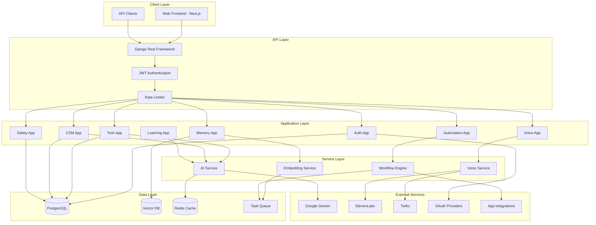

# Design Document: NeuroTwin Platform

## Overview

NeuroTwin is a cognitive digital twin platform built with Django 6.0+ and Django Rest Framework. The system creates AI replicas of users that can learn their communication patterns, make decisions on their behalf, and execute automated workflows across connected applications.

The architecture follows a modular Django application structure with clear separation between:
- **Authentication & User Management**: JWT-based auth with OAuth support
- **Cognitive Engine**: CSM profiles, vector memory, and learning loops
- **Automation Hub**: Integration management and workflow execution
- **Voice Twin**: Phone capabilities via Twilio and ElevenLabs
- **Safety Layer**: Permissions, audit logging, and kill switch

## Architecture



## Components and Interfaces

### 1. Authentication App (`apps/auth`)

Handles user registration, login, OAuth, and session management.

```python
# apps/auth/services.py
from dataclasses import dataclass
from typing import Optional
from datetime import datetime, timedelta

@dataclass
class AuthResult:
    success: bool
    user_id: Optional[str] = None
    token: Optional[str] = None
    error: Optional[str] = None

class AuthService:
    """Handles authentication operations."""
    
    def register(self, email: str, password: str) -> AuthResult:
        """Create new account and send verification email."""
        pass
    
    def verify_email(self, token: str) -> AuthResult:
        """Activate account via verification link."""
        pass
    
    def login(self, email: str, password: str) -> AuthResult:
        """Authenticate user and return JWT token."""
        pass
    
    def oauth_callback(self, provider: str, code: str) -> AuthResult:
        """Handle OAuth callback and create/link account."""
        pass
    
    def request_password_reset(self, email: str) -> bool:
        """Send password reset link valid for 24 hours."""
        pass
    
    def reset_password(self, token: str, new_password: str) -> AuthResult:
        """Reset password using valid reset token."""
        pass
    
    def validate_token(self, token: str) -> Optional[str]:
        """Validate JWT and return user_id if valid."""
        pass
```

### 2. Twin App (`apps/twin`)

Manages Twin creation, configuration, and the onboarding flow.

```python
# apps/twin/services.py
from dataclasses import dataclass
from typing import Optional, List
from enum import Enum

class AIModel(Enum):
    GEMINI_FLASH = "gemini-3-flash"
    QWEN = "qwen"
    MISTRAL = "mistral"
    GEMINI_PRO = "gemini-3-pro"

@dataclass
class QuestionnaireResponse:
    communication_style: dict
    decision_patterns: dict
    preferences: dict

@dataclass
class Twin:
    id: str
    user_id: str
    model: AIModel
    cognitive_blend: int  # 0-100
    csm_id: str
    memory_engine_id: str
    created_at: datetime
    is_active: bool

class TwinService:
    """Manages Twin lifecycle and configuration."""
    
    def start_onboarding(self, user_id: str) -> dict:
        """Return cognitive questionnaire for new user."""
        pass
    
    def complete_onboarding(
        self, 
        user_id: str, 
        responses: QuestionnaireResponse,
        model: AIModel,
        cognitive_blend: int
    ) -> Twin:
        """Create Twin with initial CSM from questionnaire responses."""
        pass
    
    def update_cognitive_blend(self, twin_id: str, blend: int) -> Twin:
        """Update the cognitive blend setting (0-100)."""
        pass
    
    def get_twin(self, user_id: str) -> Optional[Twin]:
        """Retrieve user's Twin."""
        pass
    
    def deactivate_twin(self, twin_id: str) -> bool:
        """Deactivate Twin (kill switch)."""
        pass
```

### 3. CSM App (`apps/csm`)

Manages Cognitive Signature Model profiles.

```python
# apps/csm/models.py
from dataclasses import dataclass, field
from typing import List, Dict, Optional
from datetime import datetime
import json

@dataclass
class PersonalityTraits:
    openness: float  # 0.0-1.0
    conscientiousness: float
    extraversion: float
    agreeableness: float
    neuroticism: float

@dataclass
class TonePreferences:
    formality: float  # 0.0 casual - 1.0 formal
    warmth: float
    directness: float
    humor_level: float

@dataclass
class CommunicationHabits:
    preferred_greeting: str
    sign_off_style: str
    response_length: str  # "brief", "moderate", "detailed"
    emoji_usage: str  # "none", "minimal", "moderate", "frequent"

@dataclass
class DecisionStyle:
    risk_tolerance: float  # 0.0 conservative - 1.0 aggressive
    speed_vs_accuracy: float  # 0.0 thorough - 1.0 quick
    collaboration_preference: float  # 0.0 independent - 1.0 collaborative

@dataclass
class CSMProfile:
    id: str
    user_id: str
    version: int
    personality: PersonalityTraits
    tone: TonePreferences
    vocabulary_patterns: List[str]
    communication: CommunicationHabits
    decision_style: DecisionStyle
    custom_rules: Dict[str, str]
    created_at: datetime
    updated_at: datetime
    
    def to_json(self) -> str:
        """Serialize CSM to JSON for storage."""
        pass
    
    @classmethod
    def from_json(cls, json_str: str) -> 'CSMProfile':
        """Deserialize CSM from JSON."""
        pass
```

```python
# apps/csm/services.py
from typing import Optional, List

class CSMService:
    """Manages CSM profiles and versioning."""
    
    def create_from_questionnaire(
        self, 
        user_id: str, 
        responses: QuestionnaireResponse
    ) -> CSMProfile:
        """Generate initial CSM from onboarding responses."""
        pass
    
    def get_profile(self, user_id: str) -> Optional[CSMProfile]:
        """Get current CSM profile for user."""
        pass
    
    def update_profile(
        self, 
        profile_id: str, 
        updates: dict
    ) -> CSMProfile:
        """Update CSM and create new version in history."""
        pass
    
    def get_version_history(self, user_id: str) -> List[CSMProfile]:
        """Get all historical versions of user's CSM."""
        pass
    
    def rollback_to_version(self, user_id: str, version: int) -> CSMProfile:
        """Restore CSM to a previous version."""
        pass
    
    def apply_blend(self, profile: CSMProfile, blend: int) -> dict:
        """Apply cognitive blend to profile for response generation."""
        pass
```

### 4. Memory App (`apps/memory`)

Handles vector memory storage and semantic retrieval.

```python
# apps/memory/services.py
from dataclasses import dataclass
from typing import List, Optional
from datetime import datetime

@dataclass
class Memory:
    id: str
    user_id: str
    content: str
    embedding: List[float]
    source: str  # "conversation", "action", "feedback"
    timestamp: datetime
    relevance_score: Optional[float] = None

@dataclass
class MemoryQuery:
    query_text: str
    max_results: int = 10
    min_relevance: float = 0.5
    recency_weight: float = 0.3

class VectorMemoryEngine:
    """Manages semantic memory storage and retrieval."""
    
    async def store_memory(
        self, 
        user_id: str, 
        content: str, 
        source: str
    ) -> Memory:
        """Asynchronously generate embedding and store memory."""
        pass
    
    def retrieve_relevant(
        self, 
        user_id: str, 
        query: MemoryQuery
    ) -> List[Memory]:
        """Retrieve semantically relevant memories with timestamps."""
        pass
    
    def validate_memory_exists(self, memory_id: str) -> bool:
        """Verify a memory actually exists before referencing."""
        pass
    
    def get_memory_with_source(self, memory_id: str) -> Optional[Memory]:
        """Get memory with source timestamp for validation."""
        pass
```

### 5. Learning App (`apps/learning`)

Implements the learning loop for continuous improvement.

```python
# apps/learning/services.py
from dataclasses import dataclass
from typing import Dict, Any
from enum import Enum

class FeedbackType(Enum):
    POSITIVE = "positive"
    NEGATIVE = "negative"
    CORRECTION = "correction"

@dataclass
class ExtractedFeatures:
    action_type: str
    context: dict
    patterns: List[str]
    sentiment: float

@dataclass
class LearningEvent:
    id: str
    user_id: str
    action: str
    features: ExtractedFeatures
    profile_updates: dict
    feedback: Optional[FeedbackType]
    timestamp: datetime

class LearningService:
    """Implements the learning loop for Twin improvement."""
    
    async def process_user_action(
        self, 
        user_id: str, 
        action: dict
    ) -> ExtractedFeatures:
        """Extract features from user action for learning."""
        pass
    
    async def update_profile(
        self, 
        user_id: str, 
        features: ExtractedFeatures
    ) -> dict:
        """Asynchronously update CSM based on extracted features."""
        pass
    
    def apply_feedback(
        self, 
        user_id: str, 
        action_id: str, 
        feedback: FeedbackType
    ) -> bool:
        """Reinforce or correct behavior based on user feedback."""
        pass
    
    def get_learning_history(self, user_id: str) -> List[LearningEvent]:
        """Get history of learning events for transparency."""
        pass
```

### 6. Automation App (`apps/automation`)

Manages integrations and workflow execution.

```python
# apps/automation/models.py
from dataclasses import dataclass
from typing import List, Dict, Optional
from enum import Enum
from datetime import datetime

class IntegrationType(Enum):
    WHATSAPP = "whatsapp"
    TELEGRAM = "telegram"
    SLACK = "slack"
    GMAIL = "gmail"
    OUTLOOK = "outlook"
    GOOGLE_CALENDAR = "google_calendar"
    GOOGLE_DOCS = "google_docs"
    MICROSOFT_OFFICE = "microsoft_office"
    ZOOM = "zoom"
    GOOGLE_MEET = "google_meet"
    CRM = "crm"

@dataclass
class Integration:
    id: str
    user_id: str
    type: IntegrationType
    oauth_token: str
    refresh_token: Optional[str]
    scopes: List[str]
    steering_rules: Dict[str, Any]
    permissions: Dict[str, bool]
    token_expires_at: datetime
    is_active: bool

@dataclass
class WorkflowStep:
    integration: IntegrationType
    action: str
    parameters: dict
    requires_confirmation: bool

@dataclass
class Workflow:
    id: str
    user_id: str
    name: str
    trigger: str
    steps: List[WorkflowStep]
    is_active: bool
```

```python
# apps/automation/services.py
from typing import List, Optional
from dataclasses import dataclass

@dataclass
class WorkflowResult:
    success: bool
    steps_completed: int
    error: Optional[str] = None
    requires_confirmation: bool = False

class IntegrationService:
    """Manages app integrations and OAuth tokens."""
    
    def connect_integration(
        self, 
        user_id: str, 
        integration_type: IntegrationType,
        oauth_code: str
    ) -> Integration:
        """Connect integration with minimal required scopes."""
        pass
    
    def get_integrations(self, user_id: str) -> List[Integration]:
        """Get all connected integrations for user."""
        pass
    
    def update_permissions(
        self, 
        integration_id: str, 
        permissions: dict
    ) -> Integration:
        """Update integration permissions."""
        pass
    
    def refresh_token(self, integration_id: str) -> bool:
        """Attempt to refresh expired OAuth token."""
        pass
    
    def disconnect(self, integration_id: str) -> bool:
        """Disconnect and remove integration."""
        pass

class WorkflowEngine:
    """Executes automated workflows across integrations."""
    
    async def execute_workflow(
        self, 
        workflow_id: str,
        permission_flag: bool,
        cognitive_blend: int
    ) -> WorkflowResult:
        """Execute workflow asynchronously with permission checks."""
        pass
    
    def verify_permissions(
        self, 
        user_id: str, 
        workflow: Workflow
    ) -> bool:
        """Verify user has granted all required permissions."""
        pass
    
    def requires_confirmation(self, cognitive_blend: int, action: str) -> bool:
        """Check if action requires user confirmation based on blend."""
        pass
```

### 7. Voice App (`apps/voice`)

Handles Voice Twin phone capabilities.

```python
# apps/voice/services.py
from dataclasses import dataclass
from typing import Optional
from datetime import datetime

@dataclass
class VoiceProfile:
    id: str
    user_id: str
    phone_number: str
    voice_clone_id: str
    is_approved: bool
    approval_expires_at: Optional[datetime]

@dataclass
class CallRecord:
    id: str
    user_id: str
    direction: str  # "inbound", "outbound"
    phone_number: str
    transcript: str
    duration_seconds: int
    started_at: datetime
    ended_at: datetime

class VoiceTwinService:
    """Manages Voice Twin phone capabilities."""
    
    def provision_phone_number(self, user_id: str) -> str:
        """Provision virtual phone number via Twilio."""
        pass
    
    def create_voice_clone(
        self, 
        user_id: str, 
        audio_samples: List[bytes]
    ) -> str:
        """Create voice clone via ElevenLabs."""
        pass
    
    def approve_voice_session(self, user_id: str) -> bool:
        """Grant explicit approval for voice cloning session."""
        pass
    
    async def handle_inbound_call(
        self, 
        user_id: str, 
        caller_number: str
    ) -> CallRecord:
        """Handle incoming call with cloned voice and CSM."""
        pass
    
    async def make_outbound_call(
        self, 
        user_id: str, 
        target_number: str,
        script: Optional[str]
    ) -> CallRecord:
        """Make outbound call with cloned voice."""
        pass
    
    def terminate_call(self, call_id: str) -> bool:
        """Kill switch - immediately terminate call."""
        pass
    
    def get_call_transcript(self, call_id: str) -> Optional[str]:
        """Retrieve transcript for a call."""
        pass
```

### 8. Safety App (`apps/safety`)

Implements permissions, audit logging, and kill switch.

```python
# apps/safety/models.py
from dataclasses import dataclass
from typing import Dict, Any, Optional
from datetime import datetime
from enum import Enum

class ActionType(Enum):
    READ = "read"
    WRITE = "write"
    SEND = "send"
    DELETE = "delete"
    FINANCIAL = "financial"
    LEGAL = "legal"
    CALL = "call"

@dataclass
class PermissionScope:
    integration: str
    action_type: ActionType
    is_granted: bool
    requires_approval: bool  # Per-action approval needed

@dataclass
class AuditEntry:
    id: str
    user_id: str
    twin_id: str
    timestamp: datetime
    action_type: ActionType
    target_integration: str
    input_data: dict
    outcome: str  # "success", "failure", "pending_approval"
    cognitive_blend: int
    reasoning_chain: Optional[str]
    is_twin_generated: bool
```

```python
# apps/safety/services.py
from typing import List, Optional
from datetime import datetime, timedelta

class PermissionService:
    """Manages permission scopes and action authorization."""
    
    def get_permissions(self, user_id: str) -> List[PermissionScope]:
        """Get all permission scopes for user."""
        pass
    
    def update_permission(
        self, 
        user_id: str, 
        scope: PermissionScope
    ) -> bool:
        """Update a permission scope."""
        pass
    
    def check_permission(
        self, 
        user_id: str, 
        integration: str, 
        action_type: ActionType
    ) -> tuple[bool, bool]:
        """Check if action is permitted and if approval needed."""
        pass
    
    def is_high_risk_action(self, action_type: ActionType) -> bool:
        """Check if action is financial, legal, or irreversible."""
        pass

class AuditService:
    """Manages immutable audit logging."""
    
    def log_action(
        self,
        user_id: str,
        twin_id: str,
        action_type: ActionType,
        target: str,
        input_data: dict,
        outcome: str,
        cognitive_blend: int,
        reasoning: Optional[str] = None
    ) -> AuditEntry:
        """Log Twin action with full context."""
        pass
    
    def get_audit_history(
        self,
        user_id: str,
        filters: Optional[dict] = None,
        start_date: Optional[datetime] = None,
        end_date: Optional[datetime] = None
    ) -> List[AuditEntry]:
        """Get filterable audit history."""
        pass
    
    def verify_log_integrity(self, entry_id: str) -> bool:
        """Verify audit entry hasn't been tampered with."""
        pass

class KillSwitchService:
    """Emergency controls for Twin behavior."""
    
    def activate_kill_switch(self, user_id: str) -> bool:
        """Immediately halt all Twin automations."""
        pass
    
    def is_kill_switch_active(self, user_id: str) -> bool:
        """Check if kill switch is currently active."""
        pass
    
    def deactivate_kill_switch(self, user_id: str) -> bool:
        """Re-enable Twin automations."""
        pass
    
    def get_undo_window(self, action_id: str) -> Optional[datetime]:
        """Get deadline for undoing a reversible action."""
        pass
    
    def undo_action(self, action_id: str) -> bool:
        """Undo a reversible action within time window."""
        pass
```

### 9. Subscription App (`apps/subscription`)

Manages pricing tiers and feature access.

```python
# apps/subscription/models.py
from dataclasses import dataclass
from typing import List
from datetime import datetime
from enum import Enum

class SubscriptionTier(Enum):
    FREE = "free"
    PRO = "pro"
    TWIN_PLUS = "twin_plus"
    EXECUTIVE = "executive"

@dataclass
class TierFeatures:
    available_models: List[str]
    has_cognitive_learning: bool
    has_voice_twin: bool
    has_autonomous_workflows: bool
    has_custom_models: bool

@dataclass
class Subscription:
    id: str
    user_id: str
    tier: SubscriptionTier
    started_at: datetime
    expires_at: Optional[datetime]
    is_active: bool
```

```python
# apps/subscription/services.py
class SubscriptionService:
    """Manages subscriptions and feature access."""
    
    def get_subscription(self, user_id: str) -> Subscription:
        """Get user's current subscription."""
        pass
    
    def get_tier_features(self, tier: SubscriptionTier) -> TierFeatures:
        """Get features available for a tier."""
        pass
    
    def upgrade(self, user_id: str, new_tier: SubscriptionTier) -> Subscription:
        """Upgrade subscription and enable features immediately."""
        pass
    
    def downgrade(self, user_id: str, new_tier: SubscriptionTier) -> Subscription:
        """Downgrade subscription while preserving data."""
        pass
    
    def check_feature_access(self, user_id: str, feature: str) -> bool:
        """Check if user has access to a specific feature."""
        pass
    
    def handle_lapsed_subscription(self, user_id: str) -> Subscription:
        """Downgrade to Free tier when subscription lapses."""
        pass
```

### 10. AI Service (`core/ai`)

Centralized AI model interaction service.

```python
# core/ai/services.py
from dataclasses import dataclass
from typing import Optional, List
from enum import Enum

@dataclass
class AIResponse:
    content: str
    model_used: str
    tokens_used: int
    reasoning_chain: Optional[str]

class AIService:
    """Centralized AI model interaction."""
    
    def generate_response(
        self,
        prompt: str,
        csm_profile: CSMProfile,
        cognitive_blend: int,
        model: AIModel,
        context_memories: List[Memory]
    ) -> AIResponse:
        """Generate response with personality matching."""
        pass
    
    def extract_features(self, action: dict) -> ExtractedFeatures:
        """Extract learning features from user action."""
        pass
    
    def generate_embeddings(self, text: str) -> List[float]:
        """Generate embeddings for vector storage."""
        pass
```

## Data Models

### PostgreSQL Schema

```sql
-- Users and Authentication
CREATE TABLE users (
    id UUID PRIMARY KEY DEFAULT gen_random_uuid(),
    email VARCHAR(255) UNIQUE NOT NULL,
    password_hash VARCHAR(255),
    is_verified BOOLEAN DEFAULT FALSE,
    oauth_provider VARCHAR(50),
    oauth_id VARCHAR(255),
    created_at TIMESTAMP DEFAULT NOW(),
    updated_at TIMESTAMP DEFAULT NOW()
);

CREATE TABLE sessions (
    id UUID PRIMARY KEY DEFAULT gen_random_uuid(),
    user_id UUID REFERENCES users(id),
    token_hash VARCHAR(255) NOT NULL,
    expires_at TIMESTAMP NOT NULL,
    created_at TIMESTAMP DEFAULT NOW()
);

-- Subscriptions
CREATE TABLE subscriptions (
    id UUID PRIMARY KEY DEFAULT gen_random_uuid(),
    user_id UUID REFERENCES users(id) UNIQUE,
    tier VARCHAR(20) NOT NULL DEFAULT 'free',
    started_at TIMESTAMP DEFAULT NOW(),
    expires_at TIMESTAMP,
    is_active BOOLEAN DEFAULT TRUE
);

-- Twins
CREATE TABLE twins (
    id UUID PRIMARY KEY DEFAULT gen_random_uuid(),
    user_id UUID REFERENCES users(id) UNIQUE,
    model VARCHAR(50) NOT NULL,
    cognitive_blend INTEGER CHECK (cognitive_blend >= 0 AND cognitive_blend <= 100),
    is_active BOOLEAN DEFAULT TRUE,
    kill_switch_active BOOLEAN DEFAULT FALSE,
    created_at TIMESTAMP DEFAULT NOW(),
    updated_at TIMESTAMP DEFAULT NOW()
);

-- CSM Profiles with versioning
CREATE TABLE csm_profiles (
    id UUID PRIMARY KEY DEFAULT gen_random_uuid(),
    user_id UUID REFERENCES users(id),
    version INTEGER NOT NULL,
    profile_data JSONB NOT NULL,
    created_at TIMESTAMP DEFAULT NOW(),
    UNIQUE(user_id, version)
);

-- Integrations
CREATE TABLE integrations (
    id UUID PRIMARY KEY DEFAULT gen_random_uuid(),
    user_id UUID REFERENCES users(id),
    type VARCHAR(50) NOT NULL,
    oauth_token_encrypted BYTEA,
    refresh_token_encrypted BYTEA,
    scopes JSONB,
    steering_rules JSONB,
    permissions JSONB,
    token_expires_at TIMESTAMP,
    is_active BOOLEAN DEFAULT TRUE,
    created_at TIMESTAMP DEFAULT NOW(),
    UNIQUE(user_id, type)
);

-- Workflows
CREATE TABLE workflows (
    id UUID PRIMARY KEY DEFAULT gen_random_uuid(),
    user_id UUID REFERENCES users(id),
    name VARCHAR(255) NOT NULL,
    trigger_config JSONB NOT NULL,
    steps JSONB NOT NULL,
    is_active BOOLEAN DEFAULT TRUE,
    created_at TIMESTAMP DEFAULT NOW()
);

-- Voice Profiles
CREATE TABLE voice_profiles (
    id UUID PRIMARY KEY DEFAULT gen_random_uuid(),
    user_id UUID REFERENCES users(id) UNIQUE,
    phone_number VARCHAR(20),
    voice_clone_id VARCHAR(255),
    is_approved BOOLEAN DEFAULT FALSE,
    approval_expires_at TIMESTAMP,
    created_at TIMESTAMP DEFAULT NOW()
);

-- Call Records
CREATE TABLE call_records (
    id UUID PRIMARY KEY DEFAULT gen_random_uuid(),
    user_id UUID REFERENCES users(id),
    direction VARCHAR(10) NOT NULL,
    phone_number VARCHAR(20) NOT NULL,
    transcript TEXT,
    duration_seconds INTEGER,
    started_at TIMESTAMP NOT NULL,
    ended_at TIMESTAMP
);

-- Permissions
CREATE TABLE permission_scopes (
    id UUID PRIMARY KEY DEFAULT gen_random_uuid(),
    user_id UUID REFERENCES users(id),
    integration VARCHAR(50) NOT NULL,
    action_type VARCHAR(20) NOT NULL,
    is_granted BOOLEAN DEFAULT FALSE,
    requires_approval BOOLEAN DEFAULT TRUE,
    updated_at TIMESTAMP DEFAULT NOW(),
    UNIQUE(user_id, integration, action_type)
);

-- Audit Log (append-only, tamper-evident)
CREATE TABLE audit_log (
    id UUID PRIMARY KEY DEFAULT gen_random_uuid(),
    user_id UUID REFERENCES users(id),
    twin_id UUID REFERENCES twins(id),
    timestamp TIMESTAMP DEFAULT NOW(),
    action_type VARCHAR(20) NOT NULL,
    target_integration VARCHAR(50),
    input_data JSONB,
    outcome VARCHAR(20) NOT NULL,
    cognitive_blend INTEGER,
    reasoning_chain TEXT,
    is_twin_generated BOOLEAN DEFAULT TRUE,
    checksum VARCHAR(64) NOT NULL  -- SHA-256 for tamper detection
);

-- Learning Events
CREATE TABLE learning_events (
    id UUID PRIMARY KEY DEFAULT gen_random_uuid(),
    user_id UUID REFERENCES users(id),
    action_type VARCHAR(50) NOT NULL,
    features JSONB NOT NULL,
    profile_updates JSONB,
    feedback VARCHAR(20),
    timestamp TIMESTAMP DEFAULT NOW()
);

-- Indexes for common queries
CREATE INDEX idx_audit_user_timestamp ON audit_log(user_id, timestamp DESC);
CREATE INDEX idx_csm_user_version ON csm_profiles(user_id, version DESC);
CREATE INDEX idx_integrations_user ON integrations(user_id);
CREATE INDEX idx_learning_user ON learning_events(user_id, timestamp DESC);
```

### Vector Database Schema (for embeddings)

```python
# Memory collection schema
{
    "collection": "user_memories",
    "fields": {
        "id": "string",
        "user_id": "string",
        "content": "string",
        "embedding": "vector[1536]",  # Dimension depends on model
        "source": "string",
        "timestamp": "datetime",
        "metadata": "json"
    },
    "indexes": [
        {"field": "user_id", "type": "filter"},
        {"field": "embedding", "type": "vector", "metric": "cosine"},
        {"field": "timestamp", "type": "range"}
    ]
}
```


## Correctness Properties

*A property is a characteristic or behavior that should hold true across all valid executions of a system—essentially, a formal statement about what the system should do. Properties serve as the bridge between human-readable specifications and machine-verifiable correctness guarantees.*

### Authentication Properties

**Property 1: Registration creates account**
*For any* valid email and password combination, registration SHALL create a new user account and queue a verification email.
**Validates: Requirements 1.1**

**Property 2: Verification activates account**
*For any* valid verification token, clicking the verification link SHALL activate the associated account and enable login.
**Validates: Requirements 1.2**

**Property 3: Valid credentials authenticate**
*For any* user with valid credentials, login SHALL succeed and return a valid JWT session token.
**Validates: Requirements 1.3**

**Property 4: Invalid credentials reject**
*For any* invalid credential combination (wrong email, wrong password, or non-existent user), login SHALL fail and return an error message.
**Validates: Requirements 1.4**

**Property 5: Expired tokens require re-authentication**
*For any* expired session token, authentication SHALL fail and require the user to re-authenticate.
**Validates: Requirements 1.6**

**Property 6: Password reset token validity**
*For any* password reset request, the system SHALL generate a reset token that expires after exactly 24 hours.
**Validates: Requirements 1.7**

### Twin and CSM Properties

**Property 7: Questionnaire generates CSM**
*For any* completed onboarding questionnaire, the system SHALL generate a valid CSM profile containing all required fields (personality, tone, vocabulary, communication, decision style).
**Validates: Requirements 2.2, 4.1**

**Property 8: Cognitive blend storage and application**
*For any* cognitive blend value (0-100), the system SHALL store the value and apply it proportionally to all Twin responses.
**Validates: Requirements 2.5, 4.2**

**Property 9: Cognitive blend behavior ranges**
*For any* cognitive blend value:
- 0-30%: Twin uses pure AI logic with minimal personality mimicry
- 31-70%: Twin balances user personality with AI reasoning
- 71-100%: Twin heavily mimics personality and requires confirmation before actions
**Validates: Requirements 4.3, 4.4, 4.5**

**Property 10: CSM JSON serialization round-trip**
*For any* valid CSM profile, serializing to JSON then deserializing SHALL produce an equivalent CSM profile.
**Validates: Requirements 4.6**

**Property 11: CSM version history and rollback**
*For any* CSM update, the system SHALL maintain version history, and rolling back to any previous version SHALL restore that exact state.
**Validates: Requirements 4.7, 6.6, 12.4, 12.5**

### Memory Properties

**Property 12: Interaction embedding storage**
*For any* user interaction, the system SHALL asynchronously generate an embedding and store it in the vector database.
**Validates: Requirements 5.1, 5.2**

**Property 13: Memory retrieval relevance**
*For any* context query, the memory engine SHALL return memories ordered by relevance and recency scoring.
**Validates: Requirements 5.3, 5.7**

**Property 14: Memory existence validation**
*For any* memory reference made by the Twin, that memory SHALL exist in the vector store (no fabrication).
**Validates: Requirements 5.4**

**Property 15: Memory timestamp inclusion**
*For any* memory read operation, the result SHALL include the source timestamp for validation.
**Validates: Requirements 5.6**

### Learning Properties

**Property 16: Learning loop processing**
*For any* user action, the learning system SHALL extract features, update the CSM profile asynchronously, and shift Twin behavior accordingly.
**Validates: Requirements 6.1, 6.2, 6.3, 6.5**

**Property 17: Feedback reinforcement**
*For any* user feedback (positive, negative, or correction), the learning system SHALL reinforce or correct the associated behavior.
**Validates: Requirements 6.4**

### Subscription Properties

**Property 18: Tier feature access**
*For any* user on a given subscription tier, the system SHALL provide access to exactly the features defined for that tier and deny access to features of higher tiers.
**Validates: Requirements 3.2, 3.3, 3.4, 3.5**

**Property 19: Tier change preserves data**
*For any* subscription upgrade or downgrade, the system SHALL adjust feature access immediately while preserving all existing user data.
**Validates: Requirements 3.6**

**Property 20: Lapsed subscription downgrade**
*For any* lapsed subscription, the system SHALL automatically downgrade to Free tier and disable premium features.
**Validates: Requirements 3.7**

### Automation Properties

**Property 21: Permission verification before action**
*For any* Twin action attempt, the system SHALL verify the action falls within granted permission scopes before execution.
**Validates: Requirements 8.1, 10.2**

**Property 22: External action permission flag**
*For any* action on external integrations, the Twin SHALL NOT execute unless permission_flag=True.
**Validates: Requirements 8.2**

**Property 23: Workflow async execution**
*For any* workflow execution, the system SHALL execute asynchronously without blocking user interactions.
**Validates: Requirements 8.3**

**Property 24: Workflow error logging**
*For any* failed workflow step, the system SHALL log the error and notify the user.
**Validates: Requirements 8.4**

**Property 25: High blend confirmation requirement**
*For any* external action when Cognitive_Blend exceeds 80%, the system SHALL require explicit user confirmation before execution.
**Validates: Requirements 8.5**

**Property 26: Content origin tracking**
*For any* content in integrations, the system SHALL distinguish Twin-generated content from user-authored content.
**Validates: Requirements 8.6**

### Integration Properties

**Property 27: Minimal OAuth scopes**
*For any* integration connection, the system SHALL request only the minimum necessary OAuth scopes.
**Validates: Requirements 7.2**

**Property 28: Integration configurability**
*For any* connected integration, the user SHALL be able to configure steering rules and modify permissions.
**Validates: Requirements 7.3, 7.4**

**Property 29: Token refresh handling**
*For any* expired integration token, the system SHALL attempt refresh or notify the user to reconnect.
**Validates: Requirements 7.5**

### Voice Properties

**Property 30: Phone number provisioning**
*For any* Voice_Twin enablement, the system SHALL provision a virtual phone number.
**Validates: Requirements 9.1**

**Property 31: Call transcript storage**
*For any* phone call (inbound or outbound), the system SHALL generate and store a transcript.
**Validates: Requirements 9.5**

**Property 32: Voice session approval requirement**
*For any* voice cloning session, the system SHALL require separate explicit approval that has not expired.
**Validates: Requirements 9.6**

**Property 33: Voice kill switch availability**
*For any* active call, the kill switch SHALL be available and immediately terminate the call when activated.
**Validates: Requirements 9.7**

### Safety Properties

**Property 34: Permission scope definition**
*For any* integration and action type combination, the permission system SHALL have a defined scope.
**Validates: Requirements 10.1**

**Property 35: High-risk action approval**
*For any* financial, legal, or irreversible action, the system SHALL require explicit per-action approval.
**Validates: Requirements 10.3, 10.4, 10.5**

**Property 36: Out-of-scope action handling**
*For any* action outside granted permission scope, the system SHALL request user approval before proceeding.
**Validates: Requirements 10.6**

**Property 37: Permission modifiability**
*For any* permission scope, the user SHALL be able to modify it at any time through settings.
**Validates: Requirements 10.7**

**Property 38: Comprehensive audit logging**
*For any* Twin action, the audit system SHALL log: timestamp, action type, target integration, input data, outcome, cognitive blend value, and reasoning chain.
**Validates: Requirements 11.1, 11.5**

**Property 39: Audit log immutability**
*For any* audit log entry, the system SHALL detect any tampering through checksum verification.
**Validates: Requirements 11.2**

**Property 40: Audit log filterability**
*For any* filter criteria (date range, action type, integration), the system SHALL return matching audit entries.
**Validates: Requirements 11.3**

**Property 41: Kill switch behavior**
*For any* kill switch activation, the system SHALL:
- Immediately halt all Twin automations
- Terminate all in-progress workflows and calls
- Prevent new automated actions until manually re-enabled
**Validates: Requirements 12.1, 12.2, 12.3**

**Property 42: Reversible action undo**
*For any* reversible Twin action within the configured time window, the undo operation SHALL successfully reverse the action.
**Validates: Requirements 12.6**

### API Properties

**Property 43: JSON response format**
*For any* API response, the body SHALL be valid JSON.
**Validates: Requirements 13.2**

**Property 44: JWT authentication enforcement**
*For any* protected API endpoint, requests without a valid JWT SHALL be rejected with 401 status.
**Validates: Requirements 13.3**

**Property 45: Error response format**
*For any* API error, the response SHALL include an appropriate HTTP status code and descriptive error message.
**Validates: Requirements 13.4**

**Property 46: Rate limiting enforcement**
*For any* client exceeding the rate limit, subsequent requests SHALL be rejected with 429 status until the limit resets.
**Validates: Requirements 13.5**

### Data Properties

**Property 47: Transaction integrity**
*For any* database write operation, the system SHALL use transactions to ensure data integrity (all-or-nothing).
**Validates: Requirements 14.3**

**Property 48: Async memory writes**
*For any* memory write operation, the write SHALL be asynchronous and not block the HTTP request.
**Validates: Requirements 14.5**

## Error Handling

### Authentication Errors

| Error Condition | Response | Recovery |
|----------------|----------|----------|
| Invalid email format | 400 Bad Request with validation message | User corrects email |
| Email already registered | 409 Conflict | User logs in or resets password |
| Invalid credentials | 401 Unauthorized | User retries or resets password |
| Expired verification token | 410 Gone | User requests new verification email |
| Expired session token | 401 Unauthorized | User re-authenticates |
| OAuth callback failure | 400 Bad Request | User retries OAuth flow |

### Twin/CSM Errors

| Error Condition | Response | Recovery |
|----------------|----------|----------|
| Invalid questionnaire response | 400 Bad Request | User corrects responses |
| CSM profile not found | 404 Not Found | System creates new profile |
| Invalid cognitive blend value | 400 Bad Request (must be 0-100) | User corrects value |
| CSM version not found | 404 Not Found | User selects valid version |
| CSM serialization failure | 500 Internal Server Error | System logs and retries |

### Memory Errors

| Error Condition | Response | Recovery |
|----------------|----------|----------|
| Embedding generation failure | Log error, retry async | Background retry with backoff |
| Vector DB connection failure | 503 Service Unavailable | Circuit breaker, fallback to recent cache |
| Memory not found | Return empty with acknowledgment | Twin acknowledges gap |

### Automation Errors

| Error Condition | Response | Recovery |
|----------------|----------|----------|
| Integration token expired | Attempt refresh, notify if fails | User reconnects integration |
| Permission denied | 403 Forbidden | User grants permission |
| Workflow step failure | Log error, notify user | User reviews and retries |
| External API failure | Log error, retry with backoff | Exponential backoff, notify after max retries |

### Voice Errors

| Error Condition | Response | Recovery |
|----------------|----------|----------|
| Phone provisioning failure | 503 Service Unavailable | Retry, notify user |
| Voice clone creation failure | Log error, notify user | User provides new samples |
| Call connection failure | Log error, notify user | User retries call |
| Transcript generation failure | Log error, store partial | Background retry |

### Safety Errors

| Error Condition | Response | Recovery |
|----------------|----------|----------|
| Audit log write failure | Critical alert, block action | Retry, escalate if persistent |
| Kill switch activation failure | Critical alert | Fallback: disable all automations |
| Rollback failure | 500 Internal Server Error | Manual intervention required |

## Testing Strategy

### Unit Testing

Unit tests verify specific examples, edge cases, and error conditions. Focus on:

- **Service layer functions**: Test each service method with valid inputs, invalid inputs, and edge cases
- **Data model validation**: Test model constraints, serialization, and deserialization
- **Permission checks**: Test authorization logic for each action type
- **Error handling**: Test that errors are properly caught and transformed

### Property-Based Testing

Property-based tests verify universal properties across many generated inputs. Use **Hypothesis** as the PBT library for Python.

**Configuration**:
- Minimum 100 iterations per property test
- Each test tagged with: `# Feature: neurotwin-platform, Property N: [property text]`

**Key Properties to Test**:

1. **Round-trip properties**:
   - CSM JSON serialization (Property 10)
   - CSM version rollback (Property 11)

2. **Invariant properties**:
   - Memory existence validation (Property 14)
   - Permission verification before action (Property 21)
   - Audit log immutability (Property 39)

3. **Metamorphic properties**:
   - Tier feature access (Property 18)
   - Cognitive blend behavior (Property 9)

4. **Error condition properties**:
   - Invalid credentials rejection (Property 4)
   - Expired token rejection (Property 5)
   - Rate limiting enforcement (Property 46)

### Integration Testing

Integration tests verify component interactions:

- **Auth flow**: Registration → Verification → Login → Token refresh
- **Twin creation**: Onboarding → CSM generation → Memory initialization
- **Workflow execution**: Trigger → Permission check → Execute → Audit log
- **Kill switch**: Activate → Verify termination → Verify prevention → Deactivate

### Test Organization

```
tests/
├── unit/
│   ├── test_auth_service.py
│   ├── test_csm_service.py
│   ├── test_memory_service.py
│   ├── test_learning_service.py
│   ├── test_automation_service.py
│   ├── test_voice_service.py
│   ├── test_safety_service.py
│   └── test_subscription_service.py
├── property/
│   ├── test_csm_properties.py
│   ├── test_auth_properties.py
│   ├── test_memory_properties.py
│   ├── test_permission_properties.py
│   └── test_audit_properties.py
└── integration/
    ├── test_auth_flow.py
    ├── test_twin_creation.py
    ├── test_workflow_execution.py
    └── test_safety_controls.py
```
