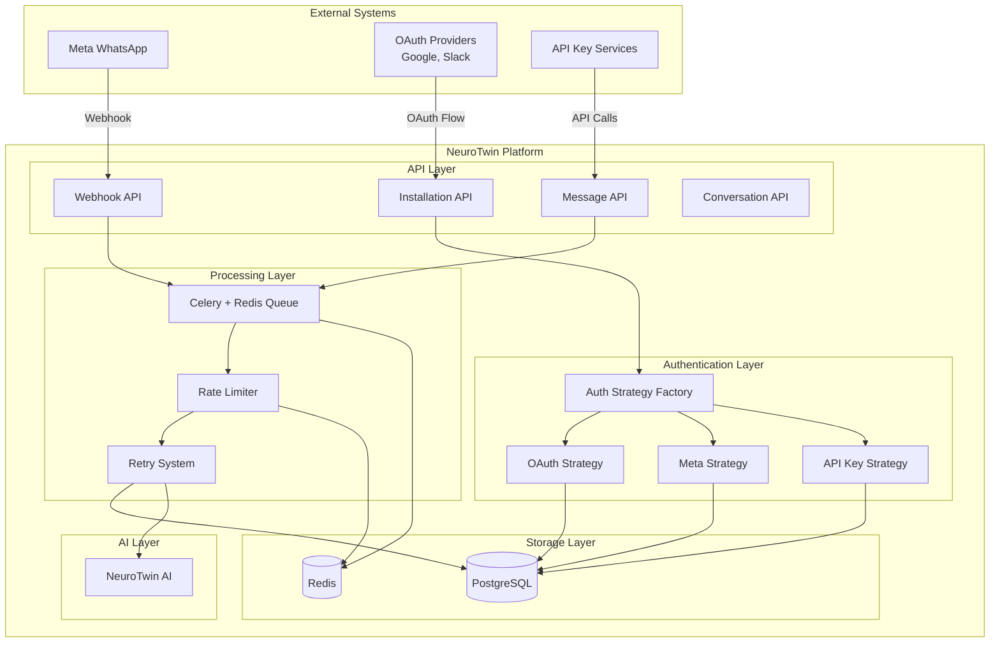
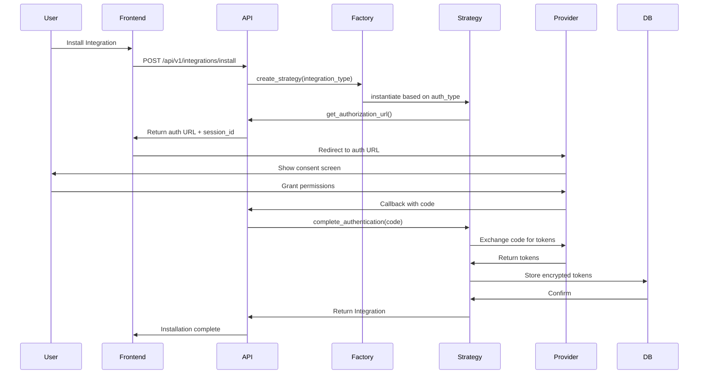
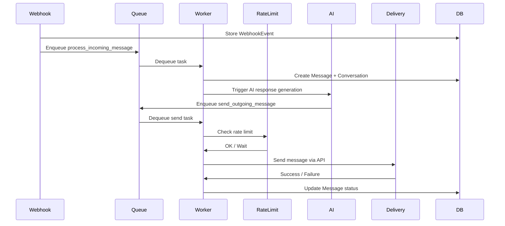

# Design Document: Scalable Integration Engine

## Overview

The Scalable Integration Engine refactors the NeuroTwin backend integration architecture to support production-ready third-party integrations with multiple authentication strategies, queue-based message processing, rate limiting, and fault-tolerant operations. This design enables the platform to scale from basic OAuth integrations to complex systems like Meta WhatsApp Business API (WABA), while maintaining security, reliability, and extensibility.

### Key Design Goals

1. **Multi-Auth Strategy Support**: Flexible authentication layer supporting OAuth 2.0, Meta Business API, and API Key authentication
2. **Scalable Message Processing**: Celery + Redis queue architecture for asynchronous message handling
3. **Rate Limit Protection**: Redis-based sliding window rate limiting to prevent API quota exhaustion
4. **Fault Tolerance**: Exponential backoff retry system with circuit breaker pattern
5. **Security First**: Fernet encryption for all credentials with separate encryption keys per auth type
6. **Production Ready**: Comprehensive logging, monitoring, and health checks

### Architecture Principles

- **Strategy Pattern**: Authentication strategies are pluggable and extensible
- **Queue-Based Processing**: All message processing is asynchronous to prevent blocking
- **Separation of Concerns**: Clear boundaries between webhook receipt, processing, AI generation, and delivery
- **Fail-Safe Design**: Graceful degradation and comprehensive error handling
- **Audit Trail**: Complete logging of all integration operations for debugging and compliance

## Architecture

### High-Level System Architecture



### Authentication Flow Architecture



### Message Processing Pipeline



## Components and Interfaces

### Authentication Strategy Layer

#### Base Authentication Strategy

```python
from abc import ABC, abstractmethod
from typing import Dict, List, Optional, Tuple
from dataclasses import dataclass

@dataclass
class AuthorizationResult:
    """Result of get_authorization_url"""
    url: str
    state: str
    session_id: str

@dataclass
class AuthenticationResult:
    """Result of complete_authentication"""
    access_token: str
    refresh_token: Optional[str]
    expires_at: datetime
    metadata: Dict[str, Any]

class BaseAuthStrategy(ABC):
    """
    Abstract base class for authentication strategies.
    
    Requirements: 4.1-4.6
    """
    
    def __init__(self, integration_type: IntegrationTypeModel):
        self.integration_type = integration_type
        self.auth_config = integration_type.auth_config
        self._validate_config()
    
    @abstractmethod
    def get_authorization_url(
        self, 
        user_id: str, 
        redirect_uri: str,
        state: str
    ) -> AuthorizationResult:
        """
        Generate authorization URL for user to grant permissions.
        
        Args:
            user_id: User identifier
            redirect_uri: Callback URL after authorization
            state: CSRF protection token
            
        Returns:
            AuthorizationResult with URL and session info
        """
        pass
    
    @abstractmethod
    def complete_authentication(
        self,
        code: str,
        state: str,
        redirect_uri: str
    ) -> AuthenticationResult:
        """
        Exchange authorization code for access tokens.
        
        Args:
            code: Authorization code from provider
            state: CSRF protection token
            redirect_uri: Original callback URL
            
        Returns:
            AuthenticationResult with tokens and metadata
        """
        pass
    
    @abstractmethod
    def refresh_credentials(self, integration: Integration) -> AuthenticationResult:
        """
        Refresh expired credentials.
        
        Args:
            integration: Integration with expired credentials
            
        Returns:
            AuthenticationResult with new tokens
        """
        pass
    
    @abstractmethod
    def revoke_credentials(self, integration: Integration) -> bool:
        """
        Revoke credentials with provider.
        
        Args:
            integration: Integration to revoke
            
        Returns:
            True if revocation successful
        """
        pass
    
    def validate_config(self) -> Tuple[bool, List[str]]:
        """
        Validate auth_config structure.
        
        Returns:
            Tuple of (is_valid, list of errors)
        """
        required_fields = self.get_required_fields()
        missing = [f for f in required_fields if f not in self.auth_config]
        
        if missing:
            return False, [f"Missing required field: {f}" for f in missing]
        
        return True, []
    
    @abstractmethod
    def get_required_fields(self) -> List[str]:
        """
        Get list of required auth_config fields.
        
        Returns:
            List of required field names
        """
        pass
    
    def _validate_config(self):
        """Internal validation called during initialization"""
        is_valid, errors = self.validate_config()
        if not is_valid:
            raise ValidationError(f"Invalid auth_config: {', '.join(errors)}")
```

#### OAuth Strategy Implementation

```python
import httpx
from urllib.parse import urlencode
from cryptography.fernet import Fernet

class OAuthStrategy(BaseAuthStrategy):
    """
    OAuth 2.0 authentication strategy with PKCE support.
    
    Requirements: 5.1-5.7
    """
    
    def get_required_fields(self) -> List[str]:
        return [
            'client_id',
            'client_secret_encrypted',
            'authorization_url',
            'token_url',
            'scopes'
        ]
    
    def get_authorization_url(
        self,
        user_id: str,
        redirect_uri: str,
        state: str
    ) -> AuthorizationResult:
        """Generate OAuth authorization URL with PKCE"""
        
        # Validate URLs use HTTPS
        if not self.auth_config['authorization_url'].startswith('https://'):
            raise ValidationError("Authorization URL must use HTTPS")
        
        # Build authorization URL
        params = {
            'client_id': self.auth_config['client_id'],
            'redirect_uri': redirect_uri,
            'response_type': 'code',
            'state': state,
            'scope': ' '.join(self._get_scopes()),
        }
        
        # Add PKCE parameters
        code_verifier = self._generate_code_verifier()
        code_challenge = self._generate_code_challenge(code_verifier)
        params['code_challenge'] = code_challenge
        params['code_challenge_method'] = 'S256'
        
        # Store code_verifier in session for later use
        cache_oauth_state(state, {
            'code_verifier': code_verifier,
            'user_id': user_id,
            'integration_type_id': str(self.integration_type.id)
        })
        
        url = f"{self.auth_config['authorization_url']}?{urlencode(params)}"
        
        return AuthorizationResult(
            url=url,
            state=state,
            session_id=state
        )
    
    def complete_authentication(
        self,
        code: str,
        state: str,
        redirect_uri: str
    ) -> AuthenticationResult:
        """Exchange OAuth code for tokens"""
        
        # Retrieve code_verifier from session
        session_data = get_oauth_state(state, consume=True)
        if not session_data:
            raise ValidationError("Invalid or expired OAuth state")
        
        code_verifier = session_data['code_verifier']
        
        # Exchange code for tokens
        token_data = {
            'grant_type': 'authorization_code',
            'code': code,
            'redirect_uri': redirect_uri,
            'client_id': self.auth_config['client_id'],
            'client_secret': self._decrypt_client_secret(),
            'code_verifier': code_verifier
        }
        
        response = httpx.post(
            self.auth_config['token_url'],
            data=token_data,
            timeout=30.0
        )
        response.raise_for_status()
        
        tokens = response.json()
        
        return AuthenticationResult(
            access_token=tokens['access_token'],
            refresh_token=tokens.get('refresh_token'),
            expires_at=timezone.now() + timedelta(seconds=tokens.get('expires_in', 3600)),
            metadata={}
        )
    
    def refresh_credentials(self, integration: Integration) -> AuthenticationResult:
        """Refresh OAuth tokens"""
        
        if not integration.refresh_token:
            raise ValidationError("No refresh token available")
        
        token_data = {
            'grant_type': 'refresh_token',
            'refresh_token': integration.refresh_token,
            'client_id': self.auth_config['client_id'],
            'client_secret': self._decrypt_client_secret()
        }
        
        response = httpx.post(
            self.auth_config['token_url'],
            data=token_data,
            timeout=30.0
        )
        response.raise_for_status()
        
        tokens = response.json()
        
        return AuthenticationResult(
            access_token=tokens['access_token'],
            refresh_token=tokens.get('refresh_token', integration.refresh_token),
            expires_at=timezone.now() + timedelta(seconds=tokens.get('expires_in', 3600)),
            metadata={}
        )
    
    def revoke_credentials(self, integration: Integration) -> bool:
        """Revoke OAuth tokens"""
        
        revoke_url = self.auth_config.get('revoke_url')
        if not revoke_url:
            return True  # No revocation endpoint
        
        try:
            response = httpx.post(
                revoke_url,
                data={
                    'token': integration.oauth_token,
                    'client_id': self.auth_config['client_id'],
                    'client_secret': self._decrypt_client_secret()
                },
                timeout=10.0
            )
            return response.status_code in [200, 204]
        except Exception as e:
            logger.error(f"Failed to revoke OAuth token: {e}")
            return False
    
    def _get_scopes(self) -> List[str]:
        """Get OAuth scopes as list"""
        scopes = self.auth_config.get('scopes', [])
        if isinstance(scopes, str):
            return [s.strip() for s in scopes.split(',')]
        return scopes
    
    def _decrypt_client_secret(self) -> str:
        """Decrypt OAuth client secret"""
        encrypted = self.auth_config['client_secret_encrypted']
        return TokenEncryption.decrypt(
            base64.b64decode(encrypted),
            auth_type='oauth'
        )
    
    def _generate_code_verifier(self) -> str:
        """Generate PKCE code verifier"""
        return base64.urlsafe_b64encode(os.urandom(32)).decode('utf-8').rstrip('=')
    
    def _generate_code_challenge(self, verifier: str) -> str:
        """Generate PKCE code challenge"""
        import hashlib
        digest = hashlib.sha256(verifier.encode('utf-8')).digest()
        return base64.urlsafe_b64encode(digest).decode('utf-8').rstrip('=')
```

#### Meta Authentication Strategy

```python
class MetaAuthStrategy(BaseAuthStrategy):
    """
    Meta Business API authentication strategy.
    
    Supports WhatsApp Business API with 60-day token expiry.
    Requirements: 6.1-6.7
    """
    
    def get_required_fields(self) -> List[str]:
        return [
            'app_id',
            'app_secret_encrypted',
            'config_id',
            'business_verification_url'
        ]
    
    def get_authorization_url(
        self,
        user_id: str,
        redirect_uri: str,
        state: str
    ) -> AuthorizationResult:
        """Generate Meta Business verification URL"""
        
        # Store session data
        cache_oauth_state(state, {
            'user_id': user_id,
            'integration_type_id': str(self.integration_type.id)
        })
        
        # Build Meta authorization URL
        params = {
            'app_id': self.auth_config['app_id'],
            'config_id': self.auth_config['config_id'],
            'redirect_uri': redirect_uri,
            'state': state,
            'response_type': 'code'
        }
        
        url = f"{self.auth_config['business_verification_url']}?{urlencode(params)}"
        
        return AuthorizationResult(
            url=url,
            state=state,
            session_id=state
        )
    
    def complete_authentication(
        self,
        code: str,
        state: str,
        redirect_uri: str
    ) -> AuthenticationResult:
        """Exchange Meta code for long-lived token"""
        
        # Validate state
        session_data = get_oauth_state(state, consume=True)
        if not session_data:
            raise ValidationError("Invalid or expired OAuth state")
        
        # Exchange code for access token
        token_url = f"https://graph.facebook.com/v18.0/oauth/access_token"
        response = httpx.get(
            token_url,
            params={
                'client_id': self.auth_config['app_id'],
                'client_secret': self._decrypt_app_secret(),
                'code': code,
                'redirect_uri': redirect_uri
            },
            timeout=30.0
        )
        response.raise_for_status()
        
        tokens = response.json()
        access_token = tokens['access_token']
        
        # Fetch business account details
        business_data = self._fetch_business_details(access_token)
        
        return AuthenticationResult(
            access_token=access_token,
            refresh_token=None,  # Meta uses long-lived tokens
            expires_at=timezone.now() + timedelta(days=60),
            metadata={
                'business_id': business_data['business_id'],
                'waba_id': business_data['waba_id'],
                'phone_number_id': business_data['phone_number_id'],
                'phone_numbers': business_data['phone_numbers']
            }
        )
    
    def refresh_credentials(self, integration: Integration) -> AuthenticationResult:
        """Refresh Meta long-lived token before 60-day expiry"""
        
        token_url = f"https://graph.facebook.com/v18.0/oauth/access_token"
        response = httpx.get(
            token_url,
            params={
                'grant_type': 'fb_exchange_token',
                'client_id': self.auth_config['app_id'],
                'client_secret': self._decrypt_app_secret(),
                'fb_exchange_token': integration.oauth_token
            },
            timeout=30.0
        )
        response.raise_for_status()
        
        tokens = response.json()
        
        return AuthenticationResult(
            access_token=tokens['access_token'],
            refresh_token=None,
            expires_at=timezone.now() + timedelta(days=60),
            metadata={}
        )
    
    def revoke_credentials(self, integration: Integration) -> bool:
        """Revoke Meta access token"""
        
        try:
            revoke_url = f"https://graph.facebook.com/v18.0/{self.auth_config['app_id']}/permissions"
            response = httpx.delete(
                revoke_url,
                params={'access_token': integration.oauth_token},
                timeout=10.0
            )
            return response.status_code in [200, 204]
        except Exception as e:
            logger.error(f"Failed to revoke Meta token: {e}")
            return False
    
    def _fetch_business_details(self, access_token: str) -> Dict[str, Any]:
        """Fetch Meta business account details"""
        
        # Get business accounts
        response = httpx.get(
            f"https://graph.facebook.com/v18.0/me/businesses",
            params={'access_token': access_token},
            timeout=30.0
        )
        response.raise_for_status()
        
        businesses = response.json()['data']
        if not businesses:
            raise ValidationError("No business accounts found")
        
        business_id = businesses[0]['id']
        
        # Get WABA (WhatsApp Business Account)
        response = httpx.get(
            f"https://graph.facebook.com/v18.0/{business_id}/owned_whatsapp_business_accounts",
            params={'access_token': access_token},
            timeout=30.0
        )
        response.raise_for_status()
        
        wabas = response.json()['data']
        if not wabas:
            raise ValidationError("No WhatsApp Business Accounts found")
        
        waba_id = wabas[0]['id']
        
        # Get phone numbers
        response = httpx.get(
            f"https://graph.facebook.com/v18.0/{waba_id}/phone_numbers",
            params={'access_token': access_token},
            timeout=30.0
        )
        response.raise_for_status()
        
        phone_numbers = response.json()['data']
        if not phone_numbers:
            raise ValidationError("No phone numbers found")
        
        phone_number_id = phone_numbers[0]['id']
        
        return {
            'business_id': business_id,
            'waba_id': waba_id,
            'phone_number_id': phone_number_id,
            'phone_numbers': [p['display_phone_number'] for p in phone_numbers]
        }
    
    def _decrypt_app_secret(self) -> str:
        """Decrypt Meta app secret"""
        encrypted = self.auth_config['app_secret_encrypted']
        return TokenEncryption.decrypt(
            base64.b64decode(encrypted),
            auth_type='meta'
        )
```

#### API Key Authentication Strategy

```python
class APIKeyStrategy(BaseAuthStrategy):
    """
    Simple API key authentication strategy.
    
    Requirements: 7.1-7.7
    """
    
    def get_required_fields(self) -> List[str]:
        return [
            'api_endpoint',
            'authentication_header_name'
        ]
    
    def get_authorization_url(
        self,
        user_id: str,
        redirect_uri: str,
        state: str
    ) -> AuthorizationResult:
        """API Key auth doesn't require redirect"""
        return None  # Frontend will show API key input form
    
    def complete_authentication(
        self,
        api_key: str,
        state: str = None,
        redirect_uri: str = None
    ) -> AuthenticationResult:
        """Validate and store API key"""
        
        # Validate API key by making test request
        is_valid = self._validate_api_key(api_key)
        if not is_valid:
            raise ValidationError("Invalid API key")
        
        return AuthenticationResult(
            access_token=api_key,
            refresh_token=None,
            expires_at=None,  # API keys don't expire
            metadata={}
        )
    
    def refresh_credentials(self, integration: Integration) -> AuthenticationResult:
        """API keys don't need refresh"""
        return AuthenticationResult(
            access_token=integration.oauth_token,
            refresh_token=None,
            expires_at=None,
            metadata={}
        )
    
    def revoke_credentials(self, integration: Integration) -> bool:
        """API keys are manually revoked by user"""
        return True
    
    def _validate_api_key(self, api_key: str) -> bool:
        """Validate API key with test request"""
        
        try:
            headers = {
                self.auth_config['authentication_header_name']: api_key
            }
            
            response = httpx.get(
                self.auth_config['api_endpoint'],
                headers=headers,
                timeout=10.0
            )
            
            return response.status_code in [200, 204]
        except Exception as e:
            logger.error(f"API key validation failed: {e}")
            return False
```

#### Authentication Strategy Factory

```python
class AuthStrategyFactory:
    """
    Factory for creating authentication strategy instances.
    
    Requirements: 8.1-8.7
    """
    
    _registry: Dict[str, Type[BaseAuthStrategy]] = {
        AuthType.OAUTH: OAuthStrategy,
        AuthType.META: MetaAuthStrategy,
        AuthType.API_KEY: APIKeyStrategy
    }
    
    @classmethod
    def create_strategy(
        cls,
        integration_type: IntegrationTypeModel
    ) -> BaseAuthStrategy:
        """
        Create appropriate authentication strategy.
        
        Args:
            integration_type: IntegrationTypeModel instance
            
        Returns:
            Instantiated authentication strategy
            
        Raises:
            ValidationError: If auth_type is not recognized
        """
        strategy_class = cls._registry.get(integration_type.auth_type)
        
        if not strategy_class:
            raise ValidationError(
                f"Unknown auth_type: {integration_type.auth_type}. "
                f"Supported types: {', '.join(cls._registry.keys())}"
            )
        
        return strategy_class(integration_type)
    
    @classmethod
    def register_strategy(
        cls,
        auth_type: str,
        strategy_class: Type[BaseAuthStrategy]
    ):
        """
        Register a new authentication strategy.
        
        Allows dynamic extension of supported auth types.
        """
        cls._registry[auth_type] = strategy_class
```

### Rate Limiting Layer

```python
from typing import Tuple
import time

class RateLimiter:
    """
    Redis-based rate limiter using sliding window algorithm.
    
    Requirements: 12.1-12.7
    """
    
    def __init__(self, redis_client):
        self.redis = redis_client
    
    def check_rate_limit(
        self,
        integration_id: str,
        limit_per_minute: int = 20,
        global_limit: int = 100
    ) -> Tuple[bool, int]:
        """
        Check if request is within rate limits.
        
        Args:
            integration_id: Integration identifier
            limit_per_minute: Per-integration limit
            global_limit: Global platform limit
            
        Returns:
            Tuple of (allowed, wait_seconds)
        """
        now = time.time()
        window = 60  # 1 minute window
        
        # Check per-integration limit
        integration_key = f"rate_limit:integration:{integration_id}"
        integration_allowed, integration_wait = self._check_sliding_window(
            integration_key,
            limit_per_minute,
            window,
            now
        )
        
        if not integration_allowed:
            return False, integration_wait
        
        # Check global limit
        global_key = "rate_limit:global"
        global_allowed, global_wait = self._check_sliding_window(
            global_key,
            global_limit,
            window,
            now
        )
        
        if not global_allowed:
            return False, global_wait
        
        # Record this request
        self._record_request(integration_key, now, window)
        self._record_request(global_key, now, window)
        
        return True, 0
    
    def _check_sliding_window(
        self,
        key: str,
        limit: int,
        window: int,
        now: float
    ) -> Tuple[bool, int]:
        """Check sliding window rate limit"""
        
        # Remove old entries
        cutoff = now - window
        self.redis.zremrangebyscore(key, 0, cutoff)
        
        # Count requests in window
        count = self.redis.zcard(key)
        
        if count >= limit:
            # Get oldest request timestamp
            oldest = self.redis.zrange(key, 0, 0, withscores=True)
            if oldest:
                oldest_time = oldest[0][1]
                wait_seconds = int(oldest_time + window - now) + 1
                return False, wait_seconds
            return False, window
        
        return True, 0
    
    def _record_request(self, key: str, timestamp: float, window: int):
        """Record a request in the sliding window"""
        self.redis.zadd(key, {str(timestamp): timestamp})
        self.redis.expire(key, window + 10)  # Extra buffer
    
    def get_rate_limit_status(
        self,
        integration_id: str,
        limit_per_minute: int = 20
    ) -> Dict[str, Any]:
        """Get current rate limit status"""
        
        now = time.time()
        window = 60
        key = f"rate_limit:integration:{integration_id}"
        
        # Remove old entries
        cutoff = now - window
        self.redis.zremrangebyscore(key, 0, cutoff)
        
        # Count current requests
        current = self.redis.zcard(key)
        remaining = max(0, limit_per_minute - current)
        
        return {
            'limit': limit_per_minute,
            'current': current,
            'remaining': remaining,
            'reset_at': now + window
        }
```

### Retry System with Exponential Backoff

```python
from celery import Task
from celery.exceptions import Retry

class RetryableTask(Task):
    """
    Base Celery task with exponential backoff retry.
    
    Requirements: 13.1-13.7
    """
    
    autoretry_for = (
        httpx.TimeoutException,
        httpx.NetworkError,
    )
    
    retry_kwargs = {
        'max_retries': 5,
        'countdown': 1  # Initial delay
    }
    
    retry_backoff = True
    retry_backoff_max = 16  # Max 16 seconds
    retry_jitter = True
    
    def should_retry(self, exc: Exception) -> bool:
        """Determine if exception is retryable"""
        
        # Transient errors - retry
        if isinstance(exc, (httpx.TimeoutException, httpx.NetworkError)):
            return True
        
        # HTTP errors
        if isinstance(exc, httpx.HTTPStatusError):
            status_code = exc.response.status_code
            
            # Rate limit - retry
            if status_code == 429:
                return True
            
            # Server errors - retry
            if 500 <= status_code < 600:
                return True
            
            # Client errors - don't retry
            if 400 <= status_code < 500:
                return False
        
        return False
    
    def on_retry(self, exc, task_id, args, kwargs, einfo):
        """Log retry attempts"""
        logger.warning(
            f"Task {self.name} retry {self.request.retries}/{self.max_retries}",
            extra={
                'task_id': task_id,
                'exception': str(exc),
                'args': args,
                'kwargs': kwargs
            }
        )
```

### Celery Task Definitions

```python
from celery import shared_task
from typing import Dict, Any

@shared_task(base=RetryableTask, bind=True)
def process_incoming_message(self, webhook_event_id: str):
    """
    Process incoming webhook message.
    
    Requirements: 11.2, 16.2, 16.3
    
    Args:
        webhook_event_id: WebhookEvent ID to process
    """
    from apps.automation.models import WebhookEvent, Message, Conversation
    
    try:
        # Get webhook event
        event = WebhookEvent.objects.get(id=webhook_event_id)
        event.status = 'processing'
        event.save()
        
        # Parse webhook payload
        payload = event.payload
        integration = event.integration
        
        # Extract message data
        external_contact_id = payload.get('from')
        message_content = payload.get('text', {}).get('body', '')
        external_message_id = payload.get('id')
        
        # Get or create conversation
        conversation, created = Conversation.objects.get_or_create(
            integration=integration,
            external_contact_id=external_contact_id,
            defaults={
                'external_contact_name': payload.get('profile', {}).get('name', 'Unknown'),
                'status': 'active'
            }
        )
        
        # Create message record
        message = Message.objects.create(
            conversation=conversation,
            direction='inbound',
            content=message_content,
            status='received',
            external_message_id=external_message_id,
            metadata=payload
        )
        
        # Update conversation timestamp
        conversation.last_message_at = timezone.now()
        conversation.save()
        
        # Mark webhook as processed
        event.status = 'processed'
        event.processed_at = timezone.now()
        event.save()
        
        # Trigger AI response if needed
        if should_trigger_ai_response(conversation, message):
            trigger_ai_response.delay(message.id)
        
        logger.info(
            f"Processed incoming message {message.id}",
            extra={
                'integration_id': str(integration.id),
                'conversation_id': str(conversation.id),
                'message_id': str(message.id)
            }
        )
        
    except Exception as e:
        logger.error(f"Failed to process webhook event: {e}")
        event.status = 'failed'
        event.error_message = str(e)
        event.save()
        raise


@shared_task(base=RetryableTask, bind=True)
def send_outgoing_message(self, message_id: str):
    """
    Send outgoing message with rate limiting.
    
    Requirements: 11.3, 12.1-12.7, 13.1-13.7, 16.6
    
    Args:
        message_id: Message ID to send
    """
    from apps.automation.models import Message
    from apps.automation.services import MessageDeliveryService
    
    try:
        # Get message
        message = Message.objects.get(id=message_id)
        conversation = message.conversation
        integration = conversation.integration
        
        # Check rate limit
        rate_limiter = RateLimiter(get_redis_connection('default'))
        allowed, wait_seconds = rate_limiter.check_rate_limit(
            str(integration.id),
            limit_per_minute=integration.integration_type.rate_limit_config.get('messages_per_minute', 20)
        )
        
        if not allowed:
            # Retry after wait period
            logger.info(f"Rate limit exceeded, retrying in {wait_seconds}s")
            raise self.retry(countdown=wait_seconds)
        
        # Send message
        delivery_service = MessageDeliveryService()
        result = delivery_service.send_message(
            integration=integration,
            conversation=conversation,
            message=message
        )
        
        # Update message status
        message.status = 'sent'
        message.external_message_id = result.get('message_id')
        message.save()
        
        logger.info(
            f"Sent outgoing message {message.id}",
            extra={
                'integration_id': str(integration.id),
                'conversation_id': str(conversation.id),
                'message_id': str(message.id),
                'external_message_id': result.get('message_id')
            }
        )
        
    except Exception as e:
        # Update retry count
        message.retry_count += 1
        message.last_retry_at = timezone.now()
        
        if message.retry_count >= 5:
            # Max retries exceeded
            message.status = 'failed'
            message.save()
            
            logger.error(
                f"Message {message.id} failed after {message.retry_count} retries",
                extra={'error': str(e)}
            )
            
            # Notify user
            notify_message_failure.delay(message.id)
        else:
            message.save()
            
            # Retry with exponential backoff
            if self.should_retry(e):
                raise
            else:
                # Permanent error - don't retry
                message.status = 'failed'
                message.save()
                logger.error(f"Permanent error sending message: {e}")

@shared_task
def trigger_ai_response(message_id: str):
    """
    Trigger AI to generate response to incoming message.
    
    Requirements: 16.4
    
    Args:
        message_id: Incoming message ID
    """
    from apps.automation.models import Message
    from apps.twin.services import TwinResponseService
    
    try:
        message = Message.objects.get(id=message_id)
        conversation = message.conversation
        integration = conversation.integration
        user = integration.user
        
        # Generate AI response
        twin_service = TwinResponseService()
        response_content = twin_service.generate_response(
            user=user,
            conversation_history=conversation.get_recent_messages(limit=10),
            incoming_message=message.content,
            integration_type=integration.integration_type.type
        )
        
        # Create outgoing message
        outgoing_message = Message.objects.create(
            conversation=conversation,
            direction='outbound',
            content=response_content,
            status='pending',
            metadata={'generated_by': 'twin'}
        )
        
        # Enqueue for sending
        send_outgoing_message.delay(str(outgoing_message.id))
        
    except Exception as e:
        logger.error(f"Failed to generate AI response: {e}")
        raise

@shared_task
def refresh_expiring_tokens():
    """
    Background task to refresh tokens expiring within 24 hours.
    
    Requirements: 5.3, 6.5
    """
    from apps.automation.models import Integration
    from apps.automation.services import IntegrationRefreshService
    
    # Find integrations with tokens expiring soon
    expiring_soon = Integration.objects.filter(
        is_active=True,
        token_expires_at__lte=timezone.now() + timedelta(hours=24),
        token_expires_at__gt=timezone.now()
    )
    
    refresh_service = IntegrationRefreshService()
    
    for integration in expiring_soon:
        try:
            refresh_service.refresh_integration(integration)
            logger.info(f"Refreshed token for integration {integration.id}")
        except Exception as e:
            logger.error(f"Failed to refresh integration {integration.id}: {e}")
```

## Data Models

### Enhanced Integration Type Model

```python
class IntegrationTypeModel(models.Model):
    """
    Platform-level integration type configuration.
    
    Requirements: 1.1-1.7
    """
    
    id = models.UUIDField(primary_key=True, default=uuid.uuid4)
    
    # Type identifier
    type = models.CharField(max_length=100, unique=True, db_index=True)
    name = models.CharField(max_length=255)
    description = models.TextField()
    
    # Authentication configuration
    auth_type = models.CharField(
        max_length=20,
        choices=AuthType.choices,
        default=AuthType.OAUTH,
        db_index=True
    )
    auth_config = models.JSONField(default=dict)
    
    # Rate limiting configuration
    rate_limit_config = models.JSONField(
        default=dict,
        help_text='Rate limit settings: messages_per_minute, requests_per_minute, burst_limit'
    )
    
    # Categorization
    category = models.CharField(
        max_length=50,
        choices=IntegrationCategory.choices,
        db_index=True
    )
    
    # Status
    is_active = models.BooleanField(default=True, db_index=True)
    
    # Timestamps
    created_at = models.DateTimeField(auto_now_add=True)
    updated_at = models.DateTimeField(auto_now=True)
    
    class Meta:
        db_table = 'integration_types'
        indexes = [
            models.Index(fields=['auth_type', 'is_active']),
            models.Index(fields=['category', 'is_active'])
        ]
```


### Enhanced Integration Model

```python
class Integration(models.Model):
    """
    User-level integration instance with encrypted credentials.
    
    Requirements: 2.1-2.7
    """
    
    id = models.UUIDField(primary_key=True, default=uuid.uuid4)
    user = models.ForeignKey(settings.AUTH_USER_MODEL, on_delete=models.CASCADE)
    integration_type = models.ForeignKey(IntegrationTypeModel, on_delete=models.PROTECT)
    
    # Encrypted credentials
    access_token_encrypted = models.BinaryField(null=True, blank=True)
    refresh_token_encrypted = models.BinaryField(null=True, blank=True)
    api_key_encrypted = models.BinaryField(null=True, blank=True)
    
    # Token expiration
    token_expires_at = models.DateTimeField(null=True, blank=True, db_index=True)
    
    # Meta-specific fields
    waba_id = models.CharField(max_length=255, null=True, blank=True, db_index=True)
    phone_number_id = models.CharField(max_length=255, null=True, blank=True)
    business_id = models.CharField(max_length=255, null=True, blank=True, db_index=True)
    
    # User configuration
    user_config = models.JSONField(default=dict)
    
    # Status
    status = models.CharField(
        max_length=20,
        choices=[
            ('active', 'Active'),
            ('disconnected', 'Disconnected'),
            ('expired', 'Expired'),
            ('revoked', 'Revoked')
        ],
        default='active',
        db_index=True
    )
    
    # Health monitoring
    last_successful_sync_at = models.DateTimeField(null=True, blank=True)
    health_status = models.CharField(
        max_length=20,
        choices=[
            ('healthy', 'Healthy'),
            ('degraded', 'Degraded'),
            ('disconnected', 'Disconnected')
        ],
        default='healthy',
        db_index=True
    )
    consecutive_failures = models.IntegerField(default=0)
    
    # Timestamps
    created_at = models.DateTimeField(auto_now_add=True)
    updated_at = models.DateTimeField(auto_now=True)
    
    class Meta:
        db_table = 'integrations'
        unique_together = [['user', 'integration_type']]
        indexes = [
            models.Index(fields=['user', 'status']),
            models.Index(fields=['token_expires_at']),
            models.Index(fields=['waba_id']),
            models.Index(fields=['health_status'])
        ]
```

### Installation Session Model

```python
class InstallationSession(models.Model):
    """
    Tracks installation progress for integrations.
    
    Requirements: 3.1-3.7
    """
    
    id = models.UUIDField(primary_key=True, default=uuid.uuid4)
    user = models.ForeignKey(settings.AUTH_USER_MODEL, on_delete=models.CASCADE)
    integration_type = models.ForeignKey(IntegrationTypeModel, on_delete=models.CASCADE)
    
    # OAuth state for CSRF protection
    oauth_state = models.CharField(max_length=255, unique=True, db_index=True)
    
    # Status tracking
    status = models.CharField(
        max_length=30,
        choices=[
            ('initiated', 'Initiated'),
            ('oauth_pending', 'OAuth Pending'),
            ('completing', 'Completing'),
            ('completed', 'Completed'),
            ('failed', 'Failed'),
            ('expired', 'Expired')
        ],
        default='initiated',
        db_index=True
    )
    progress = models.IntegerField(default=0)
    
    # Error tracking
    error_message = models.TextField(blank=True, default='')
    
    # Expiration
    expires_at = models.DateTimeField(db_index=True)
    
    # Timestamps
    created_at = models.DateTimeField(auto_now_add=True)
    updated_at = models.DateTimeField(auto_now=True)
    
    class Meta:
        db_table = 'installation_sessions'
        indexes = [
            models.Index(fields=['user', 'status']),
            models.Index(fields=['expires_at'])
        ]
    
    def save(self, *args, **kwargs):
        if not self.expires_at:
            self.expires_at = timezone.now() + timedelta(minutes=15)
        super().save(*args, **kwargs)
```

### Conversation Model

```python
class Conversation(models.Model):
    """
    Message thread between user and external contact.
    
    Requirements: 15.1-15.7
    """
    
    id = models.UUIDField(primary_key=True, default=uuid.uuid4)
    integration = models.ForeignKey(Integration, on_delete=models.CASCADE)
    
    # External contact information
    external_contact_id = models.CharField(max_length=255, db_index=True)
    external_contact_name = models.CharField(max_length=255)
    
    # Status
    status = models.CharField(
        max_length=20,
        choices=[
            ('active', 'Active'),
            ('archived', 'Archived'),
            ('blocked', 'Blocked')
        ],
        default='active'
    )
    
    # Timestamps
    last_message_at = models.DateTimeField(auto_now_add=True, db_index=True)
    created_at = models.DateTimeField(auto_now_add=True)
    updated_at = models.DateTimeField(auto_now=True)
    
    class Meta:
        db_table = 'conversations'
        unique_together = [['integration', 'external_contact_id']]
        indexes = [
            models.Index(fields=['integration', 'status']),
            models.Index(fields=['last_message_at'])
        ]
```


### Message Model

```python
class Message(models.Model):
    """
    Individual message within a conversation.
    
    Requirements: 15.3-15.7
    """
    
    id = models.UUIDField(primary_key=True, default=uuid.uuid4)
    conversation = models.ForeignKey(Conversation, on_delete=models.CASCADE)
    
    # Message direction
    direction = models.CharField(
        max_length=10,
        choices=[
            ('inbound', 'Inbound'),
            ('outbound', 'Outbound')
        ],
        db_index=True
    )
    
    # Content
    content = models.TextField()
    
    # Status
    status = models.CharField(
        max_length=20,
        choices=[
            ('pending', 'Pending'),
            ('sent', 'Sent'),
            ('delivered', 'Delivered'),
            ('read', 'Read'),
            ('failed', 'Failed')
        ],
        default='pending',
        db_index=True
    )
    
    # External reference
    external_message_id = models.CharField(max_length=255, null=True, blank=True, db_index=True)
    
    # Retry tracking
    retry_count = models.IntegerField(default=0)
    last_retry_at = models.DateTimeField(null=True, blank=True)
    
    # Platform-specific metadata
    metadata = models.JSONField(default=dict)
    
    # Timestamps
    created_at = models.DateTimeField(auto_now_add=True, db_index=True)
    updated_at = models.DateTimeField(auto_now=True)
    
    class Meta:
        db_table = 'messages'
        indexes = [
            models.Index(fields=['conversation', 'created_at']),
            models.Index(fields=['status', 'retry_count']),
            models.Index(fields=['external_message_id'])
        ]
```

### Webhook Event Model

```python
class WebhookEvent(models.Model):
    """
    Stores incoming webhook events for asynchronous processing.
    
    Requirements: 10.1-10.7, 22.1-22.7
    """
    
    id = models.UUIDField(primary_key=True, default=uuid.uuid4)
    integration_type = models.ForeignKey(IntegrationTypeModel, on_delete=models.CASCADE)
    integration = models.ForeignKey(Integration, on_delete=models.CASCADE, null=True)
    
    # Raw webhook data
    payload = models.JSONField()
    signature = models.CharField(max_length=512)
    
    # Processing status
    status = models.CharField(
        max_length=20,
        choices=[
            ('pending', 'Pending'),
            ('processing', 'Processing'),
            ('processed', 'Processed'),
            ('failed', 'Failed')
        ],
        default='pending',
        db_index=True
    )
    
    # Error tracking
    error_message = models.TextField(blank=True, default='')
    
    # Processing timestamp
    processed_at = models.DateTimeField(null=True, blank=True)
    
    # Timestamps
    created_at = models.DateTimeField(auto_now_add=True, db_index=True)
    updated_at = models.DateTimeField(auto_now=True)
    
    class Meta:
        db_table = 'webhook_events'
        indexes = [
            models.Index(fields=['status', 'created_at']),
            models.Index(fields=['integration_type', 'status'])
        ]
```

## Security Architecture

### Credential Encryption

```python
from cryptography.fernet import Fernet
import base64
import os

class TokenEncryption:
    """
    Fernet-based encryption for credentials.
    
    Requirements: 17.1-17.7
    """
    
    @staticmethod
    def _get_encryption_key(auth_type: str) -> bytes:
        """Get encryption key for specific auth type"""
        key_map = {
            'oauth': os.getenv('OAUTH_ENCRYPTION_KEY'),
            'meta': os.getenv('META_ENCRYPTION_KEY'),
            'api_key': os.getenv('API_KEY_ENCRYPTION_KEY')
        }
        
        key = key_map.get(auth_type)
        if not key:
            raise ValueError(f"Encryption key not found for auth_type: {auth_type}")
        
        return key.encode() if isinstance(key, str) else key
    
    @staticmethod
    def encrypt(plaintext: str, auth_type: str = 'oauth') -> bytes:
        """
        Encrypt plaintext using Fernet symmetric encryption.
        
        Args:
            plaintext: Text to encrypt
            auth_type: Authentication type for key selection
            
        Returns:
            Encrypted bytes
        """
        if not plaintext:
            return b''
        
        key = TokenEncryption._get_encryption_key(auth_type)
        fernet = Fernet(key)
        return fernet.encrypt(plaintext.encode())
    
    @staticmethod
    def decrypt(ciphertext: bytes, auth_type: str = 'oauth') -> str:
        """
        Decrypt ciphertext using Fernet symmetric encryption.
        
        Args:
            ciphertext: Encrypted bytes
            auth_type: Authentication type for key selection
            
        Returns:
            Decrypted plaintext
        """
        if not ciphertext:
            return ''
        
        key = TokenEncryption._get_encryption_key(auth_type)
        fernet = Fernet(key)
        return fernet.decrypt(ciphertext).decode()
```

### Webhook Signature Verification

```python
import hmac
import hashlib

class WebhookVerifier:
    """
    Verifies webhook signatures from external providers.
    
    Requirements: 10.2, 17.6
    """
    
    @staticmethod
    def verify_meta_signature(payload: bytes, signature: str, app_secret: str) -> bool:
        """
        Verify Meta webhook signature.
        
        Args:
            payload: Raw webhook payload
            signature: X-Hub-Signature-256 header value
            app_secret: Meta app secret
            
        Returns:
            True if signature is valid
        """
        if not signature.startswith('sha256='):
            return False
        
        expected_signature = signature[7:]  # Remove 'sha256=' prefix
        
        computed_signature = hmac.new(
            app_secret.encode(),
            payload,
            hashlib.sha256
        ).hexdigest()
        
        return hmac.compare_digest(computed_signature, expected_signature)
```

## API Endpoints

### Installation Endpoints

```python
# POST /api/v1/integrations/install/
class InstallIntegrationView(APIView):
    """
    Initiate integration installation.
    
    Requirements: 19.1-19.7
    """
    permission_classes = [IsAuthenticated]
    
    def post(self, request):
        integration_type_id = request.data.get('integration_type_id')
        redirect_uri = request.data.get('redirect_uri')
        
        # Get integration type
        integration_type = IntegrationTypeModel.objects.get(id=integration_type_id)
        
        # Create installation session
        oauth_state = secrets.token_urlsafe(32)
        session = InstallationSession.objects.create(
            user=request.user,
            integration_type=integration_type,
            oauth_state=oauth_state,
            status='initiated'
        )
        
        # Create auth strategy
        strategy = AuthStrategyFactory.create_strategy(integration_type)
        
        # Get authorization URL
        if integration_type.auth_type in [AuthType.OAUTH, AuthType.META]:
            auth_result = strategy.get_authorization_url(
                user_id=str(request.user.id),
                redirect_uri=redirect_uri,
                state=oauth_state
            )
            
            return Response({
                'session_id': str(session.id),
                'authorization_url': auth_result.url,
                'auth_type': integration_type.auth_type
            })
        else:
            # API Key - no redirect needed
            return Response({
                'session_id': str(session.id),
                'auth_type': integration_type.auth_type,
                'requires_api_key': True
            })
```


# POST /api/v1/integrations/oauth/callback/
class OAuthCallbackView(APIView):
    """
    Handle OAuth callback.
    
    Requirements: 5.2, 9.1-9.7
    """
    permission_classes = [IsAuthenticated]
    
    def get(self, request):
        code = request.GET.get('code')
        state = request.GET.get('state')
        
        # Get installation session
        session = InstallationSession.objects.get(oauth_state=state, user=request.user)
        
        if session.is_expired:
            return Response({'error': 'Session expired'}, status=400)
        
        # Create auth strategy
        strategy = AuthStrategyFactory.create_strategy(session.integration_type)
        
        try:
            # Complete authentication
            auth_result = strategy.complete_authentication(
                code=code,
                state=state,
                redirect_uri=request.build_absolute_uri().split('?')[0]
            )
            
            # Create or update integration
            integration, created = Integration.objects.update_or_create(
                user=request.user,
                integration_type=session.integration_type,
                defaults={
                    'status': 'active',
                    'token_expires_at': auth_result.expires_at
                }
            )
            
            # Store encrypted tokens
            integration.oauth_token = auth_result.access_token
            if auth_result.refresh_token:
                integration.refresh_token = auth_result.refresh_token
            
            # Store metadata (for Meta integrations)
            if auth_result.metadata:
                integration.business_id = auth_result.metadata.get('business_id')
                integration.waba_id = auth_result.metadata.get('waba_id')
                integration.phone_number_id = auth_result.metadata.get('phone_number_id')
                integration.user_config = auth_result.metadata
            
            integration.save()
            
            # Update session
            session.status = 'completed'
            session.progress = 100
            session.save()
            
            return Response({
                'integration_id': str(integration.id),
                'status': 'completed'
            })
            
        except Exception as e:
            session.status = 'failed'
            session.error_message = str(e)
            session.save()
            
            return Response({'error': str(e)}, status=400)

# POST /api/v1/integrations/api-key/complete/
class APIKeyCompleteView(APIView):
    """
    Complete API key integration.
    
    Requirements: 7.2, 7.4
    """
    permission_classes = [IsAuthenticated]
    
    def post(self, request):
        session_id = request.data.get('session_id')
        api_key = request.data.get('api_key')
        
        # Get installation session
        session = InstallationSession.objects.get(id=session_id, user=request.user)
        
        # Create auth strategy
        strategy = AuthStrategyFactory.create_strategy(session.integration_type)
        
        try:
            # Validate and complete authentication
            auth_result = strategy.complete_authentication(api_key=api_key)
            
            # Create integration
            integration = Integration.objects.create(
                user=request.user,
                integration_type=session.integration_type,
                status='active'
            )
            
            # Store encrypted API key
            integration.api_key_encrypted = TokenEncryption.encrypt(
                api_key,
                auth_type='api_key'
            )
            integration.save()
            
            # Update session
            session.status = 'completed'
            session.progress = 100
            session.save()
            
            return Response({
                'integration_id': str(integration.id),
                'status': 'completed'
            })
            
        except Exception as e:
            session.status = 'failed'
            session.error_message = str(e)
            session.save()
            
            return Response({'error': str(e)}, status=400)
```

### Webhook Endpoints

```python
# POST /api/v1/webhooks/meta/
class MetaWebhookView(APIView):
    """
    Receive Meta webhook events.
    
    Requirements: 10.1-10.7
    """
    permission_classes = [AllowAny]  # Webhooks come from external systems
    
    def post(self, request):
        # Verify signature
        signature = request.headers.get('X-Hub-Signature-256', '')
        app_secret = settings.META_APP_SECRET
        
        if not WebhookVerifier.verify_meta_signature(
            request.body,
            signature,
            app_secret
        ):
            return Response({'error': 'Invalid signature'}, status=403)
        
        # Store webhook event
        payload = request.data
        
        # Find integration by WABA ID
        waba_id = payload.get('entry', [{}])[0].get('id')
        integration = Integration.objects.filter(waba_id=waba_id).first()
        
        webhook_event = WebhookEvent.objects.create(
            integration_type=IntegrationTypeModel.objects.get(type='whatsapp'),
            integration=integration,
            payload=payload,
            signature=signature,
            status='pending'
        )
        
        # Enqueue for processing
        process_incoming_message.delay(str(webhook_event.id))
        
        return Response({'status': 'received'}, status=200)
    
    def get(self, request):
        """Handle Meta webhook verification challenge"""
        mode = request.GET.get('hub.mode')
        token = request.GET.get('hub.verify_token')
        challenge = request.GET.get('hub.challenge')
        
        if mode == 'subscribe' and token == settings.META_WEBHOOK_VERIFY_TOKEN:
            return HttpResponse(challenge, content_type='text/plain')
        
        return Response({'error': 'Verification failed'}, status=403)
```

### Conversation and Message Endpoints

```python
# GET /api/v1/integrations/{id}/conversations/
class ConversationListView(APIView):
    """
    List conversations for an integration.
    
    Requirements: 20.1-20.7
    """
    permission_classes = [IsAuthenticated]
    pagination_class = PageNumberPagination
    
    def get(self, request, integration_id):
        # Verify ownership
        integration = Integration.objects.get(id=integration_id, user=request.user)
        
        # Get conversations
        conversations = Conversation.objects.filter(
            integration=integration
        ).select_related('integration').order_by('-last_message_at')
        
        # Paginate
        paginator = self.pagination_class()
        page = paginator.paginate_queryset(conversations, request)
        
        serializer = ConversationSerializer(page, many=True)
        return paginator.get_paginated_response(serializer.data)

# GET /api/v1/conversations/{id}/messages/
class MessageListView(APIView):
    """
    List messages in a conversation.
    
    Requirements: 20.4-20.7
    """
    permission_classes = [IsAuthenticated]
    pagination_class = PageNumberPagination
    
    def get(self, request, conversation_id):
        # Verify ownership
        conversation = Conversation.objects.select_related(
            'integration__user'
        ).get(id=conversation_id)
        
        if conversation.integration.user != request.user:
            return Response({'error': 'Unauthorized'}, status=403)
        
        # Get messages
        messages = Message.objects.filter(
            conversation=conversation
        ).order_by('created_at')
        
        # Paginate
        paginator = self.pagination_class()
        page = paginator.paginate_queryset(messages, request)
        
        serializer = MessageSerializer(page, many=True)
        return paginator.get_paginated_response(serializer.data)

# POST /api/v1/conversations/{id}/messages/
class SendMessageView(APIView):
    """
    Send a message in a conversation.
    
    Requirements: 21.1-21.7
    """
    permission_classes = [IsAuthenticated]
    throttle_classes = [UserRateThrottle]
    
    def post(self, request, conversation_id):
        # Verify ownership
        conversation = Conversation.objects.select_related(
            'integration__user'
        ).get(id=conversation_id)
        
        if conversation.integration.user != request.user:
            return Response({'error': 'Unauthorized'}, status=403)
        
        content = request.data.get('content')
        metadata = request.data.get('metadata', {})
        
        # Check rate limit
        rate_limiter = RateLimiter(get_redis_connection('default'))
        allowed, wait_seconds = rate_limiter.check_rate_limit(
            str(conversation.integration.id)
        )
        
        if not allowed:
            return Response({
                'error': f'Rate limit exceeded. Try again in {wait_seconds} seconds.'
            }, status=429)
        
        # Create message
        message = Message.objects.create(
            conversation=conversation,
            direction='outbound',
            content=content,
            status='pending',
            metadata=metadata
        )
        
        # Enqueue for sending
        send_outgoing_message.delay(str(message.id))
        
        serializer = MessageSerializer(message)
        return Response(serializer.data, status=201)
```


## Error Handling

### Error Response Format

```python
{
    "error": "Error message",
    "error_code": "RATE_LIMIT_EXCEEDED",
    "details": {
        "retry_after": 30,
        "limit": 20,
        "current": 21
    }
}
```

### Error Codes

- `INVALID_AUTH_CONFIG`: Authentication configuration is invalid
- `AUTH_FAILED`: Authentication with provider failed
- `TOKEN_EXPIRED`: Access token has expired
- `RATE_LIMIT_EXCEEDED`: Rate limit exceeded
- `WEBHOOK_SIGNATURE_INVALID`: Webhook signature verification failed
- `INTEGRATION_NOT_FOUND`: Integration not found
- `CONVERSATION_NOT_FOUND`: Conversation not found
- `MESSAGE_SEND_FAILED`: Message delivery failed
- `PERMISSION_DENIED`: User lacks required permissions

### Circuit Breaker Pattern

```python
class CircuitBreaker:
    """
    Circuit breaker for external API calls.
    
    Requirements: 32.3, 32.4
    """
    
    def __init__(self, failure_threshold: int = 5, timeout: int = 60):
        self.failure_threshold = failure_threshold
        self.timeout = timeout
        self.failures = 0
        self.last_failure_time = None
        self.state = 'closed'  # closed, open, half_open
    
    def call(self, func, *args, **kwargs):
        """Execute function with circuit breaker protection"""
        
        if self.state == 'open':
            if time.time() - self.last_failure_time > self.timeout:
                self.state = 'half_open'
            else:
                raise CircuitBreakerOpenError("Circuit breaker is open")
        
        try:
            result = func(*args, **kwargs)
            self.on_success()
            return result
        except Exception as e:
            self.on_failure()
            raise
    
    def on_success(self):
        """Reset on successful call"""
        self.failures = 0
        self.state = 'closed'
    
    def on_failure(self):
        """Increment failure count"""
        self.failures += 1
        self.last_failure_time = time.time()
        
        if self.failures >= self.failure_threshold:
            self.state = 'open'
```

## Testing Strategy

### Unit Testing

Unit tests will focus on:

1. **Authentication Strategy Tests**
   - OAuth URL generation with PKCE
   - Token exchange and refresh
   - Meta business account fetching
   - API key validation
   - Strategy factory creation

2. **Rate Limiter Tests**
   - Sliding window algorithm
   - Per-integration limits
   - Global limits
   - Rate limit status reporting

3. **Encryption Tests**
   - Token encryption/decryption
   - Multiple encryption keys
   - Error handling for missing keys

4. **Webhook Verification Tests**
   - Meta signature verification
   - Invalid signature rejection

5. **Model Tests**
   - Integration model encryption properties
   - Conversation and message relationships
   - Installation session expiration

### Property-Based Testing

Property-based tests will use Hypothesis library with minimum 100 iterations per test. Each test will be tagged with the corresponding design property.

Configuration:
```python
from hypothesis import given, settings
import hypothesis.strategies as st

@settings(max_examples=100)
@given(...)
def test_property_name():
    # Tag: Feature: scalable-integration-engine, Property N: [property text]
    pass
```

### Integration Testing

Integration tests will cover:

1. **Complete Installation Flows**
   - OAuth flow from initiation to callback
   - Meta flow with business account fetching
   - API key installation

2. **Webhook Processing**
   - Webhook receipt and storage
   - Asynchronous message processing
   - AI response generation
   - Message delivery

3. **Rate Limiting**
   - Rate limit enforcement
   - Message queuing when rate limited
   - Rate limit recovery

4. **Token Refresh**
   - Automatic token refresh before expiry
   - Refresh failure handling

### Load Testing

Load tests will verify:

1. Webhook processing throughput (10,000 messages/minute)
2. Rate limiter performance under high load
3. Celery queue processing capacity
4. Database connection pooling
5. Redis connection pooling

## Logging and Observability

### Structured Logging

```python
import logging
import json

logger = logging.getLogger('apps.automation.integration')

# Authentication events
logger.info(
    "Authentication completed",
    extra={
        'event_type': 'auth_completed',
        'user_id': str(user.id),
        'integration_type_id': str(integration_type.id),
        'auth_type': integration_type.auth_type,
        'success': True
    }
)

# Webhook events
logger.info(
    "Webhook received",
    extra={
        'event_type': 'webhook_received',
        'integration_type': 'whatsapp',
        'waba_id': waba_id,
        'message_count': len(messages)
    }
)

# Message delivery
logger.info(
    "Message sent",
    extra={
        'event_type': 'message_sent',
        'integration_id': str(integration.id),
        'message_id': str(message.id),
        'external_message_id': external_id,
        'duration_ms': duration
    }
)

# Rate limit violations
logger.warning(
    "Rate limit exceeded",
    extra={
        'event_type': 'rate_limit_exceeded',
        'integration_id': str(integration.id),
        'limit_type': 'per_integration',
        'attempted_rate': 25,
        'limit': 20
    }
)
```

### Metrics

Prometheus metrics to track:

```python
from prometheus_client import Counter, Histogram, Gauge

# Authentication metrics
auth_attempts_total = Counter(
    'integration_auth_attempts_total',
    'Total authentication attempts',
    ['auth_type', 'result']
)

# Message metrics
messages_processed_total = Counter(
    'integration_messages_processed_total',
    'Total messages processed',
    ['integration_type', 'direction', 'status']
)

message_processing_duration = Histogram(
    'integration_message_processing_duration_seconds',
    'Message processing duration',
    ['integration_type']
)

# Rate limit metrics
rate_limit_violations_total = Counter(
    'integration_rate_limit_violations_total',
    'Total rate limit violations',
    ['integration_type', 'limit_type']
)

# Queue metrics
celery_queue_length = Gauge(
    'celery_queue_length',
    'Current Celery queue length',
    ['queue_name']
)
```


## Correctness Properties

*A property is a characteristic or behavior that should hold true across all valid executions of a system—essentially, a formal statement about what the system should do. Properties serve as the bridge between human-readable specifications and machine-verifiable correctness guarantees.*

### Property 1: Credential Encryption Round-Trip

*For any* credential (token, API key, refresh token), encrypting then decrypting with the same auth_type should return the original plaintext value.

**Validates: Requirements 2.6, 17.1**

### Property 2: Invalid Auth Type Rejection

*For any* string that is not in the set {oauth, meta, api_key}, attempting to create an IntegrationTypeModel with that auth_type should raise a ValidationError.

**Validates: Requirements 1.6**

### Property 3: Strategy Instantiation Validation

*For any* authentication strategy type, instantiating the strategy with auth_config missing required fields should raise a ValidationError listing the missing fields.

**Validates: Requirements 4.4**

### Property 4: OAuth HTTPS Enforcement

*For any* OAuth configuration, if authorization_url or token_url does not start with "https://", validation should fail with an error indicating HTTPS is required.

**Validates: Requirements 5.6**

### Property 5: Unrecognized Auth Type Factory Error

*For any* auth_type value not registered in the AuthStrategyFactory, calling create_strategy should raise a ValidationError with a message listing supported types.

**Validates: Requirements 8.5**

### Property 6: Webhook Signature Verification

*For any* webhook payload and signature pair, if the signature is computed correctly using the app_secret, verification should succeed; if the signature is incorrect or tampered, verification should fail.

**Validates: Requirements 10.2**

### Property 7: Rate Limit Message Preservation

*For any* message that exceeds the rate limit, the message should be queued (status='pending') and eventually sent when quota becomes available, never dropped or lost.

**Validates: Requirements 12.4**

### Property 8: Transient Error Retry

*For any* error that is classified as transient (TimeoutException, NetworkError, HTTP 429, HTTP 5xx), the retry system should attempt to resend the message with exponential backoff.

**Validates: Requirements 13.5**

### Property 9: Permanent Error No Retry

*For any* error that is classified as permanent (HTTP 401, HTTP 403, HTTP 400), the retry system should mark the message as failed without further retry attempts.

**Validates: Requirements 13.6**

### Property 10: Expired Session Completion Prevention

*For any* InstallationSession where current_time > expires_at, attempting to complete the installation should fail with an error indicating the session has expired.

**Validates: Requirements 3.5**

### Property 11: Auth Config Round-Trip

*For any* valid auth_config JSON object, parsing it into a typed configuration object, then serializing back to JSON, then parsing again should produce an equivalent configuration.

**Validates: Requirements 25.7**

### Property 12: Backward Compatibility Property Access

*For any* IntegrationTypeModel instance, accessing auth_config and oauth_config properties should return the same dictionary value.

**Validates: Requirements 18.6**

### Property 13: Webhook Idempotency

*For any* webhook event with a given external_message_id, processing the webhook multiple times should result in only one Message record being created (idempotent processing).

**Validates: Requirements 32.6**

### Property 14: Encryption Key Separation

*For any* two different auth_types (oauth, meta, api_key), the encryption keys used should be different, ensuring credential isolation.

**Validates: Requirements 17.4**


## Deployment and Configuration

### Environment Variables

```bash
# Database
DB_NAME=neurotwin
DB_USER=postgres
DB_PASSWORD=<secure_password>
DB_HOST=localhost
DB_PORT=5432

# Redis
REDIS_HOST=localhost
REDIS_PORT=6379
REDIS_DB=0
REDIS_PASSWORD=<secure_password>
USE_REDIS=True

# Encryption Keys (generate with: python -c "from cryptography.fernet import Fernet; print(Fernet.generate_key().decode())")
OAUTH_ENCRYPTION_KEY=<fernet_key>
META_ENCRYPTION_KEY=<fernet_key>
API_KEY_ENCRYPTION_KEY=<fernet_key>

# Meta Configuration
META_APP_SECRET=<meta_app_secret>
META_WEBHOOK_VERIFY_TOKEN=<random_token>

# Celery
CELERY_BROKER_URL=redis://localhost:6379/1
CELERY_RESULT_BACKEND=redis://localhost:6379/1

# Frontend
FRONTEND_URL=http://localhost:3000
```

### Celery Configuration

```python
# celery.py
from celery import Celery
import os

os.environ.setdefault('DJANGO_SETTINGS_MODULE', 'neurotwin.settings')

app = Celery('neurotwin')
app.config_from_object('django.conf:settings', namespace='CELERY')
app.autodiscover_tasks()

# Queue configuration
app.conf.task_routes = {
    'apps.automation.tasks.process_incoming_message': {'queue': 'incoming_messages'},
    'apps.automation.tasks.send_outgoing_message': {'queue': 'outgoing_messages'},
    'apps.automation.tasks.trigger_ai_response': {'queue': 'high_priority'},
}

# Task time limits
app.conf.task_time_limit = 300  # 5 minutes
app.conf.task_soft_time_limit = 240  # 4 minutes

# Retry configuration
app.conf.task_acks_late = True
app.conf.task_reject_on_worker_lost = True
```

### Database Migrations

```python
# Migration: Add auth_type and new fields to IntegrationTypeModel
class Migration(migrations.Migration):
    dependencies = [
        ('automation', '0001_initial'),
    ]
    
    operations = [
        # Add auth_type field
        migrations.AddField(
            model_name='integrationtypemodel',
            name='auth_type',
            field=models.CharField(
                max_length=20,
                choices=[('oauth', 'OAuth 2.0'), ('meta', 'Meta Business'), ('api_key', 'API Key')],
                default='oauth'
            ),
        ),
        
        # Rename oauth_config to auth_config
        migrations.RenameField(
            model_name='integrationtypemodel',
            old_name='oauth_config',
            new_name='auth_config',
        ),
        
        # Add rate_limit_config
        migrations.AddField(
            model_name='integrationtypemodel',
            name='rate_limit_config',
            field=models.JSONField(default=dict),
        ),
        
        # Add Meta fields to Integration
        migrations.AddField(
            model_name='integration',
            name='waba_id',
            field=models.CharField(max_length=255, null=True, blank=True),
        ),
        migrations.AddField(
            model_name='integration',
            name='phone_number_id',
            field=models.CharField(max_length=255, null=True, blank=True),
        ),
        migrations.AddField(
            model_name='integration',
            name='business_id',
            field=models.CharField(max_length=255, null=True, blank=True),
        ),
        
        # Add api_key_encrypted field
        migrations.AddField(
            model_name='integration',
            name='api_key_encrypted',
            field=models.BinaryField(null=True, blank=True),
        ),
        
        # Add indexes
        migrations.AddIndex(
            model_name='integrationtypemodel',
            index=models.Index(fields=['auth_type'], name='idx_auth_type'),
        ),
        migrations.AddIndex(
            model_name='integration',
            index=models.Index(fields=['waba_id'], name='idx_waba_id'),
        ),
    ]
```

### Monitoring and Alerting

#### Health Check Endpoint

```python
# GET /api/v1/health/
class HealthCheckView(APIView):
    """System health check"""
    permission_classes = [AllowAny]
    
    def get(self, request):
        health = {
            'status': 'healthy',
            'timestamp': timezone.now().isoformat(),
            'components': {}
        }
        
        # Check database
        try:
            from django.db import connection
            connection.ensure_connection()
            health['components']['database'] = 'healthy'
        except Exception as e:
            health['components']['database'] = f'unhealthy: {str(e)}'
            health['status'] = 'degraded'
        
        # Check Redis
        try:
            redis_conn = get_redis_connection('default')
            redis_conn.ping()
            health['components']['redis'] = 'healthy'
        except Exception as e:
            health['components']['redis'] = f'unhealthy: {str(e)}'
            health['status'] = 'degraded'
        
        # Check Celery
        try:
            from celery import current_app
            stats = current_app.control.inspect().stats()
            if stats:
                health['components']['celery'] = 'healthy'
            else:
                health['components']['celery'] = 'no workers'
                health['status'] = 'degraded'
        except Exception as e:
            health['components']['celery'] = f'unhealthy: {str(e)}'
            health['status'] = 'degraded'
        
        status_code = 200 if health['status'] == 'healthy' else 503
        return Response(health, status=status_code)
```

#### Alert Rules

1. **High Rate Limit Violations**: Alert when rate limit violations exceed 100/hour
2. **Message Delivery Failures**: Alert when message failure rate exceeds 5%
3. **Token Refresh Failures**: Alert when token refresh fails for any integration
4. **Webhook Processing Delays**: Alert when webhook processing time exceeds 10 seconds
5. **Celery Queue Backlog**: Alert when queue length exceeds 1000 messages
6. **Integration Health Degradation**: Alert when integration health_status changes to 'degraded' or 'disconnected'

## Migration Strategy

### Phase 1: Database Schema Updates (Week 1)

1. Run migrations to add new fields (auth_type, waba_id, etc.)
2. Set default auth_type='oauth' for all existing IntegrationTypeModel records
3. Verify backward compatibility with existing integrations

### Phase 2: Authentication Strategy Layer (Week 2)

1. Deploy BaseAuthStrategy, OAuthStrategy, MetaAuthStrategy, APIKeyStrategy
2. Deploy AuthStrategyFactory
3. Update installation endpoints to use factory pattern
4. Test OAuth flow with existing integrations

### Phase 3: Webhook and Queue System (Week 3)

1. Deploy WebhookEvent model and webhook endpoints
2. Configure Celery queues and workers
3. Deploy process_incoming_message and send_outgoing_message tasks
4. Test webhook processing with Meta sandbox

### Phase 4: Rate Limiting and Retry (Week 4)

1. Deploy RateLimiter with Redis
2. Deploy RetryableTask base class
3. Update message sending to use rate limiting
4. Test rate limit enforcement and retry behavior

### Phase 5: Monitoring and Production Rollout (Week 5)

1. Deploy health check endpoints
2. Configure Prometheus metrics
3. Set up alerting rules
4. Gradual rollout to production users
5. Monitor for issues and adjust rate limits as needed

## Security Considerations

1. **Encryption at Rest**: All credentials encrypted with Fernet using separate keys per auth type
2. **Encryption in Transit**: All external API calls use HTTPS/TLS 1.2+
3. **Webhook Signature Verification**: All webhooks verified before processing
4. **CSRF Protection**: OAuth state parameter prevents CSRF attacks
5. **Rate Limiting**: Prevents abuse and API quota exhaustion
6. **Input Validation**: All user input sanitized and validated
7. **Audit Logging**: All authentication and message operations logged
8. **Credential Rotation**: Support for token refresh and credential updates
9. **Least Privilege**: Integration permissions configurable per user
10. **Secure Defaults**: All new integrations start with minimal permissions

## Performance Optimization

1. **Database Connection Pooling**: Max 50 connections with 10-minute lifetime
2. **Redis Connection Pooling**: Max 100 connections
3. **Query Optimization**: Use select_related and prefetch_related to avoid N+1 queries
4. **Caching**: Cache IntegrationTypeModel records with 5-minute TTL
5. **Asynchronous Processing**: All message processing via Celery queues
6. **Rate Limiting**: Prevent API quota exhaustion
7. **Batch Processing**: Process multiple webhook events in batches when possible
8. **Index Optimization**: Indexes on frequently queried fields (auth_type, waba_id, status)
9. **Message Compression**: Compress large payloads in Redis
10. **Circuit Breaker**: Prevent cascading failures with circuit breaker pattern

## Future Enhancements

1. **Additional Auth Strategies**: Support for OAuth 1.0, SAML, JWT
2. **Webhook Replay**: Ability to replay failed webhook events
3. **Message Templates**: Pre-configured message templates per integration type
4. **Bulk Operations**: Bulk message sending and conversation management
5. **Analytics Dashboard**: Real-time metrics and insights
6. **Multi-Region Support**: Deploy across multiple regions for lower latency
7. **Advanced Rate Limiting**: Per-user rate limits and burst allowances
8. **Message Scheduling**: Schedule messages for future delivery
9. **Conversation AI**: Enhanced AI response generation with context awareness
10. **Integration Marketplace**: User-contributed integration types
